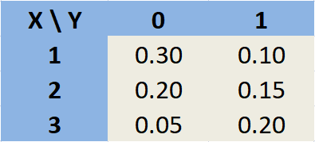

```{r setup, include=FALSE}
knitr::opts_chunk$set(echo = FALSE)
require(magrittr)
set.seed(13)
```


<!--1) Seja X uma variável aleatória com f.d.p.
$$
f(x) = C (1-x^2), ~~\text{se}~~ x\in (-1,1)
$$
determine o valor de C.-->


1) Considere a seguinte função densidade de
probabilidade:
$$
f(x) = \left \{
\begin{aligned}
k x &, ~\text{ se } 0 \leq x \leq 1;
\\
k &, ~\text{ se } 1 < x \leq 2;
\\
-k x + 3k&, ~\text{ se } 2 < x \leq 3;
\\
0 &, ~\text{ c.c. }
\end{aligned}
\right .
$$
Calcule o valor de $k$.

\vspace{0.2cm}


2) O tamanho ideal de uma classe de primeiro ano em uma faculdade particular
é de 150 alunos. A faculdade, sabendo por experiência que, em média,
apenas 30% dos alunos aceitos realmente permanecem na faculdade, utiliza
uma política de aprovação das aplicações de 450 alunos. Calcule a
probabilidade de que mais de 150 desses alunos permaneçam
na faculdade. (Não utilize a correção de continuidade na aproximação da
binomial pela normal)


\vspace{0.2cm}


3) Suponha que o tempo de vida de um determinado tipo de componente
elétrico tem distribuição de probabilidade exponencial com média igual a 10.000 horas. Se
um desses componentes já foi utilizado por 7.000 horas, qual a probabilidade
de que este componente aguente pelo menos 15000 horas no total?


\vspace{0.2cm}


<!--4) Um grande empresário possui 3 empresas que atuam em setores independentes.
Seja $X_1, X_2$ e $X_3$ as v.a.’s que representam o rendimento
projetado (em milhoes de reais) para 2022 dessas 3 empresas, respectivamente.
Sabendo que os rendimentos projetados são independentes com
distribuição de probabilidade Normal, com as respectivas médias 10, 15
e 11, e as respectivas variâncias 5, 3 e 4, determine a probabilidade do
rendimento total ser maior que 40.
-->


<!--4) Um grande investidor possui participações em 3 empresas de áreas distintas, de modo que o
faturamento de uma empresa não tem qualquer relação com as demais (são
independentes). 
Suponha que os faturamentos anuais em milhões de reais dessas 3 
empresas sejam representados respectivamente pelas letras X, Y e Q, e que
$X \sim Normal(1; 4)~,~~Y \sim Normal(2; 1)~,~~Q \sim Normal(1; 1)$.
Sabendo que esse investidor possui 30% da primeira empresa, 50% da segunda empresa e 40% da terceira empresa, 
determine a probabilidade desse investidor ter faturamento superior a 1 milhão de reais em 1 ano.-->


<!-- Muito parecido com exercício das aulas -->
<!-- 4) Um empresário possui participações em 2 empresas de áreas distintas, de modo que o -->
<!-- faturamento de uma empresa não tem qualquer relação com a outra (são -->
<!-- independentes).  -->
<!-- Suponha que os faturamentos anuais em milhões de reais dessas 2  -->
<!-- empresas sejam representados respectivamente pelas letras X e Y, e que -->
<!-- $X \sim Normal(\mu=1; \,\sigma^2=4)~,~~Y \sim Normal(\mu=2; \,\sigma^2=1)$. -->
<!-- Sabendo que esse investidor possui 20% da primeira empresa e 30% da segunda empresa,  -->
<!-- determine a probabilidade desse investidor ter faturamento superior a 1 milhão de reais em 1 ano. -->


\vspace{0.2cm}


4) Para um aluno de uma universidade pública, suponha que X represente o número 
de vestibulares que ele prestou até conseguir entrar na universidade e Y uma 
variável binária que indica se ele estudou em escolas públicas. A distribuição de probabilidade conjunta de X e Y é dada na planilha abaixo.
\center
{width=25%}
\raggedright

a) Determine a correlação de X e Y.

b) Calcule P[X=2 | Y=1].


\vspace{0.4cm}

5) O rendimento em um dia útil de um funcionário de uma linha de montagem
é formado por um valor fixo de 50 reais mais uma quantia variável de
5 reais por produto montado. Ou seja, se $X$ é o numero de produtos
montados em um dia, então o rendimento $Y$ nesse dia é dado por
$$
Y = 50 + 5X.
$$
Sabendo que a média de produtos montados por dia é 20 e que a variância
é 9, determine a probabilidade do rendimento diário médio em um ano ser
menor que 151 reais. Considere apenas dias úteis e que um ano possui 252
dias úteis. Assuma que a quantidade de produtos montados em um dia é 
independente dos demais.


\vspace{0.5cm}
**Gabarito**

1) $0.5$;
2) $0.06178$;
3) $0.44933$;
4) a $0.425$, b $0.33333$;
5) $0.85543$.


