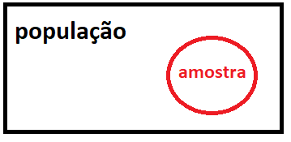

```{r setup, include=FALSE}
knitr::opts_chunk$set(echo = FALSE)
require(magrittr)
set.seed(13)
```


 
    

    


## Estatística 

- **Definição**: estatística é a ciência que trata da coleta, organização, análise e
interpretação de dados para tomada de decisões. 

  - Os dados são obtidos a partir de uma amostra da população.
  
  \pause

- **População**: coleção de todos os dados de interesse
  - geralmente desconhecido como um todo
  
  \pause
    
- **Amostra**: subconjunto da população
  - parte da população que é conhecida
  - na disciplina estaremos interessados em estudar apenas **amostra aleatória**
    + obtida de forma aleatória (ex: sorteio)
    + todos os elementos da população tem a mesma chance de entrar na amostra
    


\center
{ width=40% }


## 

- **Estatística descritiva**: conjunto de técnicas para descrever dados (medidas e gráficos)

\pause
- Exemplo: em uma pesquisa recente foi perguntado a 614 proprietários de pequenas empresas no DF se eles acreditavam que a presença de sua empresa no facebook agregava algum valor pro seu negócio. Desses 258 responderam sim e os demais responderam não. \pause


  - População: \pause todos os pequenos empresários do DF \pause

  - Amostra: \pause 614 ouvidos na pesquisa \pause
  
  - Estatística descritiva: \pause
  
      - percentual da amostra que responderam sim: $\frac{258}{614} = 42\%$ 
      
      - percentual da amostra que responderam não: $\frac{356}{614} = 58\%$

```{R, fig.height=6, out.width = '60%', fig.align = "center", echo=FALSE}
par(mfrow=c(1,2))
pie(c(0.42, 0.58), c("sim","nao"), lwd=2, cex=3)
barplot(c(0.42,0.58), names.arg = c("sim","nao"), ylim=c(0,1), cex.names = 3, cex.axis = 2)
```


##

  - **Amostragem**: processo no qual a amostra é coletada de forma a obter uma parte representativa da população;
  
  - **Inferência estatística**: refere-se ao uso apropriado de uma amostra para se gerar conhecimento sobre a população;

\vspace{0.5cm}  
\center
{ width=90% }


## Principais medidas descritivas

Seja $x_1, x_2, \dots, x_n$ uma amostra de tamanho $n$. 
\pause
\vspace{0.5cm}

- Média amostral: descreve o ponto de equilíbrio da amostra, geralmente denotada com uma barra sobre a variável ($\bar{x}$):
$$
\bar{x} = \frac{x_1+x_2+\dots+x_n}{n}
$$
\pause

- Mediana: consiste no valor central dos dados ordenados, isto é, este é o ponto em que metade dos dados é menor ou igual a ele e a outra metade é maior ou igual a ele. Vamos denotar a mediana por $M$, então se $x_{(1)}, x_{(2)}, \dots, x_{(n)}$
é o conjunto de dados ordenado, então a mediana amostral é definida como:

  - se $n$ é impar, então $M = x_{(m)}$, em que $m = (n-1)/2+1$;
  
  - se $n$ é par, então $M = ( x_{(m)} + x_{(m +1)} ) / 2$, em que $m = n/2$;


## Principais medidas descritivas

- Variância amostral: descreve o nível de dispersão dos dados em relação a média na escala quadrática, geralmente denotada por $S^2$:
$$
S^2 = \frac{ (x_1 -\bar{x})^2 + (x_2 -\bar{x})^2 + \dots + (x_n -\bar{x})^2}{n-1} = \frac{1}{n-1} \sum_{i=1}^n (x_i -\bar{x})^2
$$
\pause
\vspace{0.1cm}

- Desvio Padrão amostral: descreve o nível de dispersão dos dados em relação a média na escala original, geralmente denotado por $S$:

$$
S = \sqrt{ \frac{1}{n-1} \sum_{i=1}^n (x_i -\bar{x})^2 }
$$


##

- Exemplo: suponha que 7 alunos da turma foram sorteados para formar uma amostra das idades dos alunos. As idades observadas foram $20, 19, 21, 23, 22, 18, 20$.
\vspace{0.5cm} 
  
  - Média amostral: $\bar{x} = \frac{x_1+x_2+\dots+x_7}{7} = 143 / 7 ~~\approx 20.43$ anos; \pause
\vspace{0.5cm} 

  - Mediana: como $n=7$ então $M = x_{(4)}$. Ordenando os dados, temos $18, 19, 20, 20, 21, 22, 23$ e portanto $M = 20$ anos; \pause
\vspace{0.5cm} 

  - Variância amostral: 
  
  $S^2 = \frac{1}{6} \sum_{i=1}^7 (x_i -\bar{x})^2 = [~ (-0.43)^2 +(-1.43)^2  +(0.57)^2  +(2.57)^2  +(1.57)^2 +(-2.43)^2 +(-0.43)^2 ~] / 6 ~~ \approx 2.95$ anos$^2$ 
\pause
\vspace{0.5cm} 

  - Desvio padrão amostral: $S = \sqrt{ 2.95 } ~~\approx 1.72$ anos


## Exercício: 

Repita o exemplo anterior substituindo o valor 23 da amostra pelo valor 80. 

- Note que a média, a variância e o desvio padrão serão fortemente afetados, no entanto, a mediana ainda dará o mesmo valor de antes.

- Uma das principais características da mediana é a de não sofrer influência de valores atípicos.


## Quantis e quartis

**Quantis** são pontos de corte que, em um conjunto de dados ordenado, separam as observações em partes proporcionais a uma determinada probabilidade

\pause

  - O quantil de ordem $p$ (com $0 < p < 1$) é o valor abaixo do qual estão aproximadamente $100p\%$ dos dados.

\pause

\vspace{1cm}


**Quartis** são 3 pontos de cortes que separam os dados da seguinte maneira:

- $Q_1$: o **primeiro quartil** corresponde ao quantil de 25\%; 

  - 25\% dos dados são menores que $Q_1$ e os demais são maiores;

- $Q_2$: o **segundo quartil** corresponde ao quantil de 50\% (mediana); 

  - 50\% dos dados são menores que $Q_2$ e os demais são maiores;

- $Q_3$: o **terceiro quartil** corresponde ao quantil de 75\%; 

  - 75\% dos dados são menores que $Q_3$ e os demais são maiores.


## Exemplo: Quantis

Considere os dados ordenados:

$$
18, 19, 20, 20, 21, 22, 23
$$

\pause

- $Q_2$ (mediana): $20$

\pause

- $Q_1$: mediana da primeira metade  
  $\Rightarrow Q_1 = 19$

\pause

- $Q_3$: mediana da segunda metade  
  $\Rightarrow Q_3 = 22$

\pause

- Resumo:

  - Mínimo: 18
  - $Q_1$: 19
  - Mediana: 20
  - $Q_3$: 22
  - Máximo: 23
  
 

## Boxplot

- O **boxplot** (diagrama de caixa) é um gráfico que resume a distribuição dos dados por meio de medidas baseadas em quantis.

\pause

- Baseado no **resumo de cinco números**:

  - Mínimo  
  - Primeiro quartil ($Q_1$)  
  - Mediana ($Q_2$)  
  - Terceiro quartil ($Q_3$)  
  - Máximo  

\pause

- O boxplot permite identificar:

  - **posição** (mediana)  
  - **dispersão** (amplitude e IQR)  
  - **assimetria** da distribuição  
  - **possíveis valores discrepantes (outliers)**  


## Interpretação do Boxplot

- A **caixa** representa o intervalo entre $Q_1$ e $Q_3$  
  - Contém aproximadamente **50\% centrais dos dados**

- A linha dentro da caixa indica a **mediana**

\pause

- O **intervalo interquartil** é dado por:

$$
IQR = Q_3 - Q_1
$$

\pause

- As **hastes (bigodes)** se estendem até:

  - o menor e o maior valor **não considerados outliers**, isto é, dentro do intervalo:
  
$$
[Q_1 - 1.5 \cdot IQR,\; Q_3 + 1.5 \cdot IQR]
$$

\pause

- Valores fora desse intervalo são representados individualmente e considerados **outliers** 
 


## Exemplo - Boxplot

- Exemplo de distribuição de idades

  - Suponha que observamos o seguinte conjunto de idades dos alunos: 18, 19, 20, 21, 22, 22, 23, 24, 25, 26, 27, 28, 29, 30, 31, 32, 33, 35, 37, 45, 50.
  
```{r, echo=FALSE, fig.height=7, out.width='70%', fig.align='center'}
dados <- c(18, 19, 20, 21, 22, 22, 23, 24, 25, 26, 
           27, 28, 29, 30, 31, 32, 33, 35, 37, 
           45, 50)

boxplot(dados, 
        horizontal = TRUE,
        col = "lightblue",
        main = "Distribuição das idades",
        xlab = "Idade")
```


## Exemplo 2 - Boxplot para duas populações

- Comparação das **notas de duas turmas** em uma prova.

```{r, echo=FALSE, fig.height=7, out.width='65%', fig.align='center'}
set.seed(123)

# Turma A: desempenho mais homogêneo
turma_A <- c(rnorm(40, mean = 7.0, sd = 0.8))

# Turma B: mais dispersa + alguns valores extremos
turma_B <- c(rnorm(40, mean = 6.5, sd = 1.5), 2.0, 10.0)

boxplot(turma_A, turma_B,
        names = c("Turma A", "Turma B"),
        col = c("lightblue", "lightgreen"),
        main = "Notas em uma avaliação",
        ylab = "Nota")
```
\pause

Interpretação:

- A Turma A apresenta notas mais concentradas

- A Turma B apresenta maior variabilidade


## Exemplo 3 - Boxplot para duas populações
\small
- Comparação das **notas de duas turmas** em uma prova.

```{r, echo=FALSE, fig.height=6, out.width='65%', fig.align='center'}
set.seed(123)

# Turma A: 
turma_A <-  c( sort( rnorm(50, mean = 5, sd = 1))[3:48], 9, 10) 

# Turma B: 
turma_B <- c( sort( rnorm(50, mean = 6, sd = 1))[2:48], 2)  

boxplot(turma_A, turma_B,
        names = c("Turma A", "Turma B"),
        col = c("lightblue", "lightgreen"),
        main = "Notas em uma avaliação",
        ylim = c(1, 10),
        ylab = "Nota")
```
\pause

Interpretação:

- A Turma B apresentou desempenho típico superior ao da Turma A, o que pode ser observado pelo fato de seus quartis estarem acima dos da Turma A;

- No entanto, a Turma A possui dois valores elevados (notas 9 e 10), que se destacam em relação ao restante da turma, indicando um possível outlier superior. Por outro lado, a Turma B apresenta um valor baixo (nota 2), indicando um possível outlier inferior.


## Exercício - Interpretação de Boxplot

\small
- Considere o boxplot abaixo, que apresenta o **tempo de deslocamento (em minutos)** de alunos até a universidade, por dois meios de transporte:

```{r, echo=FALSE, fig.height=6, out.width='65%', fig.align='center'}
set.seed(321)

# Transporte A: mais estável
transporte_A <-  c( sort( rnorm(50, mean = 30, sd = 5))[3:49], 23)

# Transporte B: mais variável + alguns casos extremos
transporte_B <- c(rnorm(40, mean = 35, sd = 7), 60, 70)

boxplot(transporte_A, transporte_B,
        names = c("Transporte A", "Transporte B"),
        col = c("lightblue", "lightgreen"),
        main = "Tempo de deslocamento até a universidade",
        ylab = "Tempo (minutos)")
```

Com base no gráfico, responda:

1. Qual meio de transporte apresenta menor tempo típico?

2. Qual apresenta maior variabilidade?

3. Há presença de outliers? Em qual(is) grupo(s)?

5. Qual meio de transporte parece mais confiável (menor variação)?

6. Qual meio de transporte você escolheria? Justifique com base no gráfico.

## Gabarito do exercício

1. O Transporte A apresenta menor tempo típico.

2. O Transporte B apresenta maior dispersão (maior IQR).

3. O Transporte B possui outliers (tempos muito altos).

4. O Transporte A é mais estável (menor variabilidade).

5. O Transporte A tende a ser mais confiável, pois apresenta menor variação nos tempos.

