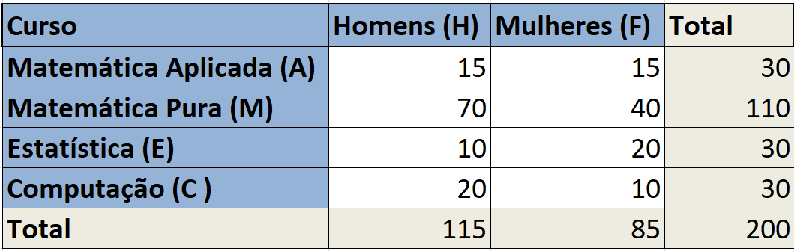
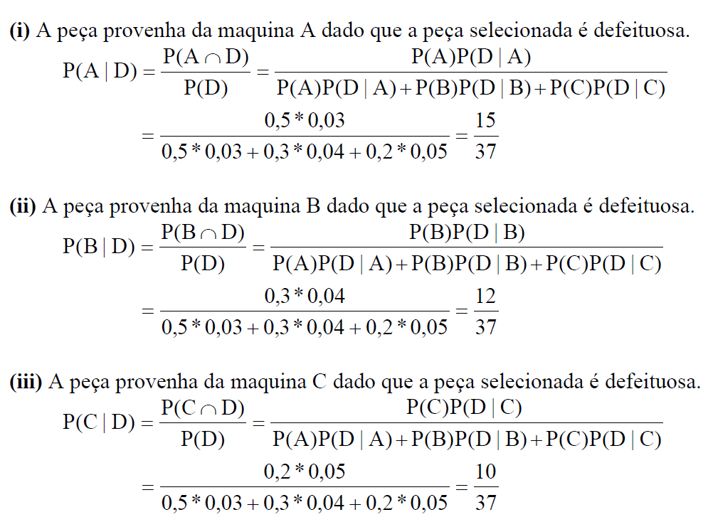

```{r setup, include=FALSE}
knitr::opts_chunk$set(echo = FALSE)
require(magrittr)
set.seed(13)
```

# Definições básicas e exemplos

## Definições

-   **Experimento aleatório**: nesse tipo de experimento os possíveis
    resultados são conhecidos, no entanto não sabemos qual resultado em
    particular irá ocorrer;
    
    \pause
    
    -   Ex 1: lançar uma moeda uma unica vez e observar o lado de cima.
        Sabemos que os resultados possíveis são cara e coroa, mas
        não sabemos o que irá ocorrer;
    
    \pause
    
    -   Ex 2: lançar um dado uma unica vez e observar o lado de cima.
        Sabemos que os resultados possíveis são 1, 2, 3, 4, 5 ou 6,
        mas não sabemos o que irá ocorrer;
    
    \pause
    
    -   Ex 3: escolher um aluno ao acaso e perguntar a sua idade.
        Sabemos que os resultados possíveis pertence ao conjunto dos naturais $\mathbb{N}$, mas não sabemos o que irá ocorrer;
        
        \pause
    
    -   Ex 4: o preço de fechamento de uma ação de uma empresa no próximo dia.
        Sabemos que os resultados possíveis pertence ao conjunto dos reais positivos $\mathbb{R}^+$, mas não sabemos o que irá ocorrer.    

## 

-   **Espaço amostral**: conjunto de todos os resultados possíveis do
    experimento aleatório. Será denotado por $\Omega~$ ("omega").
    \vspace{0.5cm}
    
    \pause

-   **Evento**: qualquer subconjunto do espaço amostral. Geralmente é 
    denotado por letras maiúsculas ($A, B, C, \dots$). \pause

    -   O evento $A=\Omega$ é chamado de "evento certo" pois sempre
        ocorre.
        
    -   O evento $B=\emptyset$ é chamado de "evento impossível" pois
        nunca ocorre.

## 

\vspace{0.5cm}

**Exemplo**: experimento aleatório de lançar uma moeda uma única vez e
observar o lado de cima 
\vspace{0.2cm}

-   Espaço amostral: \pause

    - $\Omega = \{cara,~ coroa\}$ 
    
\vspace{0.2cm}  \pause

-   Alguns possíveis eventos:

    -   Sair cara: $A = \{cara\}$ \pause
    -   Sair coroa: $B = \{coroa\}$ \pause
    -   Sair cara ou coroa: $C = \{cara,~ coroa\} = \Omega$ \pause
    -   Não sair nem cara e nem coroa: $D =\emptyset$

## 

\vspace{0.5cm}

**Exemplo**: experimento aleatório de escolher um aluno ao acaso e
verificar a sua idade
\vspace{0.2cm} \pause

-   Espaço amostral: \pause
    $\Omega = \{15, 16, 17, \dots, 100\} = \{x \in \mathbb{N},~ 15\leq x \leq 100\}$
    \vspace{0.2cm}  \pause

-   Alguns possíveis eventos:  \pause

    -   20 anos: $A = \{20\}$  \pause
    -   maior que 30 anos:
        $B = \{x \in \mathbb{N},~ 31\leq x \leq 100\}$  \pause
    -   menor que 20 anos: $C = \{x \in \mathbb{N},~ 15\leq x \leq 19\}$  \pause
    -   menor que zero: $D =\emptyset$


# Relembrando a teoria dos conjuntos

## Teoria dos conjuntos

Seja $\Omega$ o espaço amostral (conjunto arbitrário) não vazio e seja
$A, B$ e $C$ eventos de $\Omega$ (isto é, $A, B, C \subseteq \Omega$). 
Então: \pause

-   Contido ($\subseteq$):

    -   Ex: $A \subseteq B$ denota que o conjunto $A$ esta contido em
        $B$, ou seja, todos os elementos de $A$ também são elementos de
        $B$;
\pause        

-   Igual ($=$):

    -   Ex: $A = B$ denota que $A \subseteq B$ e $B \subseteq A$;  

\pause    

-   Diferença ($-$):

    -   Ex: $C = A - B$ é o conjunto formado por todos os elementos de
        $A$ que não são elementos de $B$, isto é,
        $C = \{\omega \in \Omega: \omega \in A ~\text{e}~ \omega \not \in B\} = A \cap B^c$;
        
##

-   Complementar ($^c$):

    -   Ex: $A^c$ denota o conjunto formado por todos os elementos de
        $\Omega$ que não são elementos de $A$, isto é,
        $A^c = \Omega - A = \{\omega \in \Omega: \omega \not \in A\}$;

 \pause  

-   União ($\cup$):

    -   Ex: $C = A \cup B$ é o conjunto formado por todos os elementos
        de $A$ e pelos elementos de $B$, isto é,
        $C = \{\omega \in \Omega: \omega \in A ~\text{ou}~ \omega \in B\}$;
        
\pause    

-   Interseção ($\cap$):  

    -   Ex: $C = A \cap B$ é o conjunto formado por todos os elementos
        de $A$ que também elementos de $B$, isto é,
        $C = \{\omega \in \Omega: \omega \in A ~\text{e}~ \omega \in B\}$;
    -   Se $A \cap B = \emptyset$ então $A$ e $B$ são chamados de
        **multuamente exclusivos** ou **disjuntos**;
        


## Propriedades (leis de conjuntos)

1.  Comutativa:

-   $A \cup B = B \cup A$
-   $A \cap B = B \cap A$

\pause \vspace{0.25cm}

2.  Associativa:

-   $A \cup (B \cup C) = (A \cup B) \cup C$
-   $A \cap (B \cap C) = (A \cap B) \cap C$

\pause \vspace{0.25cm}

3.  Distributiva:

-   $A \cup (B \cap C) = (A \cup B) \cap (A \cup C)$
-   $A \cap (B \cup C) = (A \cap B) \cup (A \cap C)$

## 

-   Leis de Morgan \vspace{0.25cm}

    -   $(A \cup B)^c = A^c \cap B^c$ \vspace{0.25cm}

    -   $(A \cap B)^c = A^c \cup B^c$ \vspace{0.25cm}

# Axiomas da probabilidade

## Probabilidade

Considere $\Omega$ como sendo o espaço amostral associado a um 
determinado experimento aleatório. Definimos então a 
função probabilidade da seguinte forma:

\vspace{0.5cm} 

-   **Probabilidade**: é chamada de probabilidade uma função $P()$ que
    define um número real para todo evento de $\Omega$ e que satisfaz os
    seguintes axiomas:

    1.  $0 \leq P(A) \leq 1, ~~\forall A \subseteq \Omega$;

    2.  $P(\Omega)=1$, por consequência temos $P(\emptyset)=0$;

    3.  Se $A_1, A_2, A_3, \dots$ forem disjuntos, então
        $$ P \left ( \bigcup_{i=1}^\infty A_i \right ) = \sum_{i=1}^\infty P(A_i) $$
        


## Exemplo

Exemplo: considere o experimento aleatório de observar a face superior
em dois lançamentos de uma moeda. \vspace{0.3cm} \pause


-   Espaço Amostral:
\pause

    $\Omega$ = {cara e cara, cara e coroa, coroa e cara, coroa e coroa}
\vspace{0.3cm} \pause

-   Modelo probabilistico:
\pause

    -   Supondo que a moeda é honesta, isto é, a probabilidade de sair
        cara é igual a probabilidade de sair coroa, podemos admitir que
        todos os elementos do espaço amostral tem a mesma probabilidade
        (espaço equiprovável), isto é, P( cara e cara ) = P( cara e
        coroa ) = P( coroa e cara ) = P( coroa e coroa ) = 1/4, ou
        simplesmente podemos escrever,
        $$P(\omega)=1/4, ~~\forall \omega \in \Omega$$

## Continuação

-   Probabilidade de alguns eventos:

    -   A: o primeiro lançamendo dar cara 
    \pause

        -   $A$ = {cara e cara, cara e coroa}
        -   $P(A) = 1/4 + 1/4 = 1/2$ \vspace{0.01cm}
    \pause

    -   B: pelo menos uma coroa
    \pause
    
        -   $B$ = {cara e coroa, coroa e cara, coroa e coroa}
        -   $P(B) = 1/4 + 1/4 + 1/4 = 3/4$ \vspace{0.01cm}
    \pause
    
    -   $B^c$: não ter pelo menos uma coroa
    \pause
    
        -   $B^c$ = {cara e cara}
        -   $P(B^c) = 1/4$
        -   ou $P(B^c) = 1 - P(B) = 1 - 3/4 = 1/4$ \vspace{0.01cm}
    \pause
    
    -   $A \cap B$: o primeiro lançamendo dar cara e ter pelo menos uma
        coroa
    \pause
    
        -   $A \cap B$ = {cara e coroa}
        -   $P(A \cap B) = 1/4$ \vspace{0.01cm}
    \pause
    
    -   $A \cup B$: o primeiro lançamendo dar cara ou ter pelo menos uma
        coroa
    \pause
    
        -   $A \cup B$ = {cara e cara, cara e coroa, coroa e cara, coroa
            e coroa} = $\Omega$
        -   $P(A \cup B) = P(\Omega) = 1$
        <!-- -   ou $P(A \cup B) = P(A)+P(B)- P(A \cap B) = 1$         -->
  
## Propriedades principais

Sejam $A$ e $B$ eventos quaisquer de $\Omega$. Então:

i)  $P(A^c) = 1 - P(A)$;
\pause

ii) Se $A \subseteq B$ então $P(A) \leq P(B)$;
\pause

iii) $P(A\cap B^c) = P(A) - P(A\cap B)$
\pause

iv) $P(A \cup B) = P(A) + P(B) - P(A\cap B)$;
\pause

\vspace{0.5cm}

Exercício: mostre as propriedades.

-   Dicas:

    -   no item i) utilize $A \cup A^c = \Omega$;
    -   no ii) utilize $B=(B\cap A^c) \cup A$;
    -   no iii) utilize $A=(A \cap B)\cup (A \cap B^c)$;
    -   no iv) utilize
        $A \cup B = (A \cap B) \cup (A \cap B^c) \cup (B\cap A^c)$ e o
        item iii)


# Probabilidade condicional

## Probabilidade condicional

O conhecimento prévio de um evento pode alterar a probabilidade dos
demais eventos. Neste caso, o ganho de informação pode ser utilizado
para recalcular a probabilidade do evento de interesse. \vspace{0.5cm}

\pause

**Def.:** Para dois eventos $A$ e $B$ de $\Omega$, a probabilidade de
$A$ ocorrer dado que $B$ ocorreu é representada por $P(A|B)$ e calculada
pela seguinte expressão $$
P(A|B) = \frac{ P(A\cap B) }{P(B)}
$$ desde que $P(B) > 0$.


## Exercício

Exercício: A planilha abaixo apresenta a distribuição dos alunos matriculados em quatro cursos de uma faculdade. As letrar maiúsculas (A, M, E, C, H, F) representam o respectivo evento ao selecionar um aluno dessa facultade de forma aleatória.

\center
{width=70%}

Ao selecionar um aluno de modo aleatório determine a probabilidade da ocorrência dos seguintes eventos:

\pause

- O aluno ser do curso de matemática aplicada \pause

  $P(A) = 30/200$

## Continuação

- O aluno ser do curso de computação e do sexo feminino
\pause

  $P(C \cap F) = 10/200$ 
\pause \vspace{0.3cm}

- Dado que foi selecionado uma mulher, ela ser do curso de matemática aplicada
\pause

  $P(A|F) = \frac{P(A\cap F)}{P(F)} = \frac{15/200}{85/200} = 15/85$
\pause  \vspace{0.3cm}  

- Dado que foi selecionado alguém do curso de estatística, este ser do sexo masculino
\pause

  $P(H|E) = \frac{P(H\cap E)}{P(E)} = \frac{10/200}{30/200} = 10/30$
    


# Eventos independentes

## Eventos independentes

- **Def.:** dois eventos $A, B \subseteq \Omega$ são chamados de independentes se
$$
P(A \cap B) = P(A) P(B)
$$
\pause

  - Neste caso, note que: \vspace{0.25cm}
  
    - $P(A|B) = \frac{ P(A\cap B) }{P(B)} = P(A)$ \vspace{0.25cm}
    
    - $P(B|A) = \frac{ P(B\cap A) }{P(A)} = P(B)$ \vspace{0.25cm}
\pause

    ou seja, se $A$ e $B$ são independentes, então a ocorrência prévia de um deles não interfere na probabilidade de ocorrência do outro.
    
    
    
## Exemplo

Exemplo: considere uma urna com
 2 bolas brancas e 3 bolas vermelhas,
no qual é feita duas retiradas com reposição.

Considere os eventos

  - A = primeira bola é vermelha; 
  - B = segunda bola é branca;
  
Verifique se A e B são independentes. 
\pause

Solução:

  - Espaço amostral: \pause $\Omega = \{BB,~BV,~VB,~VV\}$ \pause
  
  - Modelo de prob.: \pause $P(\{BB\})=2/5*2/5=4/25; ~P(\{BV\})=6/25; ~P(\{VB\})=6/25; P(\{VV\})=9/25;$ \pause
  
  - Prob. dos eventos: \pause
    - $A = \{VB,~VV\}$, logo $P(A) = 6/25 + 9/25 = 15/25$ \pause 
    - $B = \{BB,~VB\}$, logo $P(B) = 4/25 + 6/25 = 10/25$ \pause
    - $A\cap B = \{VB\}$, logo $P(A\cap B) = 6/25$ \pause
  - Como $P(A)*P(B) = 15/25*10/25 = 6/25$ é igual a $P(A\cap B)$ concluímos que os eventos $A$ e $B$ são independentes.
    

## Exercício: 

Exercício: Mostre que para o experimento aleatório do exemplo anterior os eventos 
  
  - C = pelo menos uma bola vermelha
  - D = pelo menos uma bola branca

não são independêntes. Calcule P(D) e P(D|C), comprove que são diferentes.


# Eventos Disjuntos e Partição

## Eventos Disjuntos

**Def.:** dois eventos $A, B \subseteq \Omega$ são disjuntos (mutualmente excludentes) se
$A \cap B = \emptyset$.

Logo: \pause

  - $P(A \cap B) = P(\emptyset) = 0$ \pause

  - $P(A | B) = \frac{P(A \cap B)}{P(B)} = \frac{0}{P(B)} = 0$ \pause
  
  - $P(A \cup B) = P(A) + P(B) - P(A \cap B) = P(A) + P(B)$ \pause 

\vspace{0.5cm}  
**Obs:** note que eventos disjuntos não são independentes, pois a ocorrência de um deles implica diretamente na não ocorrência do outro. Além do mais, nesse caso $P(A \cap B) \neq P(A)P(B)$ sempre que $P(A)>0$ e $P(B)>0$.

\vspace{0.5cm} \pause
Exemplo:

  - $A$ e $A^c$ são eventos disjuntos.
  


## Partição


**Def.:**  uma coleção $A_1, A_2, \dots, A_n$ de eventos formam uma 
partição do espaço amostral $\Omega$ se,

  - $A_i \subseteq \Omega, ~~\forall \,i=1,2,...,n$
 
  - $A_i \cap A_j = \emptyset$, para $\forall \,i \neq j$
  
  - $A_1 \cup A_2 \cup A_3 \cup ... \cup A_n = \Omega$


\vspace{0.5cm}   \pause

Exemplo:

  - Como $A$ e $A^c$ são eventos disjuntos e $\Omega = A \cup A^c$, concluímos que $A$ e $A^c$  formam uma partição do espaço amostral.


\vspace{0.5cm} \pause  
**Obs.:** note que se $A_1, A_2, \dots, A_n$ é uma partição de $\Omega$, então $\sum_{i=1}^n P(A_i) =1$, pois  
$$1=P(\Omega) = P(A_1 \cup A_2 \cup ... \cup A_n) =  \sum_{i=1}^n P(A_i)$$  
  

## Regra do produto de probabilidades

- **Regra do produto de probabilidades:**
da equação de probabilidade condicional, temos:
$$
P(A \cap B) = P(A|B) P(B)
$$
e
$$
P(A \cap B) = P(B|A) P(A)
$$

## Teorema da probabilidade total

- **Teorema da probabilidade total:** sejam $A_1, A_2, \dots, A_n$ eventos que formam uma 
partição do espaço amostral $\Omega$, isto é, $\bigcup_{i=1}^n A_i = \Omega$ e $A_i \cap A_j = \emptyset$, para $\forall ~i \neq j$. Seja $B$ um evento desse espaço. Então
$$
P(B) = \sum_{i=1}^n P(B \cap A_i) = \sum_{i=1}^n  P(B | A_i) \,P(A_i)
$$
\pause
**OBS:** Note que esse teorema permite calcular a probabilidade de um evento B, tendo como conhecimento apenas as
probabilidades em relação aos termos da partição.


## Exemplo

**Exemplo:** Três maquinas A, B e C produzem, respectivamente, 50%, 30% e 20% do número total de
peças de uma fábrica. As porcentagens de defeituosos na produção destas máquinas são 3%, 4% e
5%. Se uma peça é selecionada aleatoriamente dentre todas aquelas produzidas por essa fábrica,
encontre a probabilidade dessa peça ser defeituosa. 

\pause
\small

Solução:

  - As letras A, B e C denotam os eventos da peça ter sido fabricada na respectiva máquina. Considere a letra D como o evento da peça ser defeituosa; \pause

  - Note que A, B e C formam uma partição e sabemos que P(A)=0,5, P(B)=0,3 e P(C)=0,2; \pause

  - Além disso, dado a origem da peça, também sabemos a probabilidade da mesma ser defeituosa:
P(D|A)=0,03, P(D|B)=0,04 e P(D|C)=0,05; \pause

  - Assim,
$$
\begin{aligned}
P(D) &= P(A\cap D) ~+ P(B\cap D) ~+ P(C\cap D)\\
     &= P(D|A) P(A) + P(D|B) P(B) + P(D|C) P(C)\\
     &= 0,03*0,5 + 0,04*0,3 + 0,05*0,2 = 0,037.
\end{aligned}
$$
  


## Exercício

Em uma clínica onde são realizados testes para rastreamento do câncer de próstata em
homens, 96% dos resultados são negativos. Dos pacientes com resultado positivo, 31%
são de fato doentes e dos pacientes com resultado negativo, 95% não são doentes. Qual
a probabilidade de um paciente da clínica ter câncer?

\pause

- Resposta: 6,04%


# Teorema de Bayes

## Teorema de Bayes 

- Seja $A, B \subseteq \Omega$, então se $P(B) >0$, podemos escrever
$$
P(A|B) = \frac{ P(A \cap B)}{P(B)} = \frac{ P(B|A) P(A)}{P(B)}
$$
Essa equação é especialmente importante pois permite que uma probabilidade a priori (P(A)) seja atualizada para uma probabilidades a posteriori (P(A|B)). \pause \vspace{0.5cm} 

- No caso de $A_1, A_2, \dots, A_n$ formarem uma partição de $\Omega$, temos a seguinte versão do teorema:
$$
P(A_i|B) = \frac{ P(A_i \cap B)}{P(B)} = \frac{ P(B|A_i) P(A_i)}{\sum_{j=1}^n  P(B|A_j) P(A_j)},~~i=1,2,\dots,n
$$


## Exemplo 1 - Teorema de Bayes

**Exemplo:** Três maquinas A, B e C produzem, respectivamente, 50%, 30% e 20% do número total de
peças de uma fábrica. As porcentagens de defeituosos na produção destas máquinas são 3%, 4% e
5%. Se uma peça é selecionada aleatoriamente dentre todas aquelas produzidas por essa fábrica,
obtenha as probabilidades:

(i) A peça provenha da máquina A dado que a peça selecionada é defeituosa.

(ii) A peça provenha da máquina B dado que a peça selecionada é defeituosa.

(iii) A peça provenha da máquina C dado que a peça selecionada é defeituosa.

Obs: a solução esta no próximo slide.


## Exemplo 1 - Teorema de Bayes - Solução

\center
{width=95%}

## Exemplo 2 - Teorema de Bayes

**Exemplo:** Um teste de laboratório é 95% efetivo para detectar uma doença quando a pessoa de fato esta doente (sensibilidade do teste). 
Além disso o teste produz um falso positivo para 1% das pessoas testadas.
Supondo que 5% da população tenha a doença, qual a probabilidade da pessoa ter a doença dado que o resultado foi positivo?

Solução: \pause
  
  \small
  
  - Eventos:
    - $A:$ resultado do teste dar positivo; $A^c:$ resultado do teste dar negativo
    - $D:$ a pessoa esta doente; $D^c:$ a pessoa não esta doente \pause
    
  - Espaço amostral: $\Omega = \{A^cD^c, A^cD, AD^c, AD\}$ \pause
  
  - Dados
    - $P(A|D)=0.95   ~~~~\Rightarrow~~~~  P(A^c|D)=0.05$
    - $P(A|D^c)= 0.01   ~~~~\Rightarrow~~~~  P(A^c|D^c)=0.99$
    - $P(D) = 0.05   ~~~~~~\Rightarrow~~~~  P(D^c)=0.95$
    
  \pause  
    
  - Probabilidade desejada: $P(D|A)=?$ \pause
  
    $P(D|A)=\frac{P(A|D) P(D)}{P(A)} = \frac{P(A|D) P(D)}{P(A|D) P(D) + P(A|D^c) P(D^c)} = \frac{0.95*0.05}{0.95*0.05 + 0.01*0.95} = 0.833$
  


## Exercício 1

**Exercício:** numa região do DF estima-se que cerca de 20% dos habitantes têm algum tipo de alergia. Sabe-se que 40% dos alérgicos praticam esporte, enquanto que essa porcentagem entre os não alergicos é 50%. Para um indivíduo escolhido aleatoriamente nesta região, obtenha as probabilidades:

A) Não praticar esporte. 

    - Resposta: 0,52

B) Ser alérgico dado que não pratica esporte

    - Resposta: 0,2308


## Exercício 2

**Exercício:**  Suponha que 24% dos imóveis de uma certa cidade são rurais e 76% são urbanos. Suponha
ainda que 75% dos imóveis rurais não realizam a coleta seletiva, enquanto que na área urbana
esse valor é de 38%. Qual é a probabilidade de um imóvel que não realiza a coleta
seletiva ser da área rural?


- Resposta: 0,384


