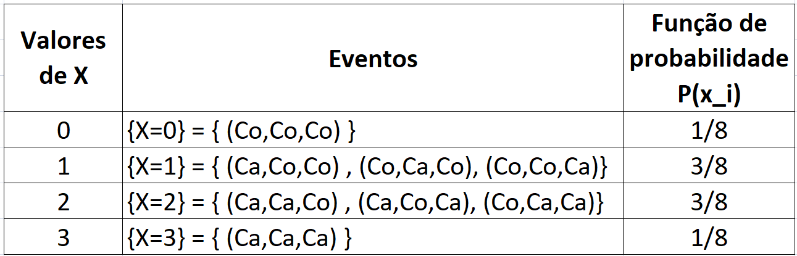
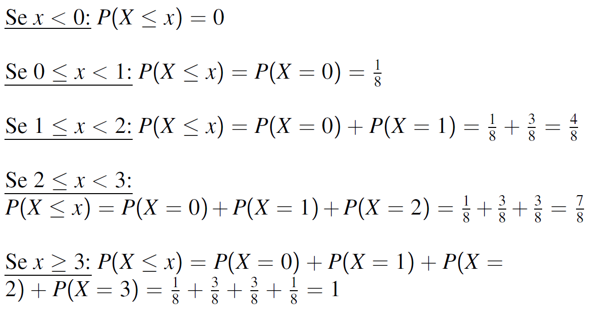
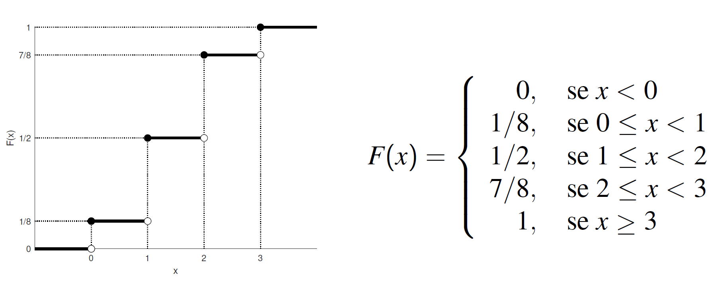
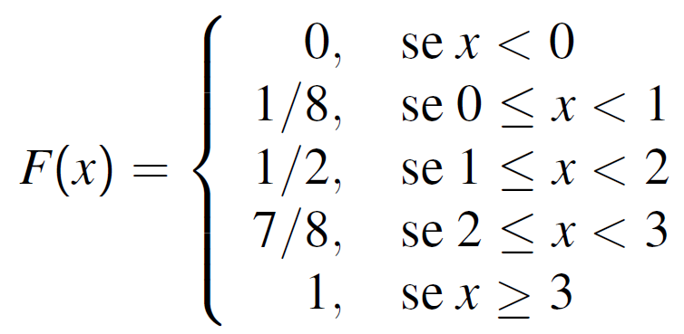
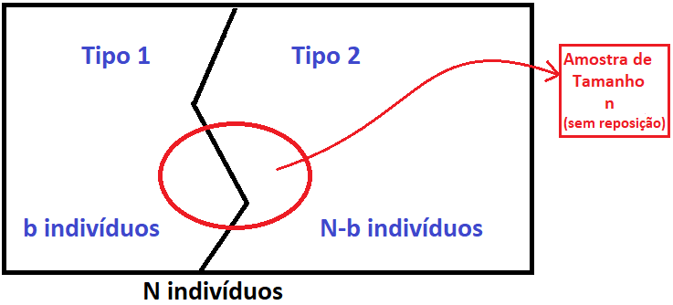

```{r setup, include=FALSE}
knitr::opts_chunk$set(echo = FALSE)
require(magrittr)
library(ggplot2)
require(gridExtra)
require(foreach)
library(latex2exp)
set.seed(13)
```


##

\tableofcontents

# Variável aleatória

## Variável aleatória

**Def.:** uma variável aleatória X é uma função que atribui valor numérico para cada  possível resultado de um experimento.

\footnotesize

- Exemplos: \pause

  - Variável finita discreta \pause
  
    - Lançamento de uma moeda
    $$ 
    X = 
    \begin{cases}
    0, \text{se cara}\\
    1, \text{se coroa}\\
    \end{cases} 
    $$
    \pause
    
    - Número de caras em 3 lançamentos de uma moeda
    $$ 
    X = 
    \begin{cases}
    0, \text{nenhuma cara}\\
    1, \text{uma cara}\\
    2, \text{duas caras}\\
    3, \text{três caras}\\
    \end{cases} 
    $$
    \pause \vspace{-0.2cm}
    
  - Variável infinita discreta \pause
  
    - Número de clientes em um shopping em um determinado dia
    $$
    X \in \{0, 1, 2, 3, \dots \}
    $$ \pause \vspace{-0.2cm}
    
  - Variável contínua \pause
  
    - Volume de combustível em um tanque com capacidade de 50L
    $$
    X \in [0, 50]
    $$  


## Variável aleatória discreta

**Def.:** Seja X uma variável aleatória (v.a.) discreta e $x_1, x_2, \dots$ os possíveis valores de X. Denotamos por $P(X = x_i)$ a probabilidade do evento em que a v.a. $X$ assume o valor $x_i$.
Assim a cada possível resultado $x_i$, associamos o 
número $P(x_i) = P(X = x_i)$ que será denominado **probabilidade** de $x_i$. 

Desta forma, $P(x_i)$ deve satisfazer as seguintes condições:

  - $P(x_i) \in [0, 1], ~~i=1,2,3,\dots$
  
  - $\sum_{i=1}^\infty P(x_i)=1$

\vspace{0.5cm} \pause

**Def.:** A coleção de pares ($x_i, P(x_i)$) para $i=1,2,\dots$ é chamada de **distribuição de probabilidade** da v.a. X.


## Exemplo

**Exemplo:** Seja $X$ o número de caras em 3 lançamentos de uma moeda. \pause

  - Espaço amostral:
      - $\Omega$ = {(Ca,Ca,Ca); 
                    (Ca,Ca,Co); (Ca,Co,Ca); (Co,Ca,Ca); 
                    (Ca,Co,Co); (Co,Ca,Co); (Co,Co,Ca); 
                    (Co,Co,Co)} \pause
                    
  - Modelo probabilistico: 
    - $P(\omega) = 1/8, ~~\forall \omega \in \Omega$ \pause
  
  
  - Função de probabilidade de X: \pause
  
  \center
  {width=70%}
  
  - Verificação: \pause
  
    - $P(x_i) \geq 0,  i=1,2,3,4$
    
    - $\sum_{i=1}^4 P(x_i) = 1/8 + 3/8 + 3/8 + 1/8 = 1$
  
  
  
##

**Def.:** A **função de distribuição acumulada** (f.d.a) de $X$ é definida para qualquer número real $x$ pela seguinte expressão:
$$
F(x) = P(X \leq x).
$$
\pause

No caso discreto, a função de distribuição de X pode ser
calculada como 
$F(x) = \sum_{x_i \leq x} P(X = xi),$ em que os $x_i$'s
representam os possíveis valores de $X$.
  

##

**Exemplo:** para o exemplo anterior (3 lançamentos da moeda), temos:

\center
{width=80%}


##

\center
{width=108%}
  


## Propriedades

A função de distribuição acumulada (f.d.a) possui as seguintes propriedades:

  - F é não decrescente \pause
  
  - $\lim_{x \rightarrow -\infty} F(x) = 0$ \pause
  
  - $\lim_{x \rightarrow \infty} F(x) = 1$ \pause
  
  - Não contínua com saltos nos pontos em que a probabilidade é maior que zero; \pause

  - A altura do salto em um ponto $x$ é justamente a probabilidade de $x$;
  
  
## Exercício:  

**Exercício:** Dado a f.d.a. abaixo, encontre a função de probabilidade.
\center
{width=30%}

  - Note que os pontos com saltos são 0, 1, 2, 3.
  
  
  
## Valor esperado (média)

**Def.:** o **valor esperado** ou valor médio de uma v.a. discreta X que assume os possíveis valores $x_1, x_2,\dots$ é definido como
$$
E[X] = \sum_{i=1}^\infty x_i \,P(x_i)
$$


- Geralmente o valor esperado de uma variável é denotado por $\mu$, pois esse representa uma média populacional.
  
  
  
## Variância e desvio padrão

**Def.:** a **variância** de uma v.a. discreta X que assume os possíveis valores $x_1, x_2,\dots$ é definida como
$$
Var[X] = \sum_{i=1}^\infty (x_i-\mu)^2 \,P(x_i)
$$
em que $\mu = E[X]$. O desvio padrão é a raiz quadrada da variância, isto é, $DP(X) = \sqrt{Var[X]}$.


- Geralmente a variância de uma variável aleatória é denotada por $\sigma^2$ e o desvio padrão por $\sigma$.
  
  
  
## Exemplo

**Exemplo:** para o exemplo anterior (3 lançamentos da moeda), temos:

- Valor Esperado (média): \pause
$$
\begin{aligned}
E[X] &= \sum_{i=1}^\infty x_i \,P(x_i)\\ \pause
     &= 0*P(X=0) + 1*P(X=1) + 2*P(X=2) + 3*P(X=3) \\   \pause    
     &= 0*1/8 + 1*3/8 + 2*3/8 + 3*1/8 \\ \pause
     &= 1.5
\end{aligned}
$$ \pause
  - Interpretação: a média do número de caras em 3 lançamentos de uma moeda é 1.5 caras.
  
  
##


- Variância:

\scriptsize
$$
\begin{aligned}
Var[X] &= \sum_{i=1}^\infty (x_i-E[x])^2 \,P(x_i)\\ \pause
     &= (0-1.5)^2 P(X=0) + (1-1.5)^2 P(X=1) + (2-1.5)^2 P(X=2) + (3-1.5)^2 P(X=3) \\  \pause      
     &= 1.5^2*1/8 + 0.5^2*3/8 + 0.5^2*3/8 + 1.5^2*1/8 \\ \pause
     &= 0.75 \pause
\end{aligned}
$$

\normalsize

- Desvio Padrão: \pause
$$
DP(X) = \sqrt{Var[X]} = \sqrt{0.75} \approx 0.87
$$
  - Interpretação: a variação comum em torno da média $\mu=1.5$ é $\sigma=0.87$ caras.
  
  
  
## Exercício:

**Exercício:** Para um sorteio de 4 prêmios nos valores de \$500.00, \$250.00, \$150.00 e \$75,00 são vendidos 1500 bilhetes por \$2.00 cada um. Imagine que você compre um bilhete, qual é o retorno financeiro esperado desse investimento (desconte o valor investido)?
\pause

- Resposta: \$ -1.35, ou seja, o retorno esperado é perder \$ -1.35, o que corresponde a perder -67.5\% do valor investido.


## Definição

**Def.:** Dado uma variável aleatória X e a respectiva função de probabilidade $P(x)$, então o valor esperado de uma função real h(X) é
$$
E[h(X)] = \sum_{i=1}^\infty h(x_i) P(x_i)
$$
\pause

\vspace{0.7cm}
Obs.: como $\mu = E[X]$ é uma constante, segue da definição que $Var[X] = E[ (X-\mu)^2 ]$.


<!-- **Def.:** Seja X e Y duas variáveis aleatórias, dizemos que X e Y são **independentes** se, e somente se, $P( \{X=x\} \cap \{Y=y\}) = P( \{X=x\}) P( \{Y=y\}, ~~\forall ~x,y$, em que $x$ é qualquer possível valor de X e $y$ é qualquer possível valor de $Y$. -->


## Propriedades do valor esperado e da variância

<!-- 1) Seja X e Y v.a.'s, então -->

<!--   - $E[X+Y] = E[X] + E[Y]$ -->

<!--   - $Var[X+Y] = Var[X] + Var[Y]$, se X e Y são independentes. -->
  
1) Se $a$ e $b$ são constantes, então

a) $E[aX+b] = a E[X] + b$ \pause
  
b) $Var[aX+b] = a^2 Var[X]$ \pause

\vspace{0.2cm}

\small

Demonstração:

a)
$$
\begin{aligned}
E[aX+b] &= \sum_i (a x_i +b) P(x_i) = a \sum_i x_i P(x_i) + b \sum_i P(x_i) \\
        &= a E[X] + b
\end{aligned}
$$
b) Seja $\mu=E[X]$, do item a), temos $E[aX+b] = a \mu + b$, logo
$$
\begin{aligned}
Var[aX+b] &= E[ (aX+b - a\mu-b)^2 ] = E[ a^2 (X - \mu)^2 ]\\
\text{"do item a)"}          &= a^2\, E[  (X - \mu)^2 ]\\
          &= a^2\, Var[X]
\end{aligned}
$$
  
##

2) $Var[X]=E[X^2] - E[X]^2$ \pause

\vspace{0.7cm}

Demonstração: Seja $\mu=E[X]$, então

  $$
  \begin{aligned}
  Var[X] &= E[ (X-\mu)^2 ]\\
            &= E \left [  X^2 -2X\mu + \mu^2  \right ] \\
            &= E[X^2] -2 \mu E[X] + \mu^2\\
            &= E[X^2] -2 \mu^2 + \mu^2\\
            &= E[X^2] - \mu^2\\
            &= E[X^2] - E[X]^2
  \end{aligned}
  $$


## Exercício:

**Exercício:** O tempo $T$, em minutos, necessário para um operador processar uma peça é uma v.a. com a seguinte função de probabilidade

\centering

\begin{tabular}{|c|c|c|c|c|}
\hline
t & 2 & 3 & 4 & 5\\ \hline
p(t) & 0.2 & 0.2 & 0.3 & 0.3\\
\hline
\end{tabular}

\raggedright

Por peça produzida esse operador ganha $\$2$ e mais um bonus de $\$0.5$ por minuto inferior a 5 minutos, ou seja, a renda desse operador por peça produzida é calculada de acordo com a seguinte equação
$$
g(T) = 2 + 0.5 (5-T) = 4.5 - 0.5T.
$$
Determine:

a) a média, a variância e o desvio padrão para o tempo de produção de uma peça. \pause

    - \small Resposta: E[T] = 3.7 min; Var[T] = 1.21 min$^2$; DP[T] = 1.1 min \pause

b)  a média, a variância e o desvio padrão para a renda por peça produzida \pause

    -  \small Resposta: E[g(T)] = 2.65 $\$$; Var[g(T)] = 0.3025 $\$^2$; DP[g(T)] = 0.55$\$$
  
  


## Resolução do exercício:

a)
\small
$$
\begin{aligned}
E[T] &= \sum_{t=2}^5 \,t * p(t) = 2*0.2 + 3*0.2 + 4*0.3 + 5*0.3 = 3.7 ~min
\\
E[T^2] &= \sum_{t=2}^5 \,t^2 * p(t) = 2^2*0.2 + 3^2*0.2 + 4^2*0.3 + 5^2*0.3 = 14.9 ~min^2
\\
Var[T] &= E[T^2] - E[T]^2 = 14.9 - 3.7^2 = 1.21 ~min^2
\\
DP[T] &= \sqrt{Var[T]} = \sqrt{1.21} = 1.1 ~min
\end{aligned}
$$


b)
\small
$$
\begin{aligned}
E[g(T)] &= E[ 4.5 - 0.5T ] = 4.5 -0.5*E[T] = 2.65  ~\$
\\
Var[g(T)] &= Var[ 4.5 - 0.5T ] = (-0.5)^2*Var[T] = 0.3025 ~\$^2
\\
DP[g(T)] &= \sqrt{Var[g(T)]} = \sqrt{0.3025 } = 0.55 ~\$
\end{aligned}
$$


# Modelos probabilísticos para v.a. discretas


## Modelos probabilísticos para v.a. discretas

No curso serão vistos os seguintes modelos para variáveis aleatórias discretas:

- Distribuição Uniforme Discreta

- Distribuição de Bernoulli

- Distribuição Binomial

- Distribuição Geométrica

- Distribuição Hipergeométrica

- Distribuição de Poisson


# Distribuição Uniforme discreta

## Uniforme discreta

**Def.:** A v.a. discreta X que assume os possíveis valores $x_1,x_2,\dots,x_k$, tem distribuição de probabilidade **Uniforme Discreta** se todos os pontos possuem a mesma probabilidade, isto é,
$$
P[X=x_i] = \frac{1}{k}, ~~\forall i=1,2,\dots,k.
$$
\pause

- Valor Esperado
$$
E[X] = \frac{1}{k} \sum_{i=1}^k x_i
$$
\pause

- Variância
$$
Var[X] =  E[X^2] - E[X]^2 =  \frac{1}{k} \sum_{i=1}^k x_i^2 - \left( \frac{1}{k} \sum_{i=1}^k x_i \right)^2
$$
\pause

- Função de distribuição acumulada
$$
F(x) = \sum_{(x_i \leq x)} \frac{1}{k}
$$


## Exemplo

**Exemplo:** Seja X o número na face superior no lançamento de um dado. 

\centering

\begin{tabular}{|c|c|c|c|c|c|c|}
\hline
x & 1  & 2 & 3 & 4 & 5 & 6 \\ \hline
p(x) & $\frac{1}{6}$ & $\frac{1}{6}$ & $\frac{1}{6}$ & $\frac{1}{6}$ & $\frac{1}{6}$ & $\frac{1}{6}$\\
\hline
\end{tabular}

\raggedright

a) Calcule a média e a variância.

    - \small Resposta: $E[X] = 3.5;~~ Var[X] \approx 2.92$

b) Calcule e faça o gráfico da f.d.a.
- \small Resposta:
$$
F(x) = 
\begin{cases}
0, ~~\text{ se } x < 1
\\
1/6, \text{ se } 1 \leq x < 2
\\
2/6, \text{ se } 2 \leq x < 3
\\
3/6, \text{ se } 3 \leq x < 4
\\
4/6, \text{ se } 4 \leq x < 5
\\
5/6, \text{ se } 5 \leq x < 6
\\
1, ~~\text{ se } x \geq 6
\end{cases}
$$

c) Calcule $P[X > 2.5]$ e $P[2 < X \leq 5]$ 

    - \small Resposta: $P[X > 2.5] = 4/6;~~ P[2 < X \leq 5] =  3/6$  
  
  
# Distribuição de Bernoulli

## Bernoulli

\small

**Def.:** Uma v.a. discreta X que assume os possíveis valores $0$ e $1$, tem distribuição de probabilidade **Bernoulli**. O resultado 1 é atribuido para o sucesso de um experimento e o resultado 0 para o fracasso do experimento. A letra "p" é utilizada para denotar a probabilidade do sucesso, ou seja, $P[X=1]=p$ e $P[X=0]=1-p$. \pause

- \small Notação: $$X \sim Bernoulli(p)$$ \pause

- \small Função de probabilidade
$$
P[X=x] = p^x (1-p)^{1-x},~~x=0 \text{ ou } 1
$$ \pause

- \small Valor Esperado
$$
E[X] = p
$$ \pause

- \small Variância
$$
Var[X] =  p(1-p)
$$ 


## Bernoulli

```{r, include=T}

g = foreach( p = c(0.1,0.2,0.3,0.5,0.7,0.9)) %do% {
  x = c(0, 1)
  Px=dbinom(x, size=1, prob=p, log = FALSE)
  
  # Create data
  data <- data.frame(
    x=x ,  
    Px=Px
  )
  
  # Barplot
  g = ggplot(data, aes(x= as.character(x), y=Px)) + 
    geom_bar(stat = "identity") +
    labs(title= paste0("p=",p), x ="x", 
         y = TeX( r'($P(x) = p^x (1-p)^{1-x}$)' ) )
  
  g
}

grid.arrange(g[[1]], g[[2]],g[[3]],g[[4]],g[[5]],g[[6]], ncol=3, nrow=2)

```


##

- \small Função de distribuição acumulada
$$
F(x) = 
\begin{cases}
0,&~~x<0\\
1-p,&~~0\leq x < 1\\
1,&~~ x \geq 1\\
\end{cases}
$$


## Exemplos: 

1) Lançar uma moeda e observar se ocorreu cara
$$
X = 
\begin{cases}
1,& \text{ se o resultado foi cara}\\
0,& \text{ se o resultado não foi cara}\\
\end{cases}
$$ \pause
Logo, suponto que a moeda seja honesta, temos 
$$
X \sim ~Bernoulli( 0.5 )
$$
Então
$$
E[X] = 0.5 \text{ e } Var[X]=0.5*(1-0.5)=0.25
$$


## Exemplos: 

2) Uma pessoa se submete a uma cirurgia em que a probabilidade de sucesso é de 95\%. Então
$$
X = 
\begin{cases}
1,& \text{ se sucesso}\\
0,& \text{ se fracasso}\\
\end{cases}
$$
Logo,  \pause 
$$
X \sim ~Bernoulli( 0.95 )
$$
Então \pause
$$
E[X] = 0.95 \text{ e } Var[X]=0.95*(1-0.95)=0.0475
$$

# Distribuição Geométrica

## Geométrica

**Def.:** Seja $X$ a contagem do número de ensaios independentes de Bernoulli($p$) até ocorrer o primeiro sucesso. Neste caso, dizemos que a v.a. $X$ tem distribuição de probabilidade **Geométrica** com parâmetro $p$. 
\pause

- Possíveis valores de $X$: \pause $1, 2, 3, \dots$ \pause

- Notação: $$X \sim Geometrica(p)$$ \pause

- Função de probabilidade \pause
$$
P[X=x] = p \,(1-p)^{x-1},~~x=  1, 2, 3, \dots
$$ \pause

- Valor Esperado
$$
E[X] = 1/p
$$ \pause


- Variância
$$
Var[X] = \frac{1-p}{p^2}
$$


## Geométrica

```{r, include=T}

g = foreach( p = c(0.1,0.2,0.3,0.5,0.7,0.9)) %do% {
  x = 1:30
  Px=dgeom(x-1, prob=p)
  
  # Create data
  data <- data.frame(
    x=x ,  
    Px=Px
  )
  
  # Barplot
  # Barplot
  g = ggplot(data, aes(x= x, y=Px)) + 
    geom_bar(stat = "identity") +
    labs(title= paste0("p=",p), x ="x", 
         y = TeX( r'($P(x) = p  \,(1-p)^{x-1}$)' ) )
  
  g
}

grid.arrange(g[[1]], g[[2]],g[[3]],g[[4]],g[[5]],g[[6]], ncol=3, nrow=2)

```


##  Geométrica

- Propriedade de **falta de memória**: para $t,s = 0,1,2,3,\dots$, então:
$$
\begin{aligned}
& a) ~P[X \geq t+s | X > s] = P[X \geq t];
\\
& b) ~P[X > t+s | X > s] = P[X > t];
\\
& c) ~P[X = t+s | X > s] = P[X = t];
\end{aligned}
$$

\small \vspace{0.5cm} \pause

  **Demonstração (caso a):**
  
  Primeiramente note que $P[X\geq k] = \sum_{i=k}^\infty p (1-p)^{i-1} = (1-p)^{k-1}$, então:
$$
\begin{aligned}
P[X \geq t+s | X > s] &= \frac{P[ \{X \geq t+s\} \cap \{X > s \} ]}{P[ X > s]} = \frac{P[ X \geq t+s ]}{P[ X \geq s+1]}
\\
&= \frac{ (1-p)^{t+s-1} }{ (1-p)^{s} } = (1-p)^{t-1} = P[X\geq t]
\end{aligned}
$$


## Exemplo

**Exemplo:** Um casal planeja ter filhos até nascer a primeira menina. Supondo que a probabilidade de nascer menino e menina sejam iguais, determine:

a) Quantos filhos são esperados e qual o desvio padrão? \pause

    - Seja X o número total de filhos desse casal, logo $X\sim Geometrica(p=0.5)$ \pause

    - Resposta: $E[X] = 1/p = 2;~~ DP[X] = \sqrt{\frac{1-p}{p^2}} \approx 1.41$ \pause

b) Qual a probabilidade deles gerarem ao todo 4 filhos? \pause

    - Resposta: $P[X=4] = (1-p)^{4-1} p = 0.0625$ \pause

c) Dado que eles já tem 2 filhos homens, qual a probabilidade deles geraram 4 filhos ao todo? \pause

    - Resposta: Dado a propriedade de falta de memória da Geométrica, temos  $P[X=4|X>2] = P[X=2] = 0.25$ 


## Exemplo
\small

**Exemplo:** Um jogador de basquete **acerta** cada lance livre com
probabilidade 0.75, independentemente dos demais. Determine: 

a) Qual a probabilidade de que ele acerte pelo menos três lances antes de
cometer o **primeiro erro**? \pause 

    - \footnotesize Seja X a v.a. que conta o número de lances até ocorrer o **primeiro erro**, logo $X\sim Geometrica(0.25)$; \pause

    - \footnotesize Note que para o jogador acertar os 3 primeiros lances e errar o último é necessário pelo menos 4 lances; \pause
    
    - \footnotesize Resposta: 
$$ 
\begin{aligned} 
  P[X\geq 4] &=  1 - P[X=1] - P[X=2] - P[X=3] \pause
  \\
        &= 1 - 0.75^{0}\,0.25 - 0.75^{1}\,0.25 - 0.75^{2}\,0.25 \pause
  \\      
        &= 0.422
\end{aligned}  
$$ \pause
    

b) Qual a probabilidade de que ele acerte pelo menos 5 cestas até cometer o primeiro erro, sabendo
que ele já acertou 2? \pause 

    - \footnotesize Note que para o jogador acertar os 5 primeiros lances e errar o último é necessário pelo menos 6 lances; \pause

    - \footnotesize Resposta: Dado a propriedade de falta de memória da Geométrica, temos
$$ 
  P[X\geq 6 | X>2] =  P[X\geq 4] = 0.422
$$

## Exercício

Uma linha de produção esta sendo analisada para efeito de controle de qualidade
das peças produzidas. Tendo em vista o alto padrão requerido, a produção é 
interrompida para regulagem toda vez que uma peça defeituosa é observada.
Se 0.05 é a probabilidade de uma peça sair defeituosa, seja $Q$ a variável que 
conta a quantida de peças produzidas até a primeira defeituosa. Assumindo independência
entre as peças, determine:

a) qual a distribuição de probabilidade de Q?

b) qual a média de peças produzidas até aparecer uma com defeito?

c) qual a probabilidade da produção ser interrompida na quinta peça?

d) sabendo que 3 peças já foram produzidas sem defeitos, qual a probabilidade da produção ser interrompida na quinta peça?


## Resposta do exercício

a) $Q \sim Geometrica(0.05)$;

b) $E[Q] = 1/0.05 = 20$;

c) $P[Q=5] = 0.05*0.95^4 = 0.0407$;

d) $P[Q=5|Q>3] = P[Q=2] = 0.05*0.95^1 = 0.0475$;


# Distribuição Binomial

## Binomial

**Def.:** Seja $X$ a contagem do número de sucessos em $n$ ensaios independentes de Bernoulli($p$). Neste caso, dizemos que a v.a. $X$ tem distribuição de probabilidade **Binomial** com parâmetros $n$ e $p$. 
\pause

\small

- Possíveis valores de $X$: \pause $0, 1, 2, \dots, n$; \pause

- Note que por definição uma v.a. $X \sim Binomial(n, p)$ nada mais é que a soma de $n$ variáveis de Bernoulli(p) independentes, digamos, $Y_1, \dots, Y_n$, ou seja,
$$
X = Y_1 + Y_2 + \dots + Y_n;
$$ \pause

- Um possível evento com $x$ sucessos é $\overbrace{1,1,\dots,1}^x, \overbrace{0,0,\dots,0}^{n-x}$ que tem probabilidade $p^x (1-p)^{n-x}$. \pause No entanto,

  - qualquer outra combinação com $x$ sucessos e $n-x$ fracassos terá essa mesma probabilidade; \pause

  - existem ${n \choose x} = \frac{n!}{x! (n-x)!}$ combinações de $x$ sucessos e $n-x$ fracassos; \pause
  
  - logo
  $$
  P[X=x] = {n \choose x} p^x (1-p)^{n-x}, ~~x=0, 1, 2, \dots, n 
  $$


## Binomial
\normalsize

- Notação: $$X \sim Binomial(n , p)$$ \pause

- Possíveis valores de $X: 0, 1, 2, \dots, n$ \pause

- Função de probabilidade
$$
P[X=x] = {n \choose x} p^x (1-p)^{n-x}, ~~x=0, 1, 2, \dots, n
$$ \pause

- Valor Esperado
$$
E[X] = n\,p
$$

- Variância
$$
Var[X] = n\,p(1-p)
$$


## Binomial

```{r, include=T}

g = foreach( p = c(0.1,0.2,0.3,0.5,0.7,0.9)) %do% {
  x = 0:9
  Px=dbinom(x, size=length(x), prob=p, log = FALSE)
  
  # Create data
  data <- data.frame(
    x=as.character(x) ,  
    Px=Px
  )
  
  # Barplot
  # Barplot
  g = ggplot(data, aes(x= x, y=Px)) + 
    geom_bar(stat = "identity") +
    labs(title= paste0("n=9, p=",p), x ="x", 
         y = TeX( r'(P(x))' ) )
  
  g
}

grid.arrange(g[[1]], g[[2]],g[[3]],g[[4]],g[[5]],g[[6]], ncol=3, nrow=2)

```


## Exemplo

**Exemplo:** Seja X o número de caras em 3 lançamentos de uma moeda. Determine:

a) A distribuição de probabilidade de X. \pause
$$
X \sim Binomial(n=3, p=0.5)
$$ 
\pause

b) A probabilidade de sair 2 caras \pause
$$
P[X=2] = {3 \choose 2} 0.5^2 (1-0.5)^{3-2} = 0.375
$$

## Exemplo - Continuação

c) A probabilidade de sair mais que 1 cara \pause \small
$$
\begin{aligned}
P[X>1] &= 1 - P[X\leq1]
\\ \pause
&=  1 - P[X=0] - P[X=1] 
\\ \pause
&= 1-{3 \choose 0} 0.5^0 (1-0.5)^{3-0} - {3 \choose 1} 0.5^1 (1-0.5)^{3-1}
\\ \pause
&= 1-0.125-0.375
\\ \pause
&= 0.5
\end{aligned}
$$

\pause \normalsize

d) A média e a variância \pause \small
$$
E[X] = n\,p = 3 * 0.5= 1.5 \,caras~, ~~~~ Var[X] = n\,p (1-p) = 3 * 0.5* 0.5= 0.75 \,caras^2
$$

## Exemplo

**Exemplo:** A prova de PE é formada por 10 questões de multipla escolha, com 5 alternativas cada uma.
Todas as questões possuem o mesmo peso. 
Para um aluno que chuta todas as questões da prova, determine:

a) A distribuição de probabilidade da sua nota; \pause \small \newline
Seja X a nota do aluno, logo
$$
X \sim Binomial(n=10, p=0.2)
$$
\normalsize \pause
b) A nota esperada e o desvio padrão; \pause \small
$$
E[X] = n \,p= 2 \,pontos~; ~~ DP[X] = \sqrt{ n\,p\,(1-p)} = 1.26 \,pontos
$$
\normalsize \pause
c) A probabilidade desse aluno tirar pelo menos 3 pontos; \pause \small
$$
\begin{aligned}
P[X\geq 3] &= 1 - P[X < 3]
\\ \pause
&=  1 - P[X=0] - P[X=1] - P[X=2]
\\ \pause
&= 1-{10 \choose 0} 0.2^0 \,0.8^{10} - {10 \choose 1} 0.2^1 \,0.8^{9} - {10 \choose 2} 0.2^2 \,0.8^{8}
\\ \pause
&\approx 1-0.107-0.268-0.302
\\ \pause
&\approx 0.323
\end{aligned}
$$

## Exemplo - Continuação

d) A probabilidade desse aluno tirar pelo menos 5 pontos; \pause \small
$$
\begin{aligned}
P[X\geq 5] &= \underbrace{ P[X\geq 3] }_{\text{(c)}} - P[X=3] - P[X=4]
\\ \pause
&\approx 0.323 - {10 \choose 3} 0.2^3 \,0.8^{7} - {10 \choose 4} 0.2^4 \,0.8^{6}
\\ \pause
&\approx 0.323 - 0.201 - 0.088
\\ \pause
&\approx 0.034
\end{aligned}
$$


## Exercício

**Exercício:** Suponha que uma determinada doença esteja presente em 15\% da população. Então para uma amostra aleatória de 8 pessoas dessa população determine:

a) A distribuição de probabilidade do número de doentes;

b) A probabilidade de ter mais que uma pessoa doente; 

c) A probabilidade de ter exatamente uma pessoa doente; 

d) O número esperado de doentes; 

e) O desvio padrão do número de doentes;

\pause

Resposta:

a) $X \sim Binomial(n=8, p=0.15)$
b) $P[X > 1] \approx 0.342$
c) $P[X = 1] \approx 0.385$
d) $E[X] = 1.2\,doentes$
e) $DP[X] = 1.00995 \,doentes$


# Distribuição Hipergeométrica

## Hipergeométrica

**Def.:** Considere uma população com $N$ indivíduos, sendo $b$ do Tipo 1 e $N-b$ do Tipo 2. Suponha que seja coletada uma amostra aleatória **sem reposição** de $n$ indivíduos. Seja $X$ a v.a. que conta o número de indivíduos do Tipo 1 na amostra. Dizemos então que $X$ tem distribuição de probabilidade **Hipergeométrica** com parâmetros $N, b$ e $n$.


\center
{width=60%}

\pause

- Notação
$$
X \sim Hiper(N, b, n)
$$
  com
    - $N \in \mathbb{N}$
    - $b \in \mathbb{N}, b \leq N$
    - $n \in \mathbb{N}, n \leq N$


## Hipergeométrica

- Possíveis valores de X: \pause $\,\max\{0, n - (N-b)\}, \dots, \min\{n,b\}$ \pause

  - Se o tamanho da amostra ($n$) é maior que o número de indivíduos do Tipo 2 ($N-b$), então o valor mínimo de indivíduos do Tipo 1 na amostra será a diferença entre $n$ e $N-b$.

- Função de probabilidade: \pause
$$
P[X=x] = \frac{{b \choose x} {N-b \choose n-x}}{{N \choose n}},~~~ x \in\{\max\{0, n - (N-b)\}, \dots, \min\{n,b\}\}
$$
\pause

- Valor Esperado
$$
E[X] = \frac{n\,b}{N}
$$ 
\pause

- Variância
$$
Var[X] =  \frac{n\,b}{N} \left ( 1 - \frac{b}{N}\right) \left ( \frac{N-n}{N-1}\right)
$$


## Hipergeométrica

```{r, include=T}

g = foreach( n = c(1, 3, 5, 7, 9, 10) ) %do% {
  
  N = 10
  b = 3
  
  x = 0:9
  Px=dhyper(x, m=b, n=N-b, k=n, log = FALSE)
  
  # Create data
  data <- data.frame(
    x=as.character(x) ,  
    Px=Px
  )
  
  # Barplot
  # Barplot
  g = ggplot(data, aes(x= x, y=Px)) + 
    geom_bar(stat = "identity") +
    labs(title= paste0("N=10, b=3, n=",n), x ="x", 
         y = TeX( r'(P(x))' ) )
  
  g
}

grid.arrange(g[[1]], g[[2]],g[[3]],g[[4]],g[[5]],g[[6]], ncol=3, nrow=2)

```

## Exemplo

Uma cartela da mega-sena contém 60 números, que variam de 1 a 60. Sabendo que apenas 6 desses números serão sorteados, suponha que um jogador realiza um jogo marcando 6 números na cartela. Qual a probabilidade de que o
jogador acerte exatamente os 6 números nesta cartela? \pause

- Solução:
  
  - Seja X o total de números que o jogador acerta; \pause
    
    - Logo, $X \sim Hiper (N=60,b=6,n=6)$ \pause

  - Como     
$$
P[X=x] = \frac{{b \choose x} {N-b \choose n-x}}{{N \choose n}} 
$$
  então 
$$
P[X=6] = \frac{{6 \choose 6} {54 \choose 0}}{{60 \choose 6}} = \frac{1}{{60 \choose 6}} =  \frac{1}{50063860}
$$


## Exemplo 2

Nas condições do exemplo anterior, suponha que o jogador marque 7 números na cartela, então calcule a chance dele acertar exatamente 5 números.

- Solução:
  
  - Seja X o total de números que o jogador acerta; \pause
    
    - Logo, $X \sim Hiper (N=60,b=6,n=7)$ \pause

  - Como     
$$
P[X=x] = \frac{{b \choose x} {N-b \choose n-x}}{{N \choose n}} = 
$$
  então 
$$
P[X=5] = \frac{{6 \choose 5} {54 \choose 2}}{{60 \choose 7}} = \frac{8586}{{386206920}} \approx \frac{1}{44981} 
$$


## Exercício

Uma raspadinha contém 35 números (1, 2, 3, ..., 35), e o jogador deve escolher raspar exatamente
14 deles. Caso todos os números divisíveis por 10 apareçam em uma única
cartela, o jogador ganha o prêmio. Qual é a probabilidade de um jogador ganhar o prêmio
ao raspar exatamente uma cartela?
\pause \vspace{0.5cm}

- Resposta: P(X=3) = 0.0556


## Exemplo 3

**Exemplo:** Considere um lote formado por 100 peças das quais 10 são defeituosas. Suponha que seja coletada uma amostra de 5 peças aleatoriamente e sem reposição. Determine:

a) Qual a probabilidade de que a amostra contenha pelo menos uma peça com defeito? \pause

    - Seja X igual ao número de peças com defeito na amostra, logo $X\sim Hiper(N=100, b=10, n=5)$ \pause
  
    - Resposta: \small \pause
$$
\begin{aligned}
P[X\geq 1] &= 1 - P[X=0]
\\ \pause
  &= 1 - \frac{{10 \choose 0} {90 \choose 5}}{{100 \choose 5}}
\\ \pause  
  &\approx 1 - 0.584 = 0.416
\end{aligned}
$$


##

b) Qual o valor esperado e a variância do número de peças com defeito na amostra?

    - Resposta: \small \pause
$$
\begin{aligned}
E[X] &= \frac{n\,b}{N} = \pause \frac{5\,*10}{100} = \pause 0.5 \, peças
\\ 
\pause
\\
Var[X] &= \frac{n\,b}{N} \left ( 1 - \frac{b}{N}\right) \left ( \frac{N-n}{N-1}\right) 
\\ \pause 
&= \frac{5*\,10}{100} \left ( 1 - \frac{10}{100}\right) \left ( \frac{100-5}{100-1}\right)
\\ \pause 
&= 0.432  \, peças^2
\end{aligned}
$$

## Observação

- Vimos que a contagem $X$ dos elementos do tipo 1 em uma amostra aleatória **sem reposição** de uma população finita formada por N indivíduos, dos quais b são do tipo 1, configura $$X \sim Hiper(N, b, n).$$ \pause 

- Note que, na mesma situação, se o processo de amostragem for alterado para **com reposição**, então cada indivíduo poderá ser visto como uma $Bernoulli(p=b/N)$ independente dos demais, ou seja, a contagem será $$X \sim Binomial(n, p=b/N).$$


## Exercício

**Exercício:** repita o exemplo anterior supondo que a amostra de peças foi observada **com reposição**. \pause

  - Resposta: $P[X\geq 1]=0.41, ~~ E[X]=0.5, ~~ Var[X]=0.45$ 


# Distribuição de Poisson


## Poisson

**Interpretação:** Em geral, uma variável aleatória com distribuição Poisson representa o número de
ocorrências de um evento de interesse (sucesso) em um determinado intervalo de tempo. Sendo que a média de ocorrências desse evento usualmente é denotada por $\lambda$. \pause

**Exemplos:** Na prática, existem muitas possibilidades para o emprego da distribuição de Poisson: \pause

a) número de chamadas telefônicas em um call center durante uma 1 hora; \pause

b) número de falhas de um computador no período de uma semana; \pause

c) número de acidentes relatados a uma companhia de seguros durante um mês; \pause

d) número de peças vendidas por uma loja no final de semana; \pause

e) número de clientes que visitam um shopping center em determinado dia;


## Poisson

**Def.:** Seja $X$ uma variável aleatória discreta, que assume todos os valores inteiros não negativos.
Dizemos que X tem distribuição de Poisson com parâmetro $\lambda$ ($\lambda>0$) se sua função de probabilidade é dada por:
$$
P[X=x] = \frac{e^{-\lambda} \, \lambda^x}{x!}, ~~~~ x=0,1,2,\dots
$$ \pause

- Notação:
$$
X \sim Poisson(\lambda)
$$ \pause

- Valor esperado
$$
E[X] = \lambda
$$ \pause

- Variância
$$
Var[X] = \lambda
$$


## Poisson

```{r, include=T}

g = foreach( lambda = c(0.1, 0.5, 1, 3, 5, 7) ) %do% {
  
  x = 0:15
  Px = dpois(x, lambda=lambda, log = FALSE)
  
  # Create data
  data <- data.frame(
    x=x ,  
    Px=Px
  )
  
  # Barplot
  # Barplot
  g = ggplot(data, aes(x= x, y=Px)) + 
    geom_bar(stat = "identity") +
    labs(title= paste0("lambda=",lambda), x ="x", 
         y = TeX( r'(P(x))' ) )
  
  g
}

grid.arrange(g[[1]], g[[2]],g[[3]],g[[4]],g[[5]],g[[6]], ncol=3, nrow=2)

```


## Exemplo

**Exemplo:** Um editor de um jornal descobre que o número médio de erros tipográficos por página do jornal é igual a dois.
Admitindo que o número de erros por página desse jornal segue a distribuição de Poisson, determine a probabilidade de que em uma determinada página o número de erros seja maior que 1.
\pause

- Solução:

    - Seja X o número de erros na página, logo
$$
X \sim Poisson(\lambda)
$$ \pause 
    
    - \vspace{-0.5cm} Note que o enunciado afirma que a média é 2, como sabemos que para o modelo Poisson $\lambda = E[X]$, então concluímos que $\lambda=2$. \pause
    
    - Então
$$
\begin{aligned}
P[X>1] &= 1- P[X \leq 1]
\\ \pause
&= 1-P[X=0]-P[X=1]
\\ \pause
&= 1 - \frac{e^{-2} \, 2^0}{0!} - \frac{e^{-2} \, 2^1}{1!}
\\ \pause
&= 1 - 0.135 - 0.271
\\ \pause
&= 0.594
\end{aligned}
$$
    


## Exercício 1

Considere que o número $X$ de clientes em um dia que procuram um
certo produto em uma loja tenha distribuição Poisson. 
Sabendo que a variância de $X$ é igual a 3, 
determine qual a probabilidade de que em um dia qualquer pelo menos
dois clientes procurem esse produto?

\pause \vspace{0.5cm}

- Resposta: 0.8008
 


## Exemplo 2

Para o exercício anterior, qual o número mínimo de produtos
que devem estar à disposição todos os dias para que a demanda
seja atendida com probabilidade de pelo menos 0.9?

\pause \vspace{0.5cm}

- Solução: 

  - $X$: demanda, $~X \sim Poisson(3)$ \pause
  
  - $k$: estoque \pause
  
  - Pergunta: qual o valor de $k$, tal que, $P[X \leq k]\, \geq\, 0.9$?

 
## Exemplo 2 - continuação

$$
\begin{aligned}
P[X = 0] &= \frac{3^0 e^{-3}}{0!} = 0.0498; ~~\left( P[X \leq 0] = 0.0498 \right )
\\ \pause
P[X= 1] &=  \frac{3^1 e^{-3}}{1!} = 0.1494; ~~\left( P[X \leq 1] = 0.1991 \right )
\\ \pause
P[X= 2] &= \frac{3^2 e^{-3}}{2!}  = 0.2240;~~\left( P[X \leq 2] = 0.4232 \right )
\\ \pause
P[X= 3] &= \frac{3^3 e^{-3}}{3!}  = 0.2240; ~~\left( P[X \leq 3] = 0.6472 \right )
\\ \pause
P[X= 4] &= \frac{3^4 e^{-3}}{4!}  = 0.1680; ~~\left( P[X \leq 4] = 0.8153 \right )
\\ \pause
P[X= 5] &= \frac{3^5 e^{-3}}{5!}  = 0.1008; ~~\left( P[X \leq 5] = 0.9161 \right )
\end{aligned}
$$
  
Logo $k=5$.


    

## Aproximação da Binomial pela Poisson

\small 
Seja $X \sim Binomial(n,p)$ e considere $\lambda = n\, p$, logo para $n$ suficientemente grande de tal modo que $p = \lambda\,/n$ seja bem pequeno, temos a aproximação:
\pause
$$
\begin{aligned}
P[X=x] &= {n \choose x} p^x (1-p)^{n-x} = \frac{n!}{x! (n-x)!} \left( \frac{\lambda}{n} \right )^x  \left(1- \frac{\lambda}{n} \right )^{n-x} 
\\ 
\pause
&= \frac{\lambda^x}{x!}  \underbrace{\left(1- \frac{\lambda}{n} \right )^{n}}_{\approx e^{-\lambda}}  \, 
  \underbrace{ \frac{ n\,(n-1)\,\dots\,(n-x+1) }{n^x}}_{\approx 1}\, 
  \underbrace{\left(1- \frac{\lambda}{n} \right )^{-x}}_{\approx 1}
\\ 
\pause
&\approx \frac{\lambda^x e^{-\lambda}}{x!}
\end{aligned}
$$
\pause

Ou seja, nessa situação a distribuição de probabilidade $Binomial(n,p)$ converge para distribuição de probabilidade $Poisson(\lambda)$, em que $\lambda = n\,p$.
\vspace{0.3cm}

Obs: $\lim_{n \rightarrow \infty} \left(1- \frac{\lambda}{n} \right )^{n} = e^{-\lambda}$ é chamado de limite exponencial.


## Exemplo 3

**Exemplo:** Considere uma industria que produz um determinado tipo de peça para automóveis em que a taxa de falha (peça defeituosa) é de apenas 1 pra 1000.
Imagine que uma montadora recebe um lote de 4000 dessas peças, determine a probabilidade de que seja encontrada 6 peças com defeito (utilize a aproximação da Binomial pela Poisson).\pause

- Solução: \pause

    - Seja X o número de peças com defeito nesse lote, logo \pause $$X \sim Binomial(n=4000, p=1/1000)$$ \pause
    
    - Solução pela Binomial(n=4000, p=0.001): \pause $$P[X=6] = {4000 \choose 6} \,0.001^6 \,(1-0.001)^{4000-6} = 0.10422~~~~ \text{(cálculo difícil)}$$ \pause
    
    - Solução pela Poisson($\lambda$), com $\lambda = n\,p = 4$: \pause $$P[X=6] \approx \frac{4^6 e^{-4}}{6!} = 0.10419$$


## Exercício 2

Uma empresa de seguros liga para 1000 potenciais clientes
em um dia. Se a probabilidade de que cada cliente faça um
seguro é de 0.005, qual a probabilidade de que no máximo dois
seguros sejam fechados? (utilize a aproximação da Binomial pela Poisson)
\pause \vspace{0.5cm}

- Resposta: 0.1247


