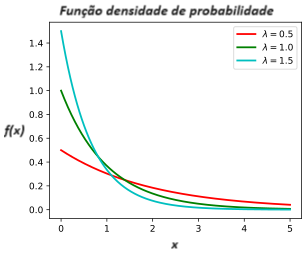
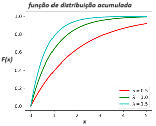
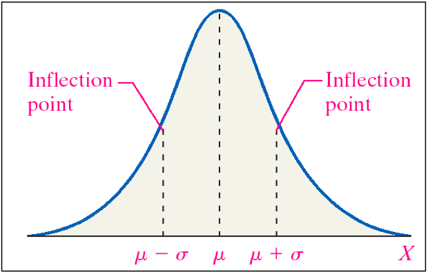
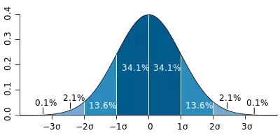

```{r setup, include=FALSE}
knitr::opts_chunk$set(echo = FALSE)
require(magrittr)
set.seed(13)
```

##

\tableofcontents

# Variáveis Aleatórias Contínuas

## Variáveis Aleatórias Contínuas

**Def.:** Uma função X, definida sobre o espaço amostral $\Omega$ e
assumindo valores em um intervalo de números reais, é dita uma
**variável aleatória contínua**;

\vspace{0.3cm} \pause

Exemplos de v.a. contínuas: \pause

-   X = lucro mensal de uma empresa; \pause

-   X = volume de um recipiente; \pause

-   X = tempo de vida de um equipamento; \pause

-   X = tensão suportada por uma corda; \pause

-   X = consumo de energia de uma residência por um determinado período;

## Função Densidade de Probabilidade

**Def.:** Dizemos que $f(x)$ é uma **função densidade de probabilidade**
(f.d.p.) para uma v.a. contínua $X$, se satisfaz as seguintes condições:

i)  $f(x) \geq 0$, para todo $x \in (-\infty, \infty)$

```{=html}
<!-- -->
```
II) A área abaixo de $f(x)$ é igual a 1, i.e., $$
    \int_{-\infty}^\infty f(x) dx = 1
    $$ \pause

-   $f(x)$ relaciona a probabilidade de um intervalo $[a, b]$ à área sob
    a curva $f(x)$ entre os pontos $a$ e $b$, $a<b$, isto é, $$
    P[a \leq X \leq b] = \int_{a}^b f(x) dx
    $$ \pause

  -   OBS: Para variáveis aleatórias contínuas, a f.d.p. $f(x)$ não representa
    a probabilidade de $X = x$.

## 

-   Note que por definição a probabilidade de um ponto indivídual é
    zero, pois, $$
    P[X=k] = P[k \leq X \leq k] = \int_{k}^k f(x) dx = 0.
    $$

\vspace{0.7cm} \pause

-   Além do mais, as probabilidades calculadas sobre
    os intervalos $[a,\,b]$, $(a,\,b]$, $[a,\,b)$ e $(a,\,b)$ são as
    mesmas, pois,
\small    
$$
P[a \leq X \leq b] = P[a < X \leq b] = P[a \leq X < b] = P[a < X < b] =\int_{a}^b f(x) dx
$$

## Função de Probabilidade Acumulada

**Def.:** A **função de distribuição acumulada** (f.d.a.) para uma v.a.
contínua X com f.d.p. $f(x)$ é dada por $$
F(x) = P[X \leq x] = \int_{-\infty}^x f(s) ds
$$

\vspace{0.3cm} \pause

-   Proposição 1: segue diretamente da definição que $$
    P[a \leq X \leq b] = F(b) - F(a)
    $$ \vspace{0.0cm} \pause

-   Proposição 2: segue diretamente da definição que $$
    \frac{d}{dx} F(x) = f(x)
    $$

## Média e Mediana

**Def.:** O **valor esperado** (ou média) de uma v.a. contínua X é dado
pela seguinte expressão: $$
E[X] =  \int_{-\infty}^\infty x\,f(x)\, dx
$$ \pause

-   Geralmente denotamos $\mu = E[X]$ \pause

\vspace{0.5cm}

**Def.:** A **mediana** de uma v.a. contínua X é o valor $Md$ que divide
$50\%$ para cada lado, i.e., 
$$
P[X \leq Md] = 0.5 \text{  e  } P[X \geq Md] = 0.5
$$ ou simplesmente, $$Md = F^{-1}(0.5)$$.

## Variância e desvio padrão

**Def.:** A **variância** de uma v.a. contínua X é dado pela seguinte
expressão: 
$$
Var[X] =  \int_{-\infty}^\infty (x-\mu)^2\,f(x)\, dx
$$ em que $\mu = E[X]$.

\vspace{0.2cm} \pause

-   Assim como para v.a. discretas, temos $$
      Var[X] = E[X^2] - E[X]^2
    $$ \pause

-   Geralmente denotamos $\sigma^2 = Var[X]$ \pause

\vspace{0.5cm}

**Def.:** O **desvio padrão** de uma v.a. contínua X é dado pela seguinte
expressão: $$
DP[X] = \sqrt{Var[X]}
$$

## Exemplo

**Exemplo:** Considere $$
f(x) = 
\begin{cases}
x/6,~~  2 < x < 4
\\
0,~~  \text{ c.c.}
\end{cases}
$$

a)  Verifique que $f(x)$ é uma f.d.p.

b)  Obtenha a f.d.a

c)  Calcule o valor esperado, mediana, variância e desvio padrão

\pause

\vspace{0.2cm}

Solução: \pause

a)  Verificando as condições: \pause

    -   $f(x)\geq 0, ~~\forall x \in \mathbb{R}$ \pause (ok) \pause

    -   $\int_{-\infty}^\infty f(x) dx \pause = \int_{2}^4 x/6\, dx \pause = \left [ x^2/12 \right ]_{x=2}^{x=4} \pause ~= \frac{16 -4}{12} \pause = 1$
        \pause (ok)

## Exemplo - continuação

b)  Como $F(x) = \int_{-\infty}^x f(s)\, ds$, temos: \pause

    -   Se $x \leq 2$, então \pause $F[x] = \int_{-\infty}^x 0\, dx = 0$
        \pause 

    -   Se $2 < x < 4$, então
        \pause $F[x] = \int_{2}^x s/6\, ds \pause = \left [ s^2/12 \right ]_{2}^{x} \pause = \frac{x^2-4}{12}$

    -   Se $x \geq 4$, então \pause $F[x] = 1$ \pause

    ou seja, $$
      F(x) = 
      \begin{cases}
      0~~~~, ~~~~ x \leq 2 \\
      \frac{x^2-4}{12}, ~~ 2 < x < 4 \\
      1~~~~, ~~~~ x \geq 4
      \end{cases}
    $$

## Exemplo - continuação

c)  .

    -   Média: \pause $$
        E[X] =  \int_{-\infty}^\infty x\,f(x)\, dx \pause = \int_{2}^4 x\,\frac{x}{6}\, dx \pause = \left [ x^3/18 \right ]_{2}^{4} \pause \approx 3.11 \pause
        $$

    -   Mediana: \pause sabemos que $P[X \leq Md] = 0.5$, então
        $F[Md]=0.5$, \pause logo $$
        \frac{Md^2 - 4}{12}=0.5 \pause ~~\Rightarrow ~~ Md=\sqrt{10} \pause
        $$

    -   Variância: \pause sabemos que $Var[X] = E[X^2] - E[X]^2$, logo
        precisamos calcular primeiramente $E[X^2]$: \pause $$
        E[X^2] =  \int_{-\infty}^\infty x^2\,f(x)\, dx \pause = \int_{2}^4 x^2\,\frac{x}{6}\, dx \pause = \left [ x^4/24 \right ]_{2}^{4} \pause = 10 \pause
        $$ então $$
        Var[X] = E[X^2] - E[X]^2 \pause \approx 10 - 3.11^2 \pause \approx 0.33
        $$

## Exercício

\small

**Exercício:** A quantia gasta anualmente, em milhões de reais, na
manutenção do asfalto em uma cidade é representada pela variável Y que
possui a seguinte f.d.a. $$
F(y) = 
\begin{cases}
0 ~~~~~~~~~~~~~~~~~~~~~~~~, ~~ y < 0.5
\\
\frac{8}{18} y^2 - \frac{4}{9} y + \frac{1}{9}~~~~, ~~ 0.5 \leq y < 2
\\
1 ~~~~~~~~~~~~~~~~~~~~~~~~, ~~  y \geq 2
\end{cases}
$$

obtenha:
\small

a)  A f.d.p. de $Y$
b)  A probabilidade do gasto total ser menor que 1.2 milhoes e a média de gastos
c)  A probabilidade de no ano atual ser gasto mais que 1.5 milhões,
    sabendo que já foi gasto 1 milhão. \pause

-   Resposta:

    a)  $$
        f(y) = 
        \begin{cases}
        \frac{8}{9} y - \frac{4}{9}, ~~ 0.5 \leq y < 2
        \\
        0~~~~~~~~~,~~~ \text{c.c.}
        \end{cases}
        $$

    b)  $P[Y < 1.2] \approx 0.218,~~ E[Y] = 1.5$

    c) $P[Y > 1.5 | Y> 1 ] \approx 0.625$

## Modelos probabilísticos para v.a. contínuas

Veremos nessa seção os seguintes modelos para variáveis aleatórias
contínuas:

-   Distribuição Uniforme Contínuo

-   Distribuição Exponencial

-   Distribuição Normal

-   Distribuição t-Student

# Modelo Uniforme Contínuo

## Uniforme

**Def.:** Dizemos que uma v.a. contínua X tem distribuição **Uniforme
Contínua** no intervalo $[a, b]$ se a função densidade de probabilidade
(f.d.p.) é dada por $$
f(x) = 
\begin{cases}
\frac{1}{b-a}, ~~\text{se } a \leq x \leq b
\\
0~, ~~~~~~\text{c.c.}
\end{cases}
$$ em que, $a \in \mathbb{R}, b \in \mathbb{R}$ e $a < b$. \pause

-   Notação: $X \sim Uniforme(a, b)$ \pause

-   Média: $$
    E[X] = \frac{a+b}{2}
    $$

\pause

-   Variância: $$
    Var[X] = \frac{(b-a)^2}{12}
    $$

## Uniforme

- Função de distribuição acumulada (f.d.a)

$$
F(x) = \int_{-\infty}^x f(k) dk =
\begin{cases}
0,~~~~~~~ ~\text{se } x < a
\\
\frac{x-a}{b-a}, ~~\text{se } a \leq x \leq b
\\
1~, ~~~~~~ ~\text{se } x > b
\end{cases}
$$ \vspace{0.3cm} \pause  

  - Exercício: mostre.

## Exemplo

**Exemplo:** Um ônibus costuma passar em um determinado ponto a qualquer
instante entre 7:00 e 7:15. Qual a probabilidade de que uma pessoa consiga
pegar o ônibus se ela chegar a esse ponto as 7:10?

\vspace{0.0cm} \pause

-   Solução:

    -   Seja $X$ o instante de chegada do ônibus, logo $$
        X \sim Uniforme(0, 15)
        $$ \pause  

    -   Assim, $$
        \begin{aligned}
        P[X>10] &= 1 - P[X<10]  \pause  
        \\
            &= 1 - F(10)  \pause  
        \\
            &= 1 - \left ( \frac{10-0}{15-0} \right) = 1-2/3  \pause  
        \\
            & = 1/3
        \end{aligned}
        $$

## Exercício

**Exercício:** Para o exemplo anterior calcule o instante esperado da
chegada do ônibus e a variabilidade. \pause  

-   Resposta: $E[X] = 7.5~min$ e $Var[X] = 18.75~ min^2$.

# Modelo Exponencial

## Exponencial

**Def.:** Dizemos que uma v.a. contínua X tem distribuição
**Exponencial** com parâmetro $\lambda$ se a função densidade de
probabilidade (f.d.p.) é dada por $$
f(x) = 
\begin{cases}
\lambda \,e^{-\lambda\,x}, ~~\text{se } x \geq 0
\\
0~, ~~~~~~\text{c.c.}
\end{cases}
$$ em que, $\lambda > 0$. \pause  

-   Notação: $X \sim Exp(\lambda)$ \pause  

-   Média: $$
    E[X] = \frac{1}{\lambda}
    $$ \pause  

-   Variância: $$
    Var[X] = \frac{1}{\lambda^2}
    $$

## Exponencial

- Função de distribuição acumulada (f.d.a)

$$
F(x) = \int_{-\infty}^x f(s) ds =
1-\,e^{-\lambda\,x}, ~~ x \geq 0
$$

\vspace{0.5cm} \pause

  - Exercício: mostre.
  
  
  

## Exponencial - Gráficos

<!--{width=<X>\textwidth}% {width=<1-X>\textwidth}-->

```{r, echo=FALSE,out.width="49.5%", out.height="55%",fig.show='hold',fig.align='center'}

knitr::include_graphics(c("Figuras/Exponential_1.png","Figuras/Exponential_2.png"))
``` 


  

## Aplicações

As aplicações mais comuns para a distribuição exponencial estão
relacionadas a uma área da estatística conhecida como sobrevivência, a
qual estuda modelagens para o tempo até que um determinado evento
ocorra.

\vspace{0.5cm}  \pause

Exemplos:

-   tempo de vida de um aparelho elétrico; \vspace{0.2cm} \pause 

-   tempo até um determinado equipamento necessitar de manutenção;
    \vspace{0.2cm} \pause 

-   tempo de esperada em caixas de supermercado, bancos, lojas, etc;
    \vspace{0.2cm} \pause 

-   expectativa de vida de pessoas (ou animais) de acordo com
    determinadas características;

## Propriedade "Perda de Memória"

**Propriedade:** Se $X\sim Exp(\lambda )$, então $$
P[X > s+t | X>s] = P[X>t], ~~\forall \,s,t > 0.
$$ \vspace{0.2cm} \pause 

-   Essa propriedade é chamada de **perda de memória**.

\vspace{0.2cm}  \pause

-   Exercício: monstre.

## Exemplo

**Exemplo:** O tempo de vida útil $T$ de uma lâmpada segue a
distribuição exponencial com média de 10000 horas. Suponha que se
encomendou um lote de 20000 lâmpadas. Determine: \vspace{0.2cm}

a)  Quantas dessas lâmpadas deverão queimar antes das 10000h de uso?
    \vspace{0.2cm}

b)  Após quantas horas de uso 90$\%$ das lâmpadas do lote deverão estar
    queimadas? \vspace{0.2cm}

c)  Se uma lâmpada já durou 12000h, qual a probabilidade que ela dure
    mais de 20000h ao todo?

## Exemplo - Solução

\small

**Solução:**

-   Como $T \sim Exp(\lambda)$ e $10000 = E[T] = 1/\lambda$, obtemos
    $\lambda=1/10000=10^{-4}$. \pause

-   Além do mais, $f(x) = 10^{-4} e^{-10^{-4} \,x },~ x\geq 0$ e
    $F(x) = 1- e^{-10^{-4} \,x },~ x\geq 0$. \pause

a)  Para 1 lâmpada, note que $$
    P[T<1000] = \pause F(1000) = \pause 1 -e^{-10^{-4} \,10^4 } = \pause 1 - e^{-1} \approx \pause 0.63 \pause
    $$ Para 20000 lâmpadas deverão queimar 20000x0.63 = 12600 delas
    antes de 10000h. \pause

b)  \pause

    $$
    \begin{aligned}
    &P[T < t] = 0.90 \pause
    \\
    \Rightarrow ~~& 1 -e^{-10^{-4} \,t } =0.90 \pause
    \\
    \Rightarrow ~~& e^{-10^{-4} \,t } = 0.10 \pause
    \\
    \Rightarrow ~~& t = -10^4 \,log(0.10) \pause
    \\
    \Rightarrow ~~& t = 23025.85 \,h
    \end{aligned}
    $$

## Exemplo - Solução

\small

**Solução:**

c)  \pause

$$
\begin{aligned}
P[T > 20000 | Y> 12000] \pause &=^{(P.M)} P[T > 8000] \pause
\\
 &= 1 - F(8000) \pause
\\
 &= 1 - (1- e^{-10^{-4} \,8000 }) \pause
\\
 &= e^{-8/10 } \pause
\\
 &\approx 0.45 
\end{aligned}
$$


## Exercício

Seja $X \sim Exp(\lambda)$, sabendo que a média de $X$ é $1/7$, determine o valor de $E[ \,(X-20)^2\, ]$.

- Dica: utilize $Var[X] = E[X^2] - E[X]^2$.
\pause \vspace{1cm}

- Resposta: 394.3265


# Modelo Normal

## Normal

**Def.:** Dizemos que uma v.a. contínua X tem distribuição **Normal**
(ou Gaussiana) com parâmetros $\mu$ e $\sigma^2$ se a função densidade
de probabilidade (f.d.p.) é dada por 
$$
f(x) =  \frac{1}{\sqrt{2 \pi \sigma^2}} \exp \left \{ - \frac{(x-\mu)^2}{2 \sigma^2} \right \}, ~~ x \in \mathbb{R}
$$ 
em que, $\mu \in \mathbb{R}$ e $\sigma^2 \in \mathbb{R}^+$. 

-   Notação: $X \sim Normal(\mu,\sigma^2)$  

-   Gráfico:  

\center

{width="50%"}


## Normal

-   Média: 
$$
    E[X] = \mu
$$
\vspace{0.3cm} \pause

-   Variância: 
$$
    Var[X] = \sigma^2
$$


## Normal - Propriedades

Se $X \sim Normal(\mu, \sigma^2)$, então: \vspace{0.3cm} \pause

-   A f.d.p. tem pontos de inflexão em $\mu-\sigma$ e $\mu+\sigma$; \vspace{0.3cm} \pause

-   A f.d.p. tem ponto máximo em $x = \mu$ com valor
    $f(\mu) = 1/\sqrt{2\pi\sigma^2}$; \vspace{0.3cm} \pause

-   $f(x) \rightarrow 0$, quando $x \rightarrow \pm \infty$; \vspace{0.3cm} \pause

-   $f(x)$ é simétrica em torno da média ($\mu$), isto é,
    $f(\mu+x) = f(\mu-x), ~~\forall x \in \mathbb{R}$; \vspace{0.3cm} \pause

-   Algumas probabilidades importantes:

    -   $P[ X < \mu ] = P[ X > \mu ] = 0.50$

    -   $P[ \mu-\sigma < X < \mu+\sigma ] = 0.6826895$ 

    -   $P[ \mu-2\sigma < X < \mu+2\sigma ] = 0.9544997$

    -   $P[ \mu-3\sigma < X < \mu+3\sigma ] = 0.9973002$


## Normal Padrão

**Teorema:** Seja $X \sim Normal(\mu, \sigma^2)$, então a variável
padronizada definida como 
$$
Z = \frac{X-\mu}{\sigma}
$$ 
tem ditribuição Normal(0; 1). \vspace{0.3cm}

- A distribuição $Normal(0; 1)$ é chamada de **Normal Padrão**.
  {width="50%"}


\vspace{0.5cm} \pause

**Obs:** Esse teorema será útil para calcular probabilidades tanto para
    $Z\sim Normal(0, 1)$, quanto para $X \sim Normal(\mu, \sigma^2)$.


## Normal Padrão

**Demonstração do teorema:** \vspace{0.5cm}

\begin{proof} \vspace{0.5cm}

- Para $\forall z \in \mathbb{R}$, temos:
$$
F_Z(z) = P[Z \leq z] = P[(X-\mu)/\sigma \leq z] = P[X \leq z \sigma + \mu] = F_X (z \sigma + \mu).
$$
- Logo,
$$
f_Z(z) = \frac{d}{ dz} F_Z(z) = \frac{d}{ dz} F_X (z \sigma + \mu) = f_X(z \sigma + \mu) \,*\sigma.
$$
- De onde obtemos:
$$
f_Z(z) = \frac{1}{\sqrt{2 \pi }} \exp \left \{ - \frac{z^2}{2 } \right \}, ~~ z \in \mathbb{R}.
$$
- Ou seja, $Z \sim Normal(0,\, 1)$.


\end{proof}
  


## Normal Padrão

Seja $Z\sim Normal(0, 1)$, então
$$
P( a < Z < b) = \int_{a}^b \frac{1}{\sqrt{2 \pi }} \exp \left \{ - \frac{z^2}{2 } \right \} dz
$$
no entanto, essa integral é desconhecida matematicamente.  \vspace{0.5cm} \pause

  - Contudo, métodos númericos podem ser empregados para aproximar o resultado dessa função.  \vspace{0.5cm} \pause
  
  - Note que $$P( a < Z < b) = P(Z < b) - P(Z < a),$$ 
  ou seja, para calcular a integral anterior basta ter uma forma de calcular $P(Z < z), ~~\forall z \in \mathbb{R}$, ou seja, bastaria conhecer a f.d.a. de $Z$.  


## Tabela da Normal

**Def.:** A função de distribuição acumulada (f.d.a.) de $Z\sim Normal(0, 1)$ será denotada pela função "phi", $\Phi(.)$, isto é,
$$
\Phi(z) = P[Z \leq z] = \int_{-\infty}^z \frac{1}{\sqrt{2 \pi }} \exp \left \{ - \frac{y^2}{2 } \right \} dy
$$
e os valores de $\Phi(.)$ são apresentados na **Tabela de valores da Normal Padrão** (ou simplesmente, Tabela da Normal).
\vspace{0.5cm} \pause

- Ou seja, para calcular  $$P( a < Z < b) = P(Z < b) - P(Z < a) = \Phi(b) - \Phi(a),$$ 
basta encontrar $\Phi(a)$ e $\Phi(b)$ na Tabela da Normal.
\vspace{0.5cm} \pause


- **Exemplo:** $P[0.25 < Z < 1.71] = \Phi(1.71) - \Phi(0.25) = 0.95637 - 0.59871 = 0.35766$.


## Utilizando a tabela

- A normal padrão é simétrica em torno da média que é zero, logo 
$$
P[Z\geq z] = P[Z\leq -z] = \Phi(-z), ~~\forall z \in \mathbb{R}.
$$
\vspace{-0.1cm} \pause

- A tabela da normal adotada no curso apresenta apenas os resultados de $\Phi(z)$ para $z\geq 0$.  \vspace{0.3cm} \pause

- Quando for necessário calcular $\Phi(z)$ para $z<0$, então vamos precisar da seguinte propriedade:
\vspace{0.2cm}

  - **Propriedade:** $\Phi(z) = 1 - \Phi(-z), ~~\forall z \in \mathbb{R}$.  \vspace{0.3cm} \pause

  - Demonstração: Seja $Z \sim Normal(0, 1)$, então
$$
\begin{aligned}
\Phi(z) &= P[Z \leq z]
\\
        &= P[Z \geq -z]     ~~~~~~~~ \text{**simetria**}
\\
        &= 1 - P[Z < -z] ~~~~ \text{**complementar**}
\\
        &= 1 - \Phi(-z)       
\end{aligned}
$$


## Utilizando a tabela

A partir da tabela da normal podemos calcular a probabilidade de um intervalor (a, b) para qualquer variável com distribuição Normal.  \vspace{0.2cm} \pause

- Seja $X \sim Normal(\mu, \sigma^2)$, então
$$
\begin{aligned}
P[a < X < b] \pause &= P \left [ \frac{a-\mu}{\sigma} <  \frac{X-\mu}{\sigma} < \frac{b-\mu}{\sigma}\right ]
\\ \pause
&= P \left [ \frac{a-\mu}{\sigma} <  Z < \frac{b-\mu}{\sigma}\right ]
\\ \pause
&= P \left [ Z < \frac{b-\mu}{\sigma}\right ] - P \left [ Z < \frac{a-\mu}{\sigma}\right ]
\\ \pause
&= \Phi \left (\frac{b-\mu}{\sigma}\right ) - \Phi \left (\frac{a-\mu}{\sigma}\right ) \pause
\end{aligned}
$$
agora para concluir o cálculo basta pegar os valores de $\Phi \left ( \frac{a-\mu}{\sigma}\right )$ e $\Phi \left (  \frac{b-\mu}{\sigma}\right )$ na tabela da normal.


## Exemplos

**Exemplo 1:** Se $X \sim Normal(5; 9)$, determine 

a) $P[X<7]$ 

b) $P[X<2]$

\vspace{0.5cm} \pause

- Solução:

a) $P[X<7] = P\left [ \frac{X-5}{3}<\frac{7-5}{3} \right ] = \Phi \left (\frac{7-5}{3}\right )= \Phi \left ( 0.67 \right ) = 0.74857$  \pause

b) $P[X<2] = \Phi \left (\frac{2-5}{3}\right )= \Phi \left ( -1 \right ) = 1 -\Phi \left ( 1 \right ) = 1 - 0.84134 = 0.15866$

## Exemplos
**Exemplo 2:** Se $X \sim Normal(-3; 25)$, determine $P[-2<X<0]$


\vspace{0.5cm} \pause

- Solução:
$$
\begin{aligned}
P[-2<X<0] &= \Phi \left (\frac{0-(-3)}{5}\right ) - \Phi \left (\frac{-2-(-3)}{5}\right )
\\
  &= \Phi \left (0.6\right ) - \Phi \left (0.2\right )
\\
  &= 0.72575  - 0.57926
\\
  &= 0.14649
\end{aligned}
$$


## Exemplos
**Exemplo 3:** Se $X \sim Normal(20; 25)$ e $P[X>b]=0.60$, encontre o valor de $b$.


\vspace{0.5cm} \pause

- Solução:
$$
\begin{aligned}
0.6 &= P[X>b]
\\
    &= P\left [Z > \frac{b-20}{5}\right]
\\
    &= P\left [Z < -\frac{b-20}{5}\right]
\\
  &= \Phi \left (-\frac{b-20}{5} \right ) 
\end{aligned}
$$
Na tabela da normal, temos $\Phi(0.25) \approx 0.6$, logo
$$
-\frac{b-20}{5} = 0.25
$$
e portanto
$$
b = 18.75
$$


## Exemplos

**Exemplo 4:** Se $X \sim Normal(\mu; 25)$ e $P[X<32]=0.35$, determine $E[X]$.


\vspace{0.5cm} \pause

- Solução:
$$
0.35 = P[X<32] = \Phi \left (\frac{32-\mu}{5} \right )
$$
Note que 0.35 não tem na tabela da normal, no entanto
$$
0.65 = \Phi \left (-\frac{32-\mu}{5} \right )
$$
Agora da tabela da normal, temos $\Phi(0.39) \approx 0.65$, então
$$
-\frac{32-\mu}{5} = 0.39
$$
e portanto
$$
E[X] = \mu = 33.95
$$


## Exemplos

**Exemplo 5:** A massa corporal dos indivídos de uma população tem distribuição de probabilidade Normal.
Seja X a massa corporal de um indivído dessa população selecionado ao acaso. 
Sabendo que P[X<70] = 0.5 e P[X < 60] = 0.3, 
qual é a probabilidade dessa pessoa ter massa superior a 78?

\vspace{0.5cm} \pause

- Solução: 

  - Note que, desejamos calcular $P[X>78]$ e sabemos que $X \sim Normal(\mu, \sigma^2)$. Logo, precisamos primeiramente encontrar os valores de $\mu$ e $\sigma^2$.

  - Como $P[X<70] = 0.5$, concluímos que $\mu = 70$.
  
  - Além do mais, note que
$$
0.3 =  P[X < 60] = P \left [ \frac{X-70}{\sigma} < \frac{60-70}{\sigma} \right ] = \Phi \left ( \frac{-10}{\sigma} \right )
$$
  
  ou equivalentemente, $0.7 = \Phi \left ( \frac{10}{\sigma} \right )$
  

## Exemplos - continuação 

  - na tabela da Normal encontramos $\Phi(0.52) \approx 0.7$, assim
$$
  \frac{10}{\sigma} = 0.52
$$
  concluímos então que $\sigma = 19.23077$.
  
  - Logo,
$$
\begin{aligned}
P[X>78] &= 1 - P[X < 78] = 1 - P \left [ \frac{X-70}{19.23077} < \frac{8}{19.23077} \right ]
\\
    &= 1 - \Phi \left ( 0.416 \right ) \approx 1 - 0.66276 
\\
    &= 0.33724
\end{aligned}
$$


## Exercício

**Exercício:** Suponha que a temperatura média de um dia qualquer seja normalmente distribuída com média $30^o$C e variância 4. Determine:

a) qual a probabilidade de que a temperatura média esteja abaixo dos 31ºC ?

b) qual a probabilidade de que a temperatura média esteja entre 28ºC e 33ºC ?

c) qual a probabilidade da temperatura média ser superior a 32.5ºC ?

d) qual o valor de $k$, tal que a probabilidade da temperatura média ser inferior a $k$ é de 90\%?.


\vspace{0.5cm} \pause

- Resposta: a) 0.69146, b) 0.77453, c) 0.10565 , d) $k=32.56$


## Normal - Propriedades


**Propriedade da transformação linear de normais:** seja $X \sim Normal(\mu, \sigma^2)$, $a \in \mathbb{R}$ e $b \in \mathbb{R}$. Assim para qualquer transformação linear, $Y = aX+b$, temos
$$
Y \sim Normal(a \mu+b ~;~ a^2\sigma^2).
$$

- Ou seja, qualquer transformação linear de uma variável Normal continua sendo Normal, apenas com os devidos ajustes de média e variância:
$$
E[Y] = E[aX+b] = a E[X] +b = a \mu+b
$$
e
$$
Var[Y] = Var[aX+b] = a^2 Var[X] = a^2 \sigma^2
$$


## Normal - Propriedades


Seja $X_1, X_2, \dots, X_n$ variáveis aleatórias independentes com distribuição de probabilidade Normal, com as respectivas médias $\mu_1, \mu_2,\dots,\mu_n$ e respectivas variâncias $\sigma_1^2, \sigma_2^2,\dots,\sigma_n^2$.

\vspace{0.4cm}

- **Propriedade da soma de normais:** 

  Seja $S_n = X_1+X_2+\dots+X_n$, então 
$$
S_n \sim Normal(\mu_1+\mu_2+\dots+\mu_n ~;~ \sigma_1^2+ \sigma_2^2+\dots+\sigma_n^2)
$$

\vspace{0.4cm}

**Obs:** *duas ou mais v.a.'s são ditas independentes quando não existe qualquer relação probabilistica entre elas. A definição formal será apresentada na Unidade V*.


<!-- \vspace{0.2cm} \pause  -->
<!-- - **Propriedade da média de normais:**  -->

<!--   Seja $\bar{X} = \frac{X_1+X_2+\dots+X_n}{n}$, então  -->
<!-- $$ -->
<!-- \bar{X} \sim Normal \left ( \frac{\mu_1+\mu_2+\dots+\mu_n}{n} ~;~ \frac{\sigma_1^2+ \sigma_2^2+\dots+\sigma_n^2}{\sqrt{n}} \right ) -->
<!-- $$ -->


## Exemplo

Um grande empresário possui 3 fábricas em áreas distintas, de modo que o faturamento de uma fábrica não tem qualquer relação com as demais (são independentes). Suponha que o faturamento anual em milhões de reais dessas 3 fábricas sejam representados respectivamente pelas letras X, Y e Q, então sabendo que
$X \sim Normal(1; 4)~,~~Y \sim Normal(2; 1)~,~~Q \sim Normal(1; 1)$,
determine a chance desse empresario fechar o ano com faturamento positivo. 

\pause


- Solução:

  Seja S=X+Y+Q o faturamento anual total desse empresário, logo
$$
S \sim Normal(4 ;~ 6)
$$
então 
$$
\begin{aligned}
P[S>0] &=  P \left [Z > \frac{0-4}{\sqrt{6}} \right] = P \left [Z > -1.63 \right]
\\
&=  1 - P \left [Z < -1.63 \right] = 1 - \Phi( -1.63 )
\\
&= 1 - (1 - \Phi( 1.63 ) ) = \Phi( 1.63 ) = 0,94845
\end{aligned}
$$


## Exercício

Nas mesmas condições do exemplo anterior, suponha que o empresário não seja dono integral das fábricas X, Y e Q, mas que ele tenha apenas participações, de modo que seja dono de 30% de X, 50% de Y e 40% de Q. Ou seja, o faturamento anual do empresario será dado por
$$
S = 0.3 X + 0.5 Y + 0.4 Q.
$$

Determine então a chance desse empresario fechar o ano com faturamento positivo. 
\pause \vspace{0.5cm}

- Resposta: neste caso $S \sim Normal(1.7; 0.77)$ e $P[S>0] = 0.97365$


