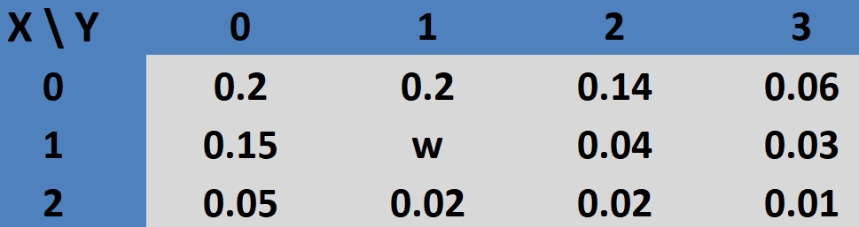
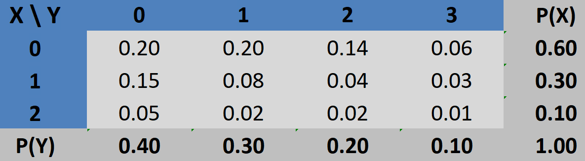
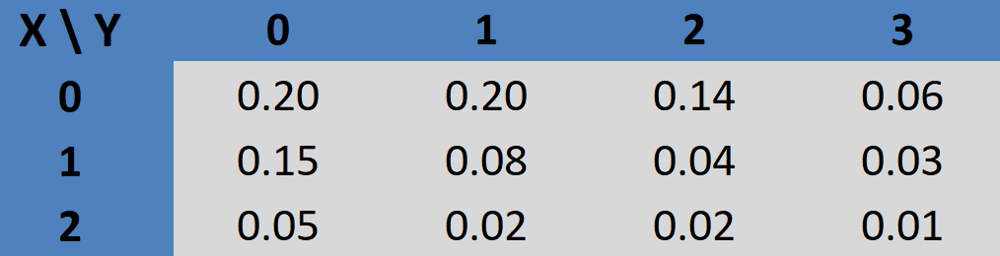
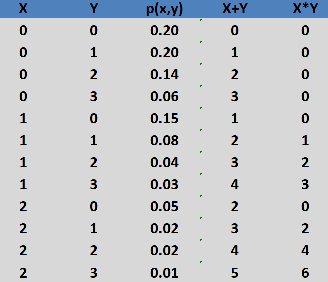
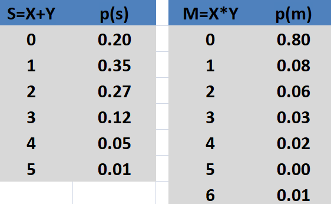
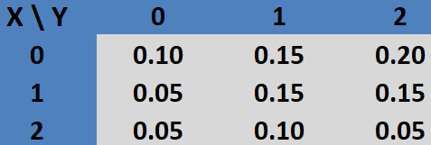
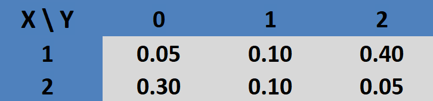

```{r setup, include=FALSE}
knitr::opts_chunk$set(echo = FALSE)
require(magrittr)
set.seed(13)
```


##

\tableofcontents


# Variáveis Aleatórias Bidimensionais 


## Variáveis Aleatórias Bidimensionais

- Até o momento tratamos apenas de variáveis aleatórias unidimensionais; \vspace{0.2cm} \pause

- Existem situações em que podemos estar interessados em observar duas ou mais característica simultameamente, bem como na relação entre elas;  \vspace{0.2cm} \pause

- No curso trataremos apenas de duas variáveis, mas os conceitos que serão estudados podem ser generalizados para três ou mais variáveis aleatórias;


## Variáveis Aleatórias Bidimensionais (Caso Discreto)


**Def.:** O par $(X, Y)$ será uma **variável aleatória bidimensional discreta** se os valores possíveis de $(X, Y)$ forem finitos ou infinitos enumeráveis. \pause

  - Isto é, os valores possíveis de $(X, Y)$ podem ser representados por $(x_i, y_j), i = 1,2, \dots, j = 1,2, \dots$. \pause


\vspace{0.8cm}


**Def.:** Seja $(X, Y)$ uma variável aleatória bidimensional discreta.
A função 
$$p(x_i,y_j) := P(X=x_i, Y=y_j) := P[(X=x_i)\cap (Y=y_j)] $$
que associa um número para cada  possível resultado $(x_i, y_j)$ é chamada de 
 função de **distribuição de probabilidade conjunta** se satisfaz as seguintes
condições: 

i) $p(x_i,y_j)\geq 0$ para todo $(x_i, y_j); ~i, j = 1, 2, \dots$

ii) $\sum_{i=1}^\infty \sum_{j=1}^\infty p(x_i,y_j) = 1$


## Exemplo 1

**Exemplo 1:**
As peças de uma linha de produção apresentam dois tipos de defeitos (A e B). Sendo que do tipo A pode ocorrer dois tipos de defeitos e do tipo B pode ocorrer até 3 tipos. 
Para uma determinada peça, seja X o número de defeitos do tipo A e seja Y o número de defeitos do tipo B.

Suponha que a distruição de probabilidade de (X,Y) é dado pela tabela:


\center
{width=50%}

\raggedright
Determine: 

a) o valor de w 

b) a probabilidade de ocorrer mais defeitos do tipo A que do tipo B 

c) a probabilidade do número de defeitos do tipo A e B serem iguais

d) a probabilidade de ocorrer exatamente dois defeitos do tipo A


## Exemplo 1 - Solução

**Solução:**

a)

  $$\begin{aligned}
1 &= \sum_{x=0}^2 \sum_{y=0}^3 p(x,y) 
\\ \pause
&= 0.2+0.2+0.14+0.06+0.15+p(1,1)+
\\&~~~~ +0.04+0.03+0.05+0.02+0.02+0.01 \pause
\end{aligned}$$

  logo, $w = p(1,1) = 0.08$. \pause

b) $P[X > Y] = \pause p(1,0)+(2,0)+p(2,1) = 0.15+0.05+0.02 = 0.22$ \pause

c) $P[X = Y] = \pause p(0,0)+(1,1)+p(2,2) = 0.2+0.08+0.02 = 0.3$ \pause

d) $P[X = 2] = \pause p(2,0)+(2,1)+p(2,2)+p(2,3) = 0.05+0.02+0.02+0.01 = 0.1$


## Definições

Seja $(X, Y)$ uma variável aleatória bidimensional discreta que assume os possíveis valores 
$(x_i, y_j), i = 1,2, \dots, j = 1,2, \dots$

\vspace{0.3cm} \pause

**Def.:** Função de distribuição acumulada (f.d.a.) conjunta:
$$
F(x,y) = P[X\leq x , Y \leq y], ~~\forall \,(x,y) \in \mathbb{R}^2
$$
\vspace{0.0cm} \pause

**Def.:** Função de Probabilidade Marginal:

  - Marginal de X
$$
P_X (x) = P(X = x) = \sum_{j=1}^\infty p(x, y_j)
$$


  - Marginal de Y
$$
P_Y (y) = P(Y = y) = \sum_{i=1}^\infty p(x_i, y)
$$


## Definições


**Def.:** Função de Probabilidade Condicional de X dado Y:
$$
P(X=x_i|Y=y_j) = \frac{P(X=x_i,Y=y_j)}{ P(Y=y_j) }
$$
\vspace{0.1cm} \pause


**Def.:** Valor esperado condicional de X dado Y:
$$
E(X|Y=y_j) = \sum_{i=1}^\infty \, x_i \,P(X=x_i|Y=y_j)
$$

## Definições 

**Def.:** X e Y são **independentes** se, e somente se,
$$
P(X=x_i,Y=y_j) = P(X=x_i) P(Y=y_j), 
$$
para todo par $(x_i,y_j),~ i = 1,2, \dots;  j = 1,2, \dots$.

\vspace{0.3cm} \pause

- **Obs 1:** se exister pelo menos um par $(x_0,y_0)$, tal que, $P(X=x_0,Y=y_0) \neq P(X=x_0) P(Y=y_0)$, então X e Y não são independentes.

\vspace{0.3cm} \pause

- **Obs 2:** se X e Y são independentes, então

  $P(X=x_i|Y=y_j) = \frac{P(X=x_i,Y=y_j)}{ P(Y=y_j) } = \frac{P(X=x_i) P(Y=y_j)}{ P(Y=y_j) } = P(X=x_i)$

  ou seja, o conhecimento prévio do valor de uma variável não influência na distribuição de probabilidade da outra.


## Exemplo 1 - Continuação

Para os dados do Exemplo 1, determine:

a) as distribuições de probabilidade marginais de X e de Y;

b) O número esperado de defeitos do tipo A;

c) O número esperado de defeitos do tipo B;

d) qual a probabilidade do número de defeitos do tipo A ser menor ou igual a 1 e o número de defeitos do tipo B ser menor ou igual a 2;

e) sabendo que a peça apresentou 2 defeitos do tipo A, qual a probabilidade dela apresentar pelo menos 1 defeito do tipo B? 

f) verifique se X e Y são independentes


## Exemplo 1 - Solução

Solução: \pause
\small

a) Somando as linhas de $p(x,y)$ temos $P_X$ e somando as columas de $p(x,y)$ temos $P_Y$. A planilha completa juntamente com as marginais é dado pela figura abaixo: \pause

\center
{width=60%}

\raggedright

b) 
$E[X] = \pause 0*P (X=0) + 1*P (X=1) + 2*P (X=2) = 0 + 1*0.3+2*0.1 = 0.5$ \pause

c)
$E[Y] = \pause 0*P (Y=0) + 1*P (Y=1) + 2*P (Y=2)+ 3*P (Y=3) = 0 + 1*0.3+2*0.2+3*0.1 = 1$ \pause

d)
$F(1,2) = P(X\leq 1, Y \leq 2) = \pause p(0,0)+p(0,1)+p(0,2)+p(1,0)+p(1,1)+p(1,2) = 0.2+0.2+0.14+0.15+0.08+0.04 = 0.81$ \pause

e) 
$P[Y\geq 1|X=2] = \pause 1 - P[Y< 1|X=2] = 1 - P[Y=0|X=2] = 1 - \frac{P[Y=0,X=2]}{P[X=2]} = 1 - \frac{0.05}{0.10} = 0.5$ \pause

f)
Como $P[X=1,Y=0] = 0.15$ e $P[X=1]P[Y=0] = 0.3*0.4 = 0.12$, concluímos que X e Y não são independentes.


# Valor esperado de função e transformação


## Valor esperado de função

**Def:** Seja (X,Y) uma variável aleatória bidimensional discreta e g(X,Y) uma função real dessas duas
variáveis, então
$$
E[g(X,Y)] = \sum_{i=1}^\infty \sum_{j=1}^\infty g(x_i,y_j)\, p(x_i,y_j).
$$


## Valor esperado da soma

**Teorema:** Nas condições da definição acima, temos
$$
E[X+Y] = E[X]+E[Y]
$$

\vspace{0.2cm} \pause

- **OBS 1:** O mesmo resultado pode ser provado para variáveis contínuas. \vspace{0.2cm} \pause

- **OBS 2:** O resultado pode ser expandido para uma quantidade qualquer de v.a. (discretas ou contínuas), isto é, $E[X_1+X_2+ \dots + X_n] = E[X_1]+E[X_2]+\dots+E[X_n]$.


##

- Demonstração do teorema para o caso discreto (o caso contínuo é análogo):
$$
\begin{aligned}
E[X+Y] &= \sum_{i=1}^\infty \sum_{j=1}^\infty (x_i+y_j)\, p(x_i,y_j)
\\
       &=  \sum_{i=1}^\infty \sum_{j=1}^\infty x_i \,p(x_i,y_j) + \sum_{j=1}^\infty \sum_{i=1}^\infty  y_j\, p(x_i,y_j)\,
\\
       &=  \sum_{i=1}^\infty x_i \underbrace{\sum_{j=1}^\infty  \,p(x_i,y_j)}_{P[X=x_i]} + \sum_{j=1}^\infty  y_j \underbrace{ \sum_{i=1}^\infty \, p(x_i,y_j)}_{P[Y=y_j]}
\\
       &=  E[X] + E[Y]       
\end{aligned}
$$
  

## Transformação de variáveis

Sejam X e Y duas v.a.'s cuja dist. de probabilidade conjunta é conhecida e seja Z = g(X,Y), em que g(.,.) é uma função qualquer.
\vspace{0.3cm} \pause

- Z também é uma v.a. cuja dist. de probabilidade podemos determinar.
\vspace{0.3cm} \pause

- Em particular estudaremos apenas os casos em que Z=X+Y e Z = $X*Y$.
\vspace{0.3cm} \pause

- Vimos que $E[X+Y] = E[X] + E[Y]$ é sempre válido;
\vspace{0.3cm} \pause
  
- No caso do produto, se X e Y são **independentes** então $E[XY] = E[X]E[Y]$;

  - Exercício: mostre.


## Exemplo 1 - Continuação

Como ilustração, utilizaremos o Exemplo 1,
\center
{width=70%}

\raggedright

\vspace{0.2cm} \pause

- Note que X+Y corresponde ao total de defeitos na peça; \vspace{0.2cm} \pause

- $X*Y$ ainda que não tenha uma interpretação direta nesse exemplo poderia ser de interesse em outras situações (ex: se X fosse o número de calças e Y o número de camisas, então $X*Y$ seria o número de combinações).


## Exemplo 1 - Continuação

a) Determine a função de probabilidade de $X+Y$ e $X*Y$: \vspace{0.0cm} \pause

    - Primeiramente vamos escrever todas as possibilidades de (X,Y) por coluna juntamente com as respectivas probabilidades. Também vamos incluir os respectivos resultados de soma e multiplicação. Veja a planilha da esquerda.
\vspace{0.0cm} \pause
  
    - Em seguida, basta escrever quais os possíveis valores da soma e da multiplicação e as respectivas probabilidades. Veja a planilha da direita. 
\vspace{0.0cm}
  
\center
{width=48%} 
{width=45%} 

\raggedright


## Exemplo 1 - Continuação

\normalsize

b) Determine $E[X+Y]$ e $E[XY]$: \vspace{0.0cm} \pause

Solução: do item anteior, temos:

\center
{width=45%}

\raggedright \vspace{0.0cm} \pause

- $E[X+Y] = \pause E[S] = \pause 0*0.2+1*0.35+2*0.27+3*0.12+4*0.05+5*0.01 = 1.5$
\pause

- $E[XY] = \pause E[M] = \pause 0*0.8+1*0.08+2*0.06+3*0.03+4*0.02+5*0.00+6*0.01 = 0.43$
\pause

- **OBS:** No exemplo anterior calculamos $E[X]=0.5$ e $E[Y]=1$, note que
$E[X+Y] = E[X]+E[Y]$ como visto no teorema, no entanto, $E[XY] \neq E[X]E[Y]$, pois X e Y não são independentes.


# Covariância e correlação


## Covariância

**Objetivo:** estudar a relação entre v.a.'s \vspace{0.0cm} \pause

**Def.** Sejam X e Y duas v.a.'s com $\mu_X = E[X]$ e $\mu_Y = E[Y]$, então a 
**covariância** de X e Y é definida como
$$
Cov(X,Y) = E[ (X-\mu_X)(Y-\mu_Y)]
$$
\vspace{0.0cm} \pause 
ou equivalentemente,
$$
Cov(X,Y) = E[XY] - E[X]E[Y].
$$
\vspace{0.0cm} \pause
  
  - Exercício: mostre que $E[ (X-\mu_X)(Y-\mu_Y)] = E[XY] - E[X]E[Y]$. \pause
  
  - Por definição, a covariância possui a escala do produto das variáveis e $Cov(X,Y) \in \mathbb{R}$ (não é limitada). \vspace{0.0cm} \pause
  
    - Por exemplo, se X é medido em centimetros e Y é medido em kilogramas, então a escala da Cov(X,Y) é $cm \times kg$. \vspace{0.0cm} \pause
    
    - Por não ser uma medida padronizada, o valor da covariância não possui interpretação direta. 


##
    
Pode-se mostrar que \vspace{0.2cm} \pause

- $Cov(X,X) = Var[X]$ \vspace{0.2cm} \pause

- $Var[X+Y] = Var[X] + Var[Y] +2Cov(X,Y)$; \vspace{0.2cm} \pause

- $Var[X-Y] = Var[X] + Var[Y] -2Cov(X,Y)$; \vspace{0.2cm} \pause

- $Cov(a\,X +b,\, c\,Y+d) = a\,c\,Cov(X,Y)$, em que $a,b,c,d$ são constantes; \vspace{0.2cm} \pause
 
- Se X e Y são independentes, então $Cov(X,Y)=0$;

  - Neste caso, $Var[X \pm Y] = Var[X] + Var[Y]$;
  
  - Obs: $Cov(X,Y)=0$ **não implica** que X e Y são independentes;
    
      

##

**Exemplo:** Mostre que $Var[X+Y] = Var[X] + Var[Y] +2Cov(X,Y)$.

- Seja $X$ e $Y$ duas variáveis aleatórias com $\mu_X = E[X]$ e $\mu_Y = E[Y]$;

- Então $E[X+Y] = E[X] + E[Y] = \mu_X + \mu_Y$;

- Por definição, sabemos que $Var[X] = E[ (X-\mu_X)^2]$, então 
$$
\begin{aligned}
Var[X+Y] &= E[(X+Y - \mu_X - \mu_Y)^2] 
\\
&= E[\left ( (X - \mu_X) + (Y-\mu_Y) \right )^2]
\\
&= E[(X - \mu_X)^2 + (Y-\mu_Y)^2 + 2(X - \mu_X)(Y-\mu_Y) ]
\\
&= E[(X - \mu_X)^2] + E[(Y-\mu_Y)^2] + 2 E[(X - \mu_X)(Y-\mu_Y)]
\\
&= Var[X] + Var[Y] +2Cov(X,Y).
\end{aligned}
$$

\vspace{0.5cm}
\pause

**Exercício:** Mostre que $Var[X-Y] = Var[X] + Var[Y] -2Cov(X,Y)$.  


## Correlação

**Def.** Sejam X e Y duas v.a.'s com as respectivas médias $\mu_X = E[X]$ e $\mu_Y = E[Y]$ e respectivas variâncias  $\sigma^2_X = Var[X]$ e $\sigma^2_Y = Var[Y]$, então a 
**correlação** de X e Y é definida como
$$
Cor(X,Y) = \frac{Cov(X,Y)}{\sigma_X \, \sigma_Y}
$$
em que $\sigma_X$ é o desvio padrão de X e $\sigma_Y$ é o desvio padrão de Y. \vspace{0.2cm} \pause

- Geralmente denotamos $\rho(X,Y) := Cor(X,Y)$.


## Propriedades da Correlação

**Propriedades:**

1) Por definição, a correlação é uma medida livre de escala; \vspace{0.1cm} \pause

2) A correlação mede a relação linear entre duas variáveis; \vspace{0.1cm} \pause

3) Pode-se mostrar que a correlação é padronizada, pois $-1 \leq Cor(X,Y) \leq 1$; \vspace{0.1cm} \pause

    - Por exemplo, se $Cor(X,Y)=0.5$ e $Cor(X,Z)=0.7$ então podemos afirmar que X e Z possui uma relação linear mais forte que X e Y. \vspace{0.1cm} \pause
  
4) Se X e Y são independentes, então $Cor(X,Y) = 0$. \vspace{0.1cm} \pause

    - Pode-se mostrar que o inverso só é valido quando $X$ e $Y$ tem ambas distribuição normal;  \vspace{0.1cm} \pause
  


## Classificações

  
  - $Cor(X,Y) = 0$ é chamada de correlação nula: não existe relação linear entre X e Y; \vspace{0.1cm} \pause

  - $Cor(X,Y) > 0$, a **correlação é positiva**, quando uma variável cresce isso sugere um valor maior para a outra variável; \vspace{0.1cm} \pause

  - $Cor(X,Y) < 0$, a **correlação é negativa**, quando uma variável cresce isso sugere um valor menor para a outra variável; \vspace{0.1cm} \pause

  - $Cor(X,Y) = 1$, a **correlação é positiva perfeita**, então $Y = aX+b$, com $a>0$; \vspace{0.1cm} \pause

  - $Cor(X,Y) = -1$, a **correlação é negativa perfeita**, então $Y = aX+b$, com $a<0$; \vspace{0.1cm} \pause
  
  - Alguns livros consideram:
  
    - **Correlação forte** se $|Cor(X,Y)| > 0.5$ 
    
    - **Correlação fraca** se $|Cor(X,Y)| < 0.5$


## Exemplo 1 - Continuação

No Exemplo 1, vimos que

\center 

{width=65%}

\raggedright

e já calculamos, $E[XY]= 0.43$, $E[X]= 0.5$ e $E[Y]= 1$. 

Então: \vspace{0.1cm} \pause


- Covariância:
$$
Cov(X,Y) = E[XY] - E[X]E[Y] \pause = 0.43 - 0.50 = -0.07 
$$

##

- Correlação:

   - Primeiramente temos que calcular as variâncias \vspace{0.1cm} \pause
   
      - $E[X^2] = 0^2 *0.6 + 1^2 *0.3+2^2*0.1 = 0.7$ \vspace{0.1cm} \pause
      
      - $\sigma^2_X = Var[X] = E[X^2] - E[X]^2 = 0.7 - 0.5^2 = 0.45$ \vspace{0.1cm} \pause

      - $E[Y^2] = 0^2 *0.4 + 1^2*0.3 +2^2*0.2 +3^2*0.1 = 2$ \vspace{0.1cm} \pause
      
      - $\sigma^2_Y =Var[Y] = E[Y^2] - E[Y]^2 = 2 - 1^2 = 1$ \vspace{0.1cm} \pause
      
  - Agora substituindo os valores na equação, obtemos a correlação:
$$
Cor(X,Y) = \frac{Cov(X,Y)}{\sigma_X \, \sigma_Y} = \frac{-0.07}{\sqrt{0.45} \, \sqrt{1}} = -0.104
$$
    
    Assim, temos uma correlação negativa, mas próxima a zero, o que pode ser considerada fraca.


<!--## Exercício

**Exercício:** um estudo realizado em uma grande universidade relacionou várias informações dos alunos. Em especial, considere X como sendo o número de atividas de extensão e Y o número de horas que o aluno afirma estudar em casa. A distribuição de probabilidade conjunta de X e Y é dada por:

\center
{width=50%}

\raggedright

Qual a correlação entre o número de atividades de extensão
e o número de horas que os alunos estudam na casa? \pause

- Resposta:
\small
  - $E[X] = 0.75, E[X^2] = 1.15, Var[X] = 0.5875$;
  - $E[Y] = 1.2, E[Y^2] = 2, Var[Y] = 0.56$;
  - $E[XY] = 0.85, Cov(X,Y) = -0.05$;
  - $Cor(X,Y) = -0.0871$, por ser negativa, o indicativo seria que quanto mais atividades de extensão, menor é o número de horas de estudo em casa. No entanto, essa relação é pequena, uma vez que o valor está proximo de zero.
-->


## Exercício

**Exercício:** um estudo realizado em uma grande universidade relacionou várias informações dos alunos. Em especial, considere X como sendo o número de atividas de extensão e Y o número de horas que o aluno afirma estudar em casa. A distribuição de probabilidade conjunta de X e Y é dada por:

\center
{width=50%}

\raggedright

Qual a correlação entre o número de atividades de extensão
e o número de horas que os alunos estudam na casa? \pause

- Resposta:
\small
  - $E[X] = 1.45, E[X^2] = 2.35, Var[X] = 0.25$;
  - $E[Y] = 1.1, E[Y^2] = 2, Var[Y] = 0.79$;
  - $E[XY] = 1.3, Cov(X,Y) = -0.295$;
  - $Cor(X,Y) = -0.667$. A correlação é negativa forte, ou seja, o indicativo é que quanto mais atividades de extensão, menor é o número de horas de estudo em casa.
