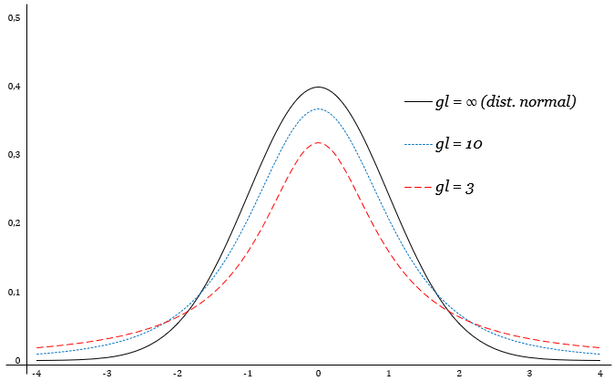
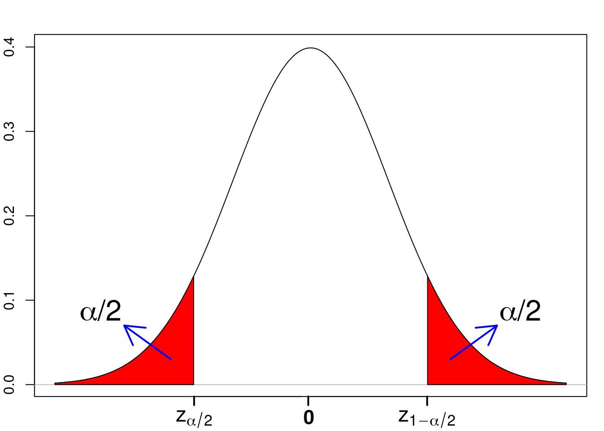

```{r setup, include=FALSE}
knitr::opts_chunk$set(echo = FALSE)
require(magrittr)
set.seed(13)
```


##

\tableofcontents


# Inferência - Introdução


## Inferência - Introdução

\center
{ width=90% }


## Inferência - Introdução

- **Inferência estatística**: refere-se ao uso apropriado de uma amostra da população para se ter conhecimento sobre os parâmetros da população; \pause

- **Parâmetro**: característica numérica da população, em geral desconhecida, para a qual temos interesse. Exemplo: Média ($\mu$), Variância ($\sigma^2$), Proporções ($p$), Taxas ($\lambda$), etc; \pause

- **Estatística**: qualquer função da amostra $T(X_1,\dots,X_n)$ é chamada de estatística. Exemplo: média amostral, variância amostral, proporção amostral, etc. \pause

- **Estimador**: um estimador é uma estatística que possibilita obter informação a respeito de um determinado parâmetro. Geralmente são denotados como sendo o parâmetro com chapéu. Por exemplo: \pause
  
  - a média amostral ($\hat{\mu} = \bar{X}$) é um estimador da média populacional ($\mu$);  \pause

  - a variância amostral ($\widehat{\sigma^2} = S^2$) é um estimador da variância populacional ($\sigma^2$); \pause
  
  - a proporção amostral ($\widehat{p} = n_1/n$) é um estimador da proporção populacional ($p$);


## Inferência - Introdução
  
- **amostra observada**: consiste nos valores observados na amostra, geralmente denotados pelas mesmas letras da v.a., mas minúsculas. Por exemplo, se $X$ é a variável aleatória, então $X_1,\dots,X_n$ denota uma a.a. qualquer da v.a. $X$ e $x_1,\dots,x_n$ denota a amostra que de fato foi observada; \pause 

- **Estimativa**: a estimativa consiste no valor do estimador obtido para a amostra observada;


## Exemplo

Suponha que uma pesquisa eleitoral ouviu 2500 eleitores, escolhidos aleatoriamente, a respeito da intenção deles votarem no candidato A.
Se 1500 responderam que pretendem votar em A, determine a população, a amostra, o parâmetro de interesse, o estimador e a estimativa.

  - População: \pause todos os eleitores; \pause
  
  - Variável: $X \sim Bernoulli(p)$; \pause
   
  - Parâmetro de interesse: \pause 
    
    - $p:$ proporção da população que irá votar em A;  \pause
  
  - Amostra: \pause 2500 ouvidos na pesquisa ($X_1, \dots, X_{2500}$); \pause

  - Estimador:
  
    - $\hat{p} = n_1 / n$, em que $n_1=X_1+\dots+X_{2500}$ é número de eleitores que vão votar em A dentro da amostra e $n=2500$ é tamanho da amostra; \pause

  - Estimativa: \pause
    
    - na amostra foi observado $n_1=1500$ e $n=2500$, logo a estimativa é $\hat{p} = 1500/2500 = 0.6$.


# Estimação Pontual


## Características de um estimador

- Podem existir vários estimadores para um parâmetro; 

- Existem técnicas para decidir qual estimador é o mais adequado;

  - Esses critérios não fazem parte da ementa da disciplina;

- Interessados em aprofundar no assunto podem consultar os tópicos abaixo no livro texto:
  
  - **Viés (vício):** o viés é definido como o erro médio do estimador. Se $\theta$ é o parâmetro de interesse e $\hat{\theta}$ é o estimador, então $Viés = \theta - E[\hat{\theta}]$.
    - é desejável que o estimador em média não apresente erro, ou seja, tenha viés igual a zero;
    
  - **Variância:** é desejável que o estimador apresente a menor variabilidade possível, ou seja, apresente valores semelhantes em diferentes amostras. Quanto menor $Var[\hat{\theta}]$, então melhor é o estimador;
    
  - **Consistência:** Um estimador $\hat{\theta}$ é consistente para estimar $\theta$, se para $\varepsilon > 0$ arbitrário, então $\lim_{n\rightarrow \infty} P(|\hat{\theta} - \theta| > \varepsilon) = 0$.
  
    - é desejável que quanto maior o tamanho da amostra, então mais próximo do valor real esteja o estimador; 
  


## Exemplo viés de estimador

**Exercício:** Compare o víes do estimador $\hat{\sigma}^2 = \frac{1}{n} \sum_{i=1}^n (X_i - \bar{X})^2$ com o víes do estimador  $S^2 = \frac{1}{n-1} \sum_{i=1}^n (X_i - \bar{X})^2$. Lembre que ambos são estimadores de $\sigma^2 = Var[X]$. 
*Utilize que $E[S^2]=\sigma^2$ (demonstrado na Unidade V)*. 
\pause

- Solução: 

  - Como $\hat{\sigma}^2 = \frac{n-1}{n} S^2$, então 
$$
E[\hat{\sigma}^2] =  \frac{n-1}{n} E[S^2] = \frac{n-1}{n} \sigma^2 \pause
$$
  
  - Logo, 
$$
Viés(\hat{\sigma}^2) = \sigma^2 - E[\hat{\sigma}^2] =  \sigma^2/n
$$
mas,
$$
Viés(S^2) = \sigma^2 - E[S^2] = 0
$$
\pause

\vspace{-0.2cm}
- Conclusão: o estimador $\hat{\sigma}^2$ é viesado para $\sigma^2$, mas o estimador $S^2$ é não viesado para $\sigma^2$. Por conta disso, o $S^2$ é geralmente adotado como o principal estimador do parâmetro $\sigma^2$.


# Estimação Pontual - Método dos Momentos

## Estimador do Método dos Momentos

- Seja $X$ uma v.a. com f.d.p. (ou f.p. se discreta) $f(x;\theta)$, em que $\theta = (\theta_1, \theta_2, \dots, \theta_k)'$ é o vetor de tamanho k dos parâmetros desconhecidos. 
\pause
\vspace{0.5cm}

- Seja $X_1,\dots,X_n$ uma a.a. de X. Definimos os k primeiros momentos amostrais como:
$$
m_j = \frac{1}{n} \sum_{i=1}^n X_i^j,~~ j=1,2,\dots,k.
$$
\pause

- Enquanto que os momentos teóricos (populacionais) são definidos como:
$$
\mu_j = E[X^j],~~ j=1,2,\dots,k.
$$


## Estimador do Método dos Momentos

**Def.:** dizemos que $\hat{\theta}_1, \dots, \hat{\theta}_k$ são os estimadores obtidos pelo **método dos momentos** (MM) para os parâmetros $\theta_1, \theta_2, \dots, \theta_k$, respectivamente, se eles forem solução do sistema de equações
$$
\begin{cases}
\mu_1 = m_1
\\
\mu_2 = m_2
\\
~~~~~~\vdots
\\
\mu_k = m_k
\end{cases}
$$


## Exemplo 1

Seja $X \sim Exp(\lambda)$ em que $\lambda$ é desconhecido.
Suponha que uma amostra aleatória de $X$ de tamanho 5 obteve os seguintes valores $3.5; 6.0; 5.2; 2.1; 4.2$. Determine a estimativa de $\lambda$ pelo MM. \pause

- Solução:

  - Sabemos que $E[X] = 1/\lambda$ (Primeiro momento teórico). \pause
  
  - O primeiro momento amostral é $m_1 = \bar{X} = (1/n) \sum_{i=1}^n X_i ~$. \pause
  
  - Igualando o momento teório com o momento amostral temos:
$$
1 / \lambda = \bar{X}
$$
    - ou seja, o estimador de momentos para $\lambda$ é $\widehat{\lambda} = 1/\bar{X}$. \pause
    
  - Como o primeiro momento observado é $\bar{x} = (3.5+6.0+5.2+2.1+4.2)/5 = 4.2$, logo a **estimativa** de $\lambda$ é
$$
\widehat{\lambda} = 1 / 4.2 = 0.2380952
$$


## Exemplo 2

Seja $X \sim Normal(\mu,\sigma^2)$ em que $\mu$ e $\sigma^2$ são ambos desconhecidos.
Suponha que uma amostra aleatória de $X$ de tamanho 5 obteve os seguintes valores $3.5; 6.0; 5.2; 2.1; 4.2$. Determine a estimativa pelo MM de $\mu$ e $\sigma^2$. \pause

- Solução:

  - Momentos teóricos: 
$$
\begin{aligned}
\mu_1 &= E[X] = \mu 
\\
\mu_2 &= E[X^2] = Var[X] + E[X]^2 = \sigma^2+ \mu^2
\end{aligned}
$$
\pause

  - Momentos amostrais observados:
$$
\begin{aligned}
m_1 &= \frac{1}{n} \sum_{i=1}^n X_i =  (3.5+6.0+5.2+2.1+4.2)/5 = 4.2
\\
m_2 &= \frac{1}{n} \sum_{i=1}^n X_i^2 = (3.5^2+6.0^2+5.2^2+2.1^2+4.2^2)/5  = 19.468
\end{aligned}
$$  
  
## Exemplo - continuação

  - Sistema de equações: 
$$
\begin{cases}
\mu_1 =  m_1
\\
\mu_2 =  m_2
\end{cases}
~~\Rightarrow ~~~~~ \pause
\begin{cases}
\mu =   4.2
\\
\sigma^2+ \mu^2 = 19.468
\end{cases}
$$
\pause

  - Logo, a solução do sistema nos da as estimativas $\hat{\mu}=4.2$ e $\hat{\sigma}^2 = 19.468 - 4.2^2= 1.828$.


##


- Apesar de simples, na prática os estimadores de MM são pouco utilizados. 

\pause
\vspace{0.5cm}

- Não raramente o estimador MM não é único, o que é uma característica não desejável na inferência estatística.

\pause
\vspace{0.5cm}


- O Estimador de Máxima Verossimilhança (será visto nos próximos slides) é o mais utilizado na prática.


<!--## Exemplo

**Exercício:** Seja $X\sim Uniforme(a, b)$ e $X_1,\dots,X_4$ uma a.a. de X. Suponha que a amostra observada seja formada pelos seguintes valores: $1.2, 2.0, 3.0, 0.2$. 
Mostre que a estimativa do métodos dos momentos não é única nessa situação.
  
  - Dica: como $E[X] = (a+b)/2$ e $Var[X] = (b-a)^2/12$ é fácil ver que $E[X^2] = (a^2 + ab +b^2)/3 = [(a+b)^2 - ab]/3$. 

\pause 
\vspace{0.5cm}
  
  - Solução: primeiramente, note que $m_1 = 1.6$ e $m_2 = 3.62$. Assim, temos o sistema:
$$
\begin{cases}
\mu_1 =  m_1
\\
\mu_2 =  m_2
\end{cases}
~~\Rightarrow ~~~~~
\begin{cases}
(a+b)/2 =  1.6
\\
[(a+b)^2 - ab]/3 =  3.62
\end{cases}
$$
de onde é fácil ver que o sistema possui duas soluções: $(\widehat{a} = -0.185, \widehat{b}=3.385)$ e $(\widehat{a} = 3.385, \widehat{b}=-0.185)$.-->


# Estimação Pontual - Máxima Verossimilhança


## Estimador de Máxima Verossimilhança

**Def.:**
Seja $X$ uma v.a. com f.d.p. (ou f.p. se discreta) $f(x;\theta)$, em que $\theta$ é o vetor de parâmetros desconhecidos.

Se ${\mathbf x} = (x_1, \dots, x_n)'$ é o valor observado da amostra aleatória, a **função de verossimilhança** é definida como sendo a distribuição conjunta calculada no ponto ${\mathbf x}$, isto é,
$$
L(\theta) := \prod_{i=1}^n f(x_i;\theta)
$$
\pause

- Note que, uma vez que ${\mathbf x}$ é um valor fixo (por ser conhecido), a função de verossimilhança é dependente apenas do parâmetro $\theta$. 
\pause

- A seguir, em muitas situações vamos utilizar o logaritmo da verossimilhança, este será denotado por $\ell(\theta)$, ou seja,
$$
\ell(\theta) := log(L(\theta)) \pause = \sum_{i=1}^n \,\log \left ( f(x_i;\theta) \right )
$$


## Estimador de Máxima Verossimilhança

**Def.:** Um **Estimador de Máxima Verossimilhança** (EMV), $\hat{\theta}$ do parâmetro $\theta$, caso exista, é o valor que maximiza $L(\theta)$, isto é,
$$
\hat{\theta} = \arg \max_\theta \, L(\theta)
$$
\pause ou equivalentemente, uma vez que a função logaritmo é monotoma crescente,
$$
\hat{\theta} = \arg \max_\theta \,\ell (\theta)
$$
\pause

\vspace{0.5cm} $~~~~~~~~$ *verossímil: aquilo que é possível ou provável por não contrariar a verdade; plausível.*


## Estimador de Máxima Verossimilhança

Se $L(\theta)$ é diferenciável em $\theta \in \Theta$, em que $\Theta$ denota o espaço paramétrico (conjunto dos possíveis valores de $\theta$), então o EMV será um ponto crítico de $L(\theta)$, isto é, deverá satisfazer
$$
\left [  \frac{\partial}{\partial \theta} \ell(\theta) \right ]_{\theta = \hat{\theta}}= 0.
$$

\pause 
Uma condição suficiente para sabermos se um ponto crítico é um ponto de máxima, e portanto um EMV, é se
$$
\left [  \frac{\partial^2}{\partial \theta^2} \ell(\theta) \right ]_{\theta = \hat{\theta}} < 0.
$$


## Propriedade da invariância


**Invariância:** pode-se mostrar que se $\hat{\theta}$ é o EMV de $\theta$, então $g(\hat{\theta})$ é o EMV de $g(\theta)$, em que $g(.)$ é uma função qualquer.


## Exemplo 1

Seja $X\sim Bernoulli(p)$ e $x_1,\dots,x_n$ uma a.a. observada de X. Determine o EMV de $p$. \pause

- Função de probabilidade: $f(x;p) = p^x (1-p)^{1-x},~~x \in \{0, 1\}$ \pause

- Verossimilhança: 
$L(p) = \pause \prod_{i=1}^n f(x_i;p) = \pause \prod_{i=1}^n p^{x_i} (1-p)^{1-x_i} = \pause p^{\sum_{i=1}^n x_i} (1-p)^{n-\sum_{i=1}^n x_i} = \pause p^{n \bar{x}} (1-p)^{n(1- \bar{x})}$ 
\pause

- Log-verossimilhança: $\ell(p) = \pause log(L(p)) = \pause n \bar{x} \log p + n(1- \bar{x}) \log(1-p)$ \pause

- Buscando o ponto que maximiza $\ell(p)$: \pause

  - Derivada em $p$
$$
\frac{d}{dp} \ell(p) = \pause \frac{n \bar{x}}{p} - \frac{n (1-\bar{x})}{1-p} \pause
$$

  - Igualando a derivada a zero ($\frac{d}{dp} \ell(p) = 0$), obtemos: $p=\bar{x}$.


## Exemplo 1 - continuação
  
- Verificando se $p=\bar{x}$ é ponto de máximo \pause

  - Segunda derivada:
$$
\frac{d^2}{dp^2} \ell(p) = \pause  -\frac{n \bar{x}}{p^2} - \frac{n (1-\bar{x})}{(1-p)^2} \pause
$$  
  - Vericando em $p=\bar{x}$, temos: \pause
$$
-\left (\frac{n }{\bar{x}} + \frac{n}{1-\bar{x}} \right ) < 0 \pause
$$


- Concluímos então que $\widehat{p}=\bar{x}$ é o EMV.


## Exemplo 2

Suponha que o tempo de vida (em 1000 horas) das lâmpadas produzidas por uma empresa seja uma v.a. X com a seguinte f.d.p $$f(x;\theta) = \theta e^{-\theta x},~~~x\geq0,$$  em que $\theta>0$ é um parâmetro desconhecido. Suponha que uma a.a. de 5 lâmpadas obteve os seguintes tempos de vidas 3.5; 6.0; 5.2; 2.1; 4.2. 
Qual a estimativa de máxima verossimilhança de $\theta$?

- Verossimilhança: $L(\theta) = \prod_{i=1}^n f(x_i;p) = \theta^n \,e^{-\theta \,n \bar{x}}$ \pause

- log-verossimilhança: $\ell(\theta) = n \log (\theta)  -n \,\bar{x}\,\theta$ \pause

- Primeira derivada: $\frac{d}{d\theta} \ell(\theta) = \frac{n}{\theta} -n \,\bar{x}$ \pause

- Buscando ponto crítico: $\frac{d}{d\theta} \ell(\theta) =0 ~~\Rightarrow~~ \hat{\theta}=1/\bar{x}$ \pause

- Confirmando se é ponto de máximo: $\left [ \frac{d^2}{d\theta^2} \ell(\theta) \right ]_{\theta = \hat{\theta}} = \left [ -\frac{n}{\theta^2} \right ]_{\theta = \hat{\theta}} = - n \bar{x}^2 < 0$ \pause (OK!) \pause

- Como $\bar{x} = (3.5+6.0+5.2+2.1+4.2)/5=4.2$, então $\hat{\theta}=1/\bar{x} = 1/4.2 = 0.2380952$  é a estimativa de máxima verossimilhança de $\theta$.


## Exemplo 3

Para o problema do Exemplo 2, determine qual o EMV para $\theta^2$ e calcule a estimativa. \pause


Solução:

- Pela propriedade da invariância, temos que o EMV de $g(\theta) = \theta^2$ é $g(\hat{\theta})$, então
$$
g(\hat{\theta}) = \widehat{\theta^2} = 1/\bar{x}^2 \pause
$$

- Logo a estimativa de $\theta^2$ é $1/4.2^2= 0.05668934$.


## Exercício 1

Seja $X\sim Normal (\mu, \sigma^2)$, com $\mu$ desconhecido e $\sigma^2=4$ conhecido. Seja 
$$
0.7; 0.1; 0.8; 0.7; 0.3
$$
uma a.a. de X.
Mostre que o EMV de $\mu$ é $\hat{\mu} =\bar{X}$ e calcule a estimativa. 


\vspace{0.5cm} \pause
- Estimativa: $\hat{\mu} = 0.52$


## Exercício 2

Seja $X\sim Binomial (m, p)$, com $m=6$ conhecido e $p$ desconhecido. Seja 
$$
2; 5; 0; 1; 4; 3; 6;
$$
uma a.a. de X.
Mostre que o EMV de $p$ é $\hat{p} = \bar{X}/m$ e calcule a estimativa.

\vspace{0.5cm} \pause
- Estimativa: $\hat{p} = 0.5$


<!-- Parte 2 -->


# Estimação Intervalar (intervalo de confiança)


## Resultados importantes (aulas anteriores)


Seja $X_1,\dots,X_n$ uma a.a. de uma população representada pela v.a. $X$, em que a média populacional é $\mu=E[X]$ e a variância  populacional é $\sigma^2=Var[X]$. \pause

- Estimadores pontuais usuais \pause

  - $\bar{X} = \frac{1}{n} \sum_{i=1}^n X_i$ é um estimador de $\mu$ \pause
  
  - $S^2 = \frac{1}{n-1} \sum_{i=1}^n (X_i-\bar{X})^2$ é um estimador de $\sigma^2$ \pause

- Vimos que \pause

  - $E[\bar{X}] = \mu$ \pause

  - $Var[\bar{X}] = \sigma^2 / n$ \pause
  
  - Se $X$ tem distribuição Normal, então:
$$
Z = \left ( \frac{\bar{X} - \mu }{ \sigma / \sqrt{n} } \right ) ~~\sim~~ Normal(0, 1)
$$
\pause


  - Se $X$ não tem distribuição Normal, mas $n$ é grande, então (TCL):
$$
Z = \left ( \frac{\bar{X} - \mu }{ \sigma / \sqrt{n} } \right ) ~~\sim^a~~ Normal(0, 1)
$$


## Distribuição t-Student - Resultado Novo

**Def.** Nas mesmas condições do slide anterior, se $X$ tem distribuição Normal, então
$$
T = \left ( \frac{\bar{X} - \mu }{ S / \sqrt{n} } \right ) ~~\sim~~t_{(n-1)}
$$
em que $t_{(n-1)}$ denota a distribuição de probabilidade **t de Student** com (n-1) graus de liberdade (g.l.).
\vspace{0.2cm} \pause 


- A distribuição **t de Student** foi proposta pelo estatístico inglês W. S. Gosset, que publicou sua pesquisa sob o pseudônimo de "Student".
\vspace{0.2cm} \pause 

- Note que, a variável $T$ se diferencia da $Z$ apenas por trocar $\sigma$ (desvio padrão populacional) pelo $S$ (desvio padrão amostral).
\vspace{0.2cm} \pause 

- Esse resultado é importante pois em muitas situações (que serão vistas a frente) o desvio padrão populacional é desconhecido, mas o desvio padrão amostral é sempre conhecido.


## Distribuição t-Student - Resultado Novo


- Probabilidades envolvendo a **t de Student** podem ser calculadas utilizando a **tabela da t-Student**.  \vspace{0.2cm} \pause 
  - A frente será visto como usar e interpretar a tabela da t-Student, que apesar de semelhante a tabela da Normal(0,1), possui algumas peculariedades.
  
\center
{ width=65% }

\pause

- Para $n$ grande, a distribuição $t_{(gl=n-1)}$ converge para a $Normal(0,1)$. Para $n$ pequeno, a distribuição $t_{(gl=n-1)}$ possui mais probabilidade nas caudas que a $Normal(0,1)$. 


# Estimação Intervalar - Média Populacional


## Intervalo de confiança para a média

- Seja $X_1,\dots,X_n$ uma a.a. de uma população representada pela v.a. $X$, em que a média populacional é $\mu=E[X]$ e a variância  populacional é $\sigma^2=Var[X]$;
\vspace{0.2cm} \pause 

- Escolhida uma probabilidade $C$ conhecida como **nível de confiança** (ou probabilidade de cobertura), o **intervalo de confiança** para a média populacional ($\mu$) é o intervalo $(LI, LS)$, tal que,
$$
C = P[LI < \mu < LS]
$$
ou seja, $C$ é a probabilidade do intervalo $(LI, LS)$ conter o real valor da média populacional (se repetido com multiplas amostras, esse seria o percentual de vezes que o parâmetro estaria dentro do intervalo). \vspace{0.2cm} \pause 


- LI e LS são chamados respectivamente de **Limite Inferior** e **Limite Superior**, os quais são estatísticas (calculadas a partir da amostra).
\vspace{0.2cm} \pause 

- Usualmente, representamos $C=1-\alpha$ em que $\alpha$ é a probabilidade do $\mu$ estar fora do intervalo $(LI, LS)$. 

<!-- A prob. $\alpha$ é conhecida como **nível de significância**. -->


## **Variância conhecida**

\small 

- Suponha que a variância populacional ($\sigma^2$) seja **conhecida**;
\vspace{0.1cm} \pause 

- Dado o nível de confiança $C=1-\alpha$, como
$$
Z = \left ( \frac{\bar{X} - \mu }{ \sigma / \sqrt{n} } \right ) ~~\sim^a~~ Normal(0, 1)
$$
podemos obter os quantis $z_{\alpha/2}$ e $z_{1-\alpha/2}$, tais que
$$
1-\alpha = P[z_{\alpha/2} < Z < z_{1-\alpha/2} ]
$$

\center
{ width=55% } 

- Note que, dado a simetria da Normal, $z_{1-\alpha/2} = - z_{\alpha/2}$.


## Variância conhecida


- Assim,
$$
\begin{aligned}
1-\alpha &= \pause P \left [ -z_{1-\alpha/2} < Z <  z_{1-\alpha/2} \right ]
\\ \pause
&=  P \left [ -z_{1-\alpha/2} < \frac{\bar{X}-\mu}{\sigma / \sqrt{n}} <  z_{1-\alpha/2} \right ]
\\ \pause
&=  P \left [ \bar{X} - z_{1-\alpha/2} \,\frac{\sigma}{\sqrt{n}} < \mu <  \bar{X} +z_{1-\alpha/2} \,\frac{\sigma}{\sqrt{n}} \right ]
\end{aligned}
$$

\pause

- Logo, deduzimos que o limite inferior e o limite superior são dados respectivamente por
$$
\begin{aligned}
LI &= \bar{X} - E
\\
LS &= \bar{X} + E
\end{aligned}
$$
em que, 
$$
E = z_{1-\alpha/2} \,\frac{\sigma}{\sqrt{n}}
$$
\pause

- Uma vez que $\bar{X}$ é o estimador pontual de $\mu$, a quantidade $E$ é chamada de **Erro Amostral** (ou **Margem de Erro**) do estimador pontual.


## Variância conhecida - tamanho da amostra

- E comum que em um estudo o pesquisador fique em dúvida sobre qual o tamanho da amostra que deve ser coletada para ter níveis razoáveis de confiança na estimação.
\vspace{0.4cm} \pause


- Se especificado a priori qual o nível desejado da margem de erro ($E$) e qual a probabilidade de cobertura ($1-\alpha$), então podemos obter o tamanho necessário da amostra isolando "$n$" na equação anterior, ou seja,
$$
n = \left ( z_{1-\alpha/2} \,\frac{\sigma}{E} \right )^2
$$
\pause

- Note que a aplicabilidade dessas equações depende do conhecimento prévio da variância populacional ($\sigma^2$).


## **Variância desconhecida**


- Em muitas situações $\sigma^2$ é **desconhecido**, o que inviabiliza o uso das equações anteriores;
\vspace{0.2cm} \pause

- No entanto, a variância amostral ($S^2$) é conhecida sempre, pois depende apenas da amostra;
\vspace{0.2cm} \pause

- Nessas situações, podemos utilizar a variável t-Student com $n-1$ graus de liberdade, pois
$$
T = \left ( \frac{\bar{X} - \mu }{ S / \sqrt{n} } \right ) ~~\sim~~t_{(n-1)}
$$
\vspace{0.2cm} \pause

- Assim, buscaremos quantis $t_{(\alpha/2, n-1)}$ e $t_{(1-\alpha/2, n-1)}$ da distribuição $t_{(n-1)}$, tais que:
$$
1-\alpha = P[\,t_{(\alpha/2, n-1)} < T < t_{(1-\alpha/2, n-1)} \,].
$$


## Variância desconhecida

- Logo, repetindo o mesmo desenvolvimento feito para o caso de variância conhecida, deduzimos que o limite inferior e o limite superior são dados respectivamente por
$$
\begin{aligned}
LI &= \bar{X} - E
\\
LS &= \bar{X} + E
\end{aligned}
$$
em que, a erro amostral (ou margem de erro) é dada por
$$
E = t_{(1-\alpha/2, n-1)} \,\frac{S}{\sqrt{n}}.
$$


##  Variância desconhecida - tamanho da amostra

- Isolando "$n$" na equação do erro amostral, obtemos
$$
n = \left ( t_{(1-\alpha/2, n-1)} \,\frac{S}{E} \right )^2
$$
no entanto, antes da amostra ser coletada o desvio padrão $S$ não pode ser calculado, bem como o valor de $t_{(1-\alpha/2, n-1)}$ pois a distribuição $t_{(n-1)}$ depende de $n$.
\vspace{0.2cm} \pause


- Usualmente, para contornar esse problema, é coletada um amostra preliminar de tamanho $n_0 > 30$, então é calculada uma variância amostral preliminar ($S_0^2$). 

  - O valor de $t_{(1-\alpha/2, n-1)}$ é aproximado por $z_{1-\alpha/2}$. 
  
  - Em seguida, esses valores são utilizados na equação anterior para aproximar o tamanho necessário da amostra.


## Exemplo 1 - amostra pequena, dist. Normal, variância conhecida

Em uma industria de cerveja o volume da bebida inserida em latas tem distribuição Normal.
Uma amostra com 20 latas acusou média de 346 ml. Obtenha um intervalo de confiança de 95\% 
para a média global, supondo que o desvio padrão, por analogia a outros produtos, é igual a 3 ml.

Solução: \vspace{0.2cm} \pause

- Dados:
  - $\sigma^2 = 3^2 = 9 \,ml^2$ (**variância conhecida**) \pause
  - Amostra: $\bar{x} = 346 \,ml$ e $n=20$ (amostra pequena e dist. Normal) \pause
  - $C=0.95 ~~\Rightarrow~~ \alpha=0.05$ \pause
  - $z_{1-\alpha/2} = z_{0.975}$ \pause


- Valor crítico: $0.975 = P[Z < z_{0.975}] ~~~~\Rightarrow^{\text{tab. Normal}}~~~~ \pause z_{0.975} = 1.96$  \pause

- Erro amostral: $E = z_{1-\alpha/2} \,\frac{\sigma}{\sqrt{n}} \pause = 1.96 \,\frac{3}{\sqrt{20}} = 1.315\,ml$ \pause

- IC(95\% ) para $\mu$: 
$$
(\bar{X}-E~,~\bar{X}+E)  \pause~\Rightarrow  (346-1.315~,~346+1.315) \pause ~\Rightarrow   (344.685 ~~,~~ 347.315)
$$


## Exemplo 2 - amostra grande, variância conhecida

Em uma industria de cerveja o volume da bebida inserida nas latas não possui dist. de probabilidade conhecida.
Uma amostra com 40 latas acusou média de 346 ml. Obtenha um intervalo com 95\% de confiança para a média global, supondo que o desvio padrão, por analogia a outros produtos, é igual a 3 ml.

Solução:  \pause

- Dados:  \pause
  - $\sigma^2 = 3^2 = 9 \,ml^2$ (**variância conhecida**)  \pause
  - Amostra: $\bar{x} = 346 \,ml$ e $n=40$ (amostra grande, aprox. TCL)  \pause
  - $C=0.95 ~~\Rightarrow~~ \alpha=0.05$  \pause
  - $z_{1-\alpha/2} = z_{0.975}$  \pause


- Valor crítico: $0.975 = P[Z < z_{0.975}] ~~~~\Rightarrow^{\text{tab. Normal}}~~~~ z_{0.975} = 1.96$  \pause

- Erro amostral: $E = z_{1-\alpha/2} \,\frac{\sigma}{\sqrt{n}} = 1.96 \,\frac{3}{\sqrt{40}} = 0.93\,ml$  \pause

- IC(95\% ) para $\mu$: 
$$
(\bar{X}-E~,~\bar{X}+E) ~\Rightarrow ~(346-0.93~,~346+0.93) ~\Rightarrow ~(345.07 ~~,~~ 346.93)
$$


## Exemplo 3 - dist. Normal e variância desconhecida

Em uma industria de cerveja o volume da bebida inserida em latas tem distribuição Normal.
Uma amostra com 20 latas acusou média de 346 ml e desvio padrão igual a 4 ml. Obtenha um intervalo de 95\% de cobertura para a média global.

Solução:  \pause

- Dados:
  - $\sigma^2 = ~?$ (**variância desconhecida**)  \pause
  - Amostra: $n=20$,  \pause $\bar{x} = 346 \,ml$ e   \pause $S^2 = 4^2 = 16 \,ml^2$  \pause
  - $C=0.95 ~~\Rightarrow~~ \alpha=0.05$   \pause
  - $t_{(1-\alpha/2, n-1)} = t_{(0.975;~ 19)}$  \pause


- Valor crítico: $0.975 = P[T < t_{(0.975;~ 19)}] \pause ~~~~\Rightarrow^{\text{*tab. t-Stud.*}}~~~~  t_{(0.975;~ 19)} = 2.0930$ \pause

- Erro amostral: $E = t_{(1-\alpha/2, n-1)} \,\frac{S}{\sqrt{n}} \pause =  2.0930 \,\frac{4}{\sqrt{20}} = 1.872\,ml$ \pause

- IC(95\% ) para $\mu$: 
$$
(\bar{X}-E~,~\bar{X}+E) ~\Rightarrow \pause (346-1.872~,~346+1.872) ~\Rightarrow \pause(344.128 ~~,~~ 347.872)
$$

  

## Exemplo 4 - tamanho da amostra

Um pesquisador quer estimar o número médio de horas semanais trabalhadas por funcionários
de mercearias em uma região. Sabendo que uma amostra preliminar com 30 funcionários revelou o desvio padrão igual a 7.9 horas, determine quantos funcionários devem ser incluídos na amostra para estar 95\% confiante que a margem de erro não exceda 1.5 horas?

Solução: \pause

- Dados: $C=95\%; \pause ~E=1.5; \pause ~S_0=7.9$ \pause

- Ponto crítico aproximado: $t_{(1-\alpha/2, n-1)} = \pause t_{(0.975, n-1)} ~~\approx ~~ \pause z_{0.975}=1.96$ \pause

- Tamanho minimo da amostra (conservador):
$$
n = \left ( t_{(1-\alpha/2, n-1)} \,\frac{S}{E} \right )^2 \approx \pause \left ( 1.96* \,\frac{7.9}{1.5} \right )^2  = \pause 10.32^2 = 106.5024
$$
ou seja, são necessários no mínimo 107 funcionários para que a margem de erro não ultrapasse 1.5 horas.


# Estimação Intervalar - Proporção Populacional


## Proporção populacional - lembrete

- Se $X \sim Bernoulli(p)$, então
$$
X = \begin{cases}
1: ~ \text{se o indivíduo possui a característica}
\\
0: ~ \text{se não possui a característica}
\end{cases}
$$
Além do mais
$$
\mu = E[X] = p ~~~~ \text{e} ~~~~ \sigma^2 = Var[X]=p(1-p) 
$$
\pause

- Seja $X_1,\dots,X_n$ uma a.a. de $X$,
  
  - Estimador pontual usual é a proporção amostral, mas essa é igual a média amostral
$$
  \hat{p} = \frac{X_1+\dots+X_n}{n} = \bar{X} \pause
$$

  - Pelo TCL, temos que para amostras grandes
$$
Z = \left ( \frac{\hat{p} - p }{ \sigma / \sqrt{n} } \right ) ~~\sim^a~~ Normal(0, 1)
$$
em que $\sigma = \sqrt{p(1-p)}$.


## Intervalo de confiança para a proporção populacional


- Uma vez que a proporção populacional é simplesmente a média populacional de uma variável binária (Bernoulli), temos que o intervalo de confiança, caso $\sigma^2$ fosse conhecido, seria dado por:
$$
\begin{aligned}
LI &= \widehat{p} - E
\\
LS &= \widehat{p} + E
\end{aligned}
$$
em que, 
$$
E = z_{1-\alpha/2} \,\frac{\sigma}{\sqrt{n}}
$$
desde que $n$ seja suficientemente grande, uma vez que estamos utilizando o TCL. \pause


- No entanto, nesse problema sabemos que $\sigma^2 = p (1-p)$, ou seja, $\sigma^2$ depende de $p$ que é o valor que estamos estimando. Desta forma, conhecemos a equação de $\sigma^2$, mas não somos capazes de calcular o valor.  
\pause

- Existem duas abordagens para contornar esse problema: **otimista** e **conservadora**;


## Intervalo de confiança para a proporção populacional

- **Abordagem Otimista:** uma vez que a proporção amostral ($\hat{p}$) é conhecida, podemos aproximar $\sigma^2 = p (1-p)$ por sua estimativa, isto é, $\hat{\sigma}^2 = \hat{p} (1-\hat{p})$. Neste caso, a margem de erro é adotada como sendo
$$
E \,= z_{1-\alpha/2} \,\frac{\hat{\sigma}}{\sqrt{n}} \,= \pause z_{1-\alpha/2} \,\sqrt{\frac{\hat{p} (1-\hat{p})}{n}}
$$
\vspace{0.5cm} \pause

- **Abordagem Conservadora:** como $\sigma^2 = p (1-p)$ e $p \in (0,\,1)$ é fácil ver que a variância é uma função limitada com valor máximo igual a 0.25, isto é, $p (1-p) \leq 0.25, ~\forall p \in (0,\,1)$. Assim, de modo conservador, adotamos o valor máximo da variância para calcular a margem de erro:
$$
E \,= z_{1-\alpha/2} \,\frac{\sqrt{0.25}}{\sqrt{n}} \,= z_{1-\alpha/2} \,\frac{0.5}{\sqrt{n}}
$$


## Intervalo de confiança para a proporção - tamanho de amostra


Dado o nível de confiança ($C=1-\alpha$) e um valor máximo pra margem de erro (E), o tamanho mínimo necessário para a amostra geralmente é calculado isolando "$n$" na equação da margem de erro. \vspace{0.3cm} \pause

- **Abordagem otimista**
$$
n \,=  \left (  z_{1-\alpha/2} \,\frac{ \, \sqrt{ \tilde{p} \, (1-\tilde{p})} }{E} \right )^2 
$$
  - **OBS:** neste caso, $\tilde{p}$ faz referência a proporção amostral de um estudo anterior (ou preliminar).
  \vspace{0.3cm} \pause


- **Abordagem conservadora**
$$
n \,=  \left (  z_{1-\alpha/2}\,\frac{  \, 0.5 }{E} \right )^2
$$


## Exemplo 1

Uma pesquisa eleitoral ouviu 600 eleitores escolhidos de forma aleatória. Cem dessas pessoas responderam que pretendem votar no candidato A. Qual a estimativa pontual e intervalar da intenção de votos em A?
Considere nível de confiança de 95\%.


Solução: \pause

- Amostra
$$
\begin{aligned}
n &=600 \pause
\\
\hat{p} &= \pause \frac{100}{600} \approx 0.17 ~~~~\text{(estimativa pontual)}
\end{aligned}
$$

\pause

- Nível de confiança: $95 \%$
$$
   C=0.95 ~~\Rightarrow \pause \alpha = 0.05 ~~\Rightarrow \pause z_{1-\alpha/2}=z_{0.975}=1.96
$$
   

## Exemplo 1- continuação

- Intervalo de confiança **otimista**

  - Margem de erro:
$$
E = z_{1-\alpha/2} \,\sqrt{\frac{\hat{p} (1-\hat{p})}{n}} = \pause  1.96 \,\sqrt{\frac{0.17* (1-0.17)}{600}} = 0.03 \pause
$$

  - IC (95\%):
$$
\begin{aligned}
IC(95\%)&: (\hat{p}-E ~~,~~ \hat{p}+E) \pause
\\
&:(0.17-0.03 ~~,~~0.17+0.03)  \pause
\\
&:(0.14 ~~,~~0.20) \pause
\end{aligned}
$$
  
  - A pesq. revelou 17\% de intenção de votos, a margem de erro é de 3 pontos percentuais para mais ou para menos. A probabilidade da pesquisa revelar a real intenção de votos é de 95\%.


## Exemplo 1- continuação

- Intervalo de confiança **conservador**

  - Margem de erro:
$$
E = z_{1-\alpha/2} \,\frac{0.5}{\sqrt{n}} = \pause  1.96 \,\frac{0.5}{\sqrt{600}} \approx 0.04 \pause
$$

  - IC (95\%):
$$
\begin{aligned}
IC(95\%)&: (\hat{p}-E ~~,~~ \hat{p}+E) \pause
\\
&:(0.17-0.04 ~~,~~0.17+0.04)  \pause
\\
&:(0.13 ~~,~~0.21) \pause
\end{aligned}
$$

  - A pesq. revelou 17\% de intenção de votos, a margem de erro é de 4 pontos percentuais para mais ou para menos. A probabilidade da pesquisa revelar a real intenção de votos é de 95\%.


## Exemplo 2

Com 95\% de confiança, determine o tamanho mínimo da amostra para garantir que a margem de erro de uma pesquisa eleitoral não ultrapasse 2 pontos percentuais. Sabendo que uma pesquisa preliminar obteve $\tilde{p} = 0.2$, utilize a abordagem otimista. \pause

Solução:

- Dados
  - $C=0.95 ~~\Rightarrow \pause \alpha = 0.05 ~~\Rightarrow \pause z_{0.975}=1.96$ \pause
  - E=0.02 \pause
  
- Tamanho mínimo da amostra  
$$
n \,=  \left (  z_{1-\alpha/2} \,\frac{ \, \sqrt{ \tilde{p} \, (1-\tilde{p})} }{E} \right )^2 \pause =   \left ( 1.96 \,\frac{\sqrt{ 0.2 \, (1-0.2)}}{0.02} \right )^2 = 1536.64  \pause
$$

- Assim, são necessárias 1537 pessoas para que a margem de erro otimista seja de 2 pontos percentuais. 


## Exemplo 3

Com 95\% de confiança, determine o tamanho mínimo da amostra para garantir que a margem de erro de uma pesquisa eleitoral não ultrapasse 2 pontos percentuais. Utilize a abordagem conservadora.
\pause

Solução:

- Dados
  - $C=0.95 ~~\Rightarrow \pause \alpha = 0.05 ~~\Rightarrow \pause z_{0.975}=1.96$ \pause
  - E=0.02 \pause
  
- Tamanho mínimo da amostra  
$$
n \,=  \left ( z_{1-\alpha/2} \,\frac{0.5}{E} \right )^2 \pause=   \left ( 1.96 \,\frac{0.5}{0.02} \right )^2 = 2401  \pause
$$

- Assim, são necessárias 2401 pessoas para que a margem de erro conservadora seja de 2 pontos percentuais. \pause

- Pesquisas eleitorais tradicionais costumam utilizar a abordagem conservadora e arredondar para 2500 pessoas.


