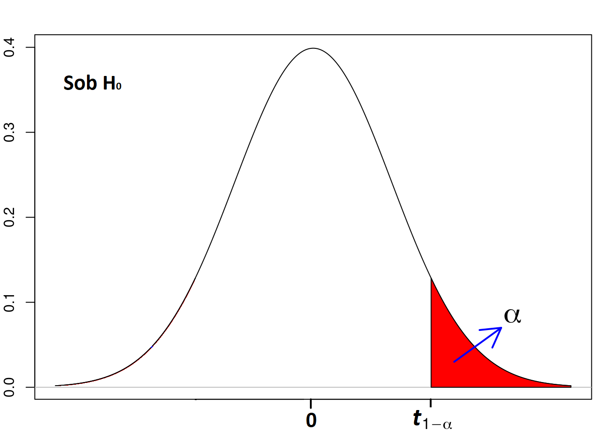
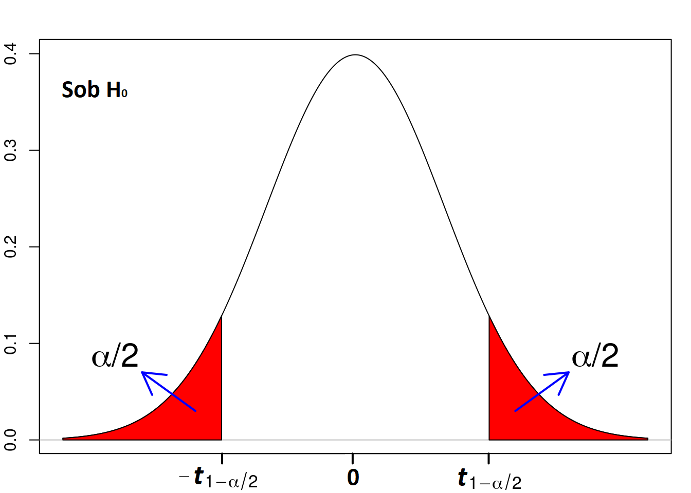
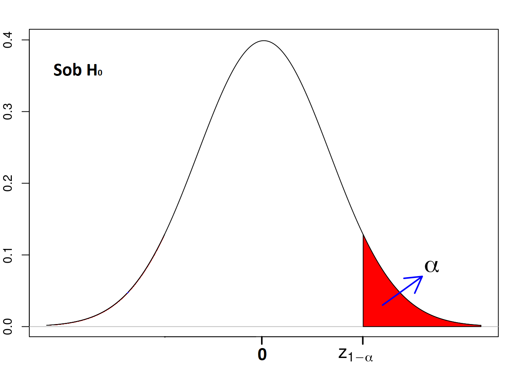
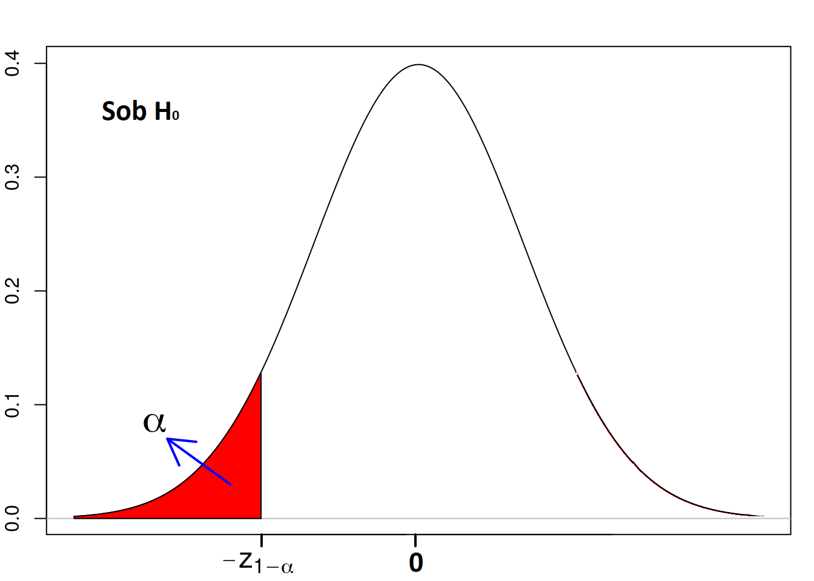
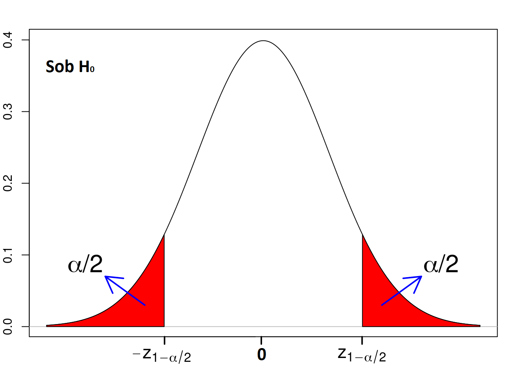

```{r setup, include=FALSE}
knitr::opts_chunk$set(echo = FALSE)
require(magrittr)
set.seed(13)
```


# Teste de hipóteses


## Teste de hipóteses

Em teste estatístico de hipóteses, os dados (amostra) são utilizados para verificar 
se uma hipótese ($H_0$) levantada sobre a população deve ser rejeitada a favor de 
uma hipótese alternativa ($H_1$). \pause

- Exemplos:

a) Teste para a média Bilateral
$$
\begin{cases}
H_0: ~~ \mu = 10
\\
H_1: ~~ \mu \neq 10
\end{cases}
$$
    - a hipótese alternativa admite que a média populacional esteja a esquerda ou a direita do 10.

b) Unilateral a esquerda
$$
\begin{cases}
H_0: ~~ \mu \geq 10
\\
H_1: ~~ \mu < 10
\end{cases}
$$
    - a hipótese alternativa admite que a média populacional esteja apenas a esquerda do 10.

<!--c) Unilateral a direita
$$
\begin{cases}
H_0: ~~ \mu \leq 10
\\
H_1: ~~ \mu > 10
\end{cases}
$$
- a hipótese alternativa admite que a média populacional esteja apenas a direita do 10.
-->


## Conceitos básicos e terminologias

- **Def.:** A **hipótese nula ($H_0$)** deve conter uma informação de igualdade 
($=,~ \leq$ ou $\geq$).
\vspace{0.5cm} \pause

- **Def.:** A **hipótese alternativa ($H_1$)** deve conter uma informação de 
desigualdade estrita  ($\neq,~ <$ ou $>$).
\vspace{0.5cm} \pause

- **OBS 1:** sempre que não existir evidências (estatísticas) suficientemente contrárias
a $H_0$, então $H_0$ é escolhida. \pause

  - \normalsize Nesta situação, dizemos que **não rejeitamos $H_0$**.
\vspace{0.5cm} \pause

- **OBS 2:** sempre que existir evidências (estatísticas) suficientemente contrárias
a $H_0$, então $H_1$ é escolhida.  \pause

  - \normalsize Nesta situação, dizemos que **rejeitamos $H_0$**.


## Tipos de erros e nível de significância

Ao tomarmos uma decisão a respeito de rejeitar ou não uma hipótese podemos estar
acertando ou errando a decisão. Este conceito é ilustrado na tabela a seguir:

\center
{ width=60% }

\vspace{0.3cm} \pause

- **Def.:** A probabilidade do Erro Tipo 1 é chamada de **nível de significância** 
do teste e será denotada por $\alpha$, ou seja,
$$
\alpha = P[\text{Erro Tipo 1}] = P[ \text{ Rejeitar } H_0 ~|~H_0 \text{ verdadeiro }]
$$

\vspace{0.0cm}\pause

- A probabilidade do Erro Tipo 2 é denotada por $\beta$, isto é,
$$
\beta = P[\text{Erro Tipo 2}] = P[ \text{ Não Rejeitar } H_0 ~|~H_1 \text{ verdadeiro }]
$$

##

- A situação ideal é aquela em que ambas as probabilidades $\alpha$ e $\beta$ são
próximas de zero. Entretanto uma probabilidade tende a ter comportamento 
contrário a outra, ou seja, quando tentamos minimizar $\alpha$, então $\beta$ 
tende a aumentar e vice-versa.
\vspace{0.5cm} \pause


- O Erro Tipo I é considerado o erro mais importante a ser evitado, desta forma, 
os testes estatísticos escolhem fixar um valor baixo para $\alpha$, mantendo assim o controle da probabilidade do Erro Tipo I, e então 
minimizam $\beta$.


## Estatística do teste

Seja ${\bf{X}} = (X_1,\dots,X_n)'$ uma amostra aleatória da variável X;
\vspace{0.5cm} \pause

**Def.:** A **estatística do teste** é uma função da amostra, $W(\bf{X})$, que 
se assumido que $H_0$ é verdade então essa estatística não depende de 
parâmetros desconhecidos. \vspace{0.3cm} \pause

- Em termos práticos, $W(\bf{X})$, permitirá que seja definido um valor de corte (VC) 
 para decidir entre $H_0$ e $H_1$;
\vspace{0.3cm} \pause
 
- Esse corte vai depender da distribuição de probabilidade de $W(\bf{X})$, 
quando $H_0$ for verdadeiro.


## Região crítica e regra de decisão

**Def.:** A **região crítica** (RC), também conhecida como região de rejeição, 
consiste no conjunto de possíveis valores de $W(\bf{X})$ que levam o 
teste a rejeitar $H_0$.
\vspace{0.2cm} \pause

  - Esta é construida a partir do nível de significância;  \vspace{0.2cm} \pause
  
  - Sob $H_0$ 
  (assumindo $H_0$ verdadeiro), então:
$$
  \alpha = P[\,W(\bf{X}) \in RC\,]
$$

\vspace{-0.2cm} \pause

  - Em termos práticos, se $W(\bf{x})$ esta em $RC$ então algo muito extremo foi observado na amostra de tal modo que isso não combina com a hipótese $H_0$, ou seja, $H_0$ possívelmente não é a hipótese correta e $H_1$ deve ser a escolhida;

\vspace{0.2cm} 

**Regra de decisão via RC:**
$$
\begin{cases}
\text{Se } W(\bf{x}) \not \in \text{ RC,  não rejeita } H_0
\\
\text{Se } W(\bf{x})   \in \text{  RC,  rejeita } H_0
\end{cases}
$$


## p-valor e regra de decisão

**Def.:** Sob $H_0$, o **p-valor** é a probabilidade de se obter uma estatística 
do teste 
$W(\bf{X})$ mais extrema do que aquela obtida na amostra observada, $W(\bf{x})$.


\vspace{0.7cm} \pause

**Regra de decisão via p-valor:**
$$
\begin{cases}
\text{Se  p-valor}  \geq \alpha, \text{  não rejeita } H_0
\\
\text{Se  p-valor}  < \alpha, \text{  rejeita } H_0
\end{cases}
$$

\vspace{0.7cm} \pause

- **OBS:** a regra de decisão via p-valor é equivalente 
a regra de decisão via RC.


# Teste para a média populacional


## Resultados importantes (aulas anteriores)


Seja ${\bf{X}} = (X_1,\dots,X_n)'$ uma a.a. de uma população representada pela v.a. $X$, em que a média populacional é $\mu=E[X]$ e a variância populacional é $\sigma^2=Var[X]$.
\vspace{0.2cm}

Sabemos que: \pause
\vspace{0.1cm}

- Se $\sigma^2$ é conhecido, então:
$$
Z = \left ( \frac{\bar{X} - \mu }{ \sigma / \sqrt{n} } \right ) ~~\sim^a~~ Normal(0, 1)
$$
\vspace{0.3cm} \pause

- Se $\sigma^2$ é desconhecido, trocamos $\sigma$ por $S$, então:
$$
T = \left ( \frac{\bar{X} - \mu }{ S / \sqrt{n} } \right ) ~~\sim^a~~t_{(n-1)}
$$
em que $t_{(n-1)}$ denota a distribuição t-Student com $n-1$ graus de liberdade.


## Nomenclatura

- **Teste Z**: teste para média quando a variância é conhecida.

\vspace{0.4cm}

- **Teste T**: teste para média quando a variância é desconhecida.


\vspace{0.7cm}

**OBS:** No que segue, faremos todo desenvolvimento assumindo $\sigma^2$ 
**desconhecido**, portanto iremos deduzir o **Teste T**. Para situações em que $\sigma^2$ é **conhecido**, 
os resultados são análogos, 
apenas trocando a estatística T pela Z.


 
  
  
  
  
  
  
  
  
## 
  
\subsection{Unilateral à Direita}  
  
  
  
## Teste T  - Unilateral à Direita

**Unilateral à Direita**:  a hipótese alternativa afirma que a média populacional esta a 
  direita de $\mu_0$, isto é,
$$
\begin{cases}
H_0: ~~ \mu \leq \mu_0
\\
H_1: ~~ \mu > \mu_0
\end{cases}
\pause ~~~~ \text{ ou, equivalentemente,  }~~~~
\begin{cases}
H_0: ~~ \mu = \mu_0
\\
H_1: ~~ \mu > \mu_0
\end{cases}
\pause
$$

\vspace{0.3cm}

- Sob $H_0$, adotamos o valor mais extremo, $\mu=\mu_0$, logo:
$$
T_0 = \left ( \frac{\bar{X} - \mu_0 }{ S / \sqrt{n} } \right ) ~~\sim~~t_{(n-1)}
$$


##  Teste T  - Unilateral à Direita


- Dado o nível de significância $\alpha$, sob $H_0$, temos:
$$
\alpha = P \left [ T_0 ~>~  t_{(1-\alpha; \,n-1)} \right ]
$$

\center 
{ width=55% }


## Teste T  - Unilateral à Direita

Se ${\bf x} = (x_1,\dots,x_n)'$ é amostra observada, então: 

- $\bar{x} = (1/n) \sum_{i=1}^nx_i$ é a média amostral observada;
  
- $t_0 = \frac{\bar{x} - \mu_0}{s/\sqrt{n}}$ é a estatística observada (sob $H_0$);

\vspace{0.2cm} \pause

**Região Crítica** para $T_0$: 
$$
RC_{T_0}: \left (t_{(1-\alpha; \,n-1)}  ~,~+\infty \right )
$$

- Regra: rejeita $H_0$ a favor de $H_1$ se $t_0 > t_{(1-\alpha; \,n-1)}$.

  
\vspace{0.5cm} \pause 

**Cálculo do p-valor**:

- A probabilidade da estatística do teste, $T_0$, ser mais extrema do que $t_0$ é dada por:
$$
\text{p-valor} = P[\,T_0 >  t_0\,] = 1 - P[\,T_0 <  t_0\,]
$$

- Regra:  rejeita $H_0$ a favor de $H_1$ se $\text{p-valor} < \alpha$.
  
    


<!--##  Teste T  - Unilateral à Direita

- Além do mais, também podemos isolar $\bar{X}$:
$$
\begin{aligned}
\alpha &= P \left [ T_0 ~>~  t_{(1-\alpha; \,n-1)} \right ]
\\
&= P \left [  \bar{X} ~>~  \mu_0 +t_{(1-\alpha; \,n-1)} \,\frac{S}{\sqrt{n}} \right ]
\end{aligned}
$$
\vspace{0.3cm}

**Teste via Região Crítica** para $\bar{X}$: 
$$
RC: \left (\mu_0 + t_{(1-\alpha; \,n-1)} \,\frac{S}{\sqrt{n}} ~,~+\infty \right )
$$

- Regra: rejeita $H_0$ a favor de $H_1$ se $\bar{x}$ estiver em RC.


-->


 
## 
  
\subsection{Unilateral à Esquerda}  
  
  
  
## Teste T  - Unilateral à Esquerda

**Unilateral à Esquerda**:  a hipótese alternativa afirma que a média populacional esta a 
  esquerda de $\mu_0$, isto é,
$$
\begin{cases}
H_0: ~~ \mu \geq \mu_0
\\
H_1: ~~ \mu < \mu_0
\end{cases}
\pause ~~~~ \text{ ou, equivalentemente,  }~~~~
\begin{cases}
H_0: ~~ \mu = \mu_0
\\
H_1: ~~ \mu < \mu_0
\end{cases}
\pause
$$

\vspace{0.3cm}

- Sob $H_0$, adotamos o valor mais extremo, $\mu=\mu_0$, 
assim utilizaremos a mesma estatística do teste do caso bilateral:
$$
T_0 = \left ( \frac{\bar{X} - \mu_0 }{ S / \sqrt{n} } \right ) ~~\sim~~t_{(n-1)}
$$


##

- Dado o nível de significância $\alpha$, sob $H_0$, temos:
$$
\alpha = P \left [ T_0 ~<~  -t_{(1-\alpha; \,n-1)} \right ]
$$


\center 
{ width=55% }


## Teste T  - Unilateral à Esquerda

Se ${\bf x} = (x_1,\dots,x_n)'$ é amostra observada, então: 

- $\bar{x} = (1/n) \sum_{i=1}^nx_i$ é a média amostral observada;
  
- $t_0 = \frac{\bar{x} - \mu_0}{s/\sqrt{n}}$ é a estatística observada (sob $H_0$);

\vspace{0.2cm} \pause


**Região Crítica** para $T_0$: 
$$
RC_{T_0}: \left (-\infty, -t_{(1-\alpha; \,n-1)} \right ) 
$$

- Regra: rejeita $H_0$ a favor de $H_1$ se $t_0 < -t_{(1-\alpha; \,n-1)}$.


  
\vspace{0.5cm} \pause 

**Cálculo do p-valor**:

- A probabilidade da estatística do teste, $T_0$, ser mais extrema do que $t_0$ é dada por:
$$
\text{p-valor} = P[\,T_0 <  t_0\,]
$$

- Regra:  rejeita $H_0$ a favor de $H_1$ se $\text{p-valor} < \alpha$.
 

<!--##  Teste T  - Unilateral à Esquerda

- Além do mais, também podemos isolar $\bar{X}$:
$$
\begin{aligned}
\alpha &=  P \left [ T_0 ~<~  -t_{(1-\alpha; \,n-1)} \right ]
\\
&= P \left [  \bar{X} ~<~  \mu_0 -t_{(1-\alpha; \,n-1)} \,\frac{S}{\sqrt{n}} \right ]
\end{aligned}
$$
\vspace{0.3cm}

**Teste via Região Crítica** para $\bar{X}$: 
$$
RC: \left (-\infty ~,~ \mu_0 - t_{(1-\alpha; \,n-1)} \,\frac{S}{\sqrt{n}} \right )
$$

- Regra: rejeita $H_0$ a favor de $H_1$ se $\bar{x}$ estiver em RC.
-->


 
##

\subsection{Bilateral}


## Teste T  - Bilateral

Seja $\mu_0$ um valor real qualquer pré-definido, então:

**Bilateral**:  a hipótese alternativa afirma que a média populacional pode estar a 
  esquerda ou a direita de $\mu_0$, isto é,
$$
\begin{cases}
H_0: ~~ \mu = \mu_0
\\
H_1: ~~ \mu \neq \mu_0
\end{cases}
$$
\pause

- Sob $H_0$, temos que $\mu=\mu_0$ é conhecido, assim podemos utilizar
$$
T_0 = \left ( \frac{\bar{X} - \mu_0 }{ S / \sqrt{n} } \right ) ~~\sim~~t_{(n-1)}
$$
como a estatística do teste.

##
- Dado o nível de significância $\alpha$, existem valores $t_{(\alpha/2; \,n-1)}$ e $t_{(1-\alpha/2; \,n-1)}$, tais que
$$
1-\alpha =  P \left [ t_{(\alpha/2; \,n-1)} < T_0 <  t_{(1-\alpha/2; \,n-1)} \right ]
$$

  - Por conta da simetria, temos $t_{(\alpha/2; \,n-1)} = - t_{(1-\alpha/2; \,n-1)}$, logo
$$
1-\alpha =  P \left [ - t_{(1-\alpha/2; \,n-1)} < T_0 <  t_{(1-\alpha/2; \,n-1)} \right ]
$$

\center 
{ width=55% }


## Teste T  - Bilateral

Se ${\bf x} = (x_1,\dots,x_n)'$ é amostra observada, então: 

- $\bar{x} = (1/n) \sum_{i=1}^nx_i$ é a média amostral observada;
  
- $t_0 = \frac{\bar{x} - \mu_0}{s/\sqrt{n}}$ é a estatística observada (sob $H_0$);

\vspace{0.3cm} \pause     

**Região Crítica** para $T_0$: 
$$
RC_{T_0}: \left (-\infty, -t_{(1-\alpha/2; \,n-1)} \right ) \cup \left (t_{(1-\alpha/2; \,n-1)}  ~,~+\infty \right )
$$

- Regra: rejeita $H_0$ a favor de $H_1$ se $|t_0| > t_{(1-\alpha/2; \,n-1)}$.
  
\vspace{0.2cm} \pause 

**Cálculo do p-valor**:

Sob $H_0$, a probabilidade da estatística do teste, $T_0$, ser mais extrema do que $t_0$ é dada por:
$$
\text{p-valor} = P[\,T_0 < - |t_0|\,] + P[\,T_0 >  |t_0|\,] = 2 \,(1 - P[\,T_0 < |t_0|\,])
$$

\vspace{-0.4cm}

- Regra:  rejeita $H_0$ a favor de $H_1$ se $\text{p-valor} < \alpha$.
  
  
  


<!--## Teste T  - Bilateral

- Além do mais, também podemos isolar $\bar{X}$:
$$
\begin{aligned}
1-\alpha &= \pause P \left [ - t_{(1-\alpha/2; \,n-1)} < T_0 <  t_{(1-\alpha/2; \,n-1)} \right ]
\\
&= \pause P \left [ - t_{(1-\alpha/2; \,n-1)} < \frac{\bar{X}-\mu_0}{S / \sqrt{n}} <  t_{(1-\alpha/2; \,n-1)} \right ]
\\
&= \pause P \left [ \mu_0 - t_{(1-\alpha/2; \,n-1)} \,\frac{S}{\sqrt{n}} ~<~ \bar{X} ~<~  \mu_0 +t_{(1-\alpha/2; \,n-1)} \,\frac{S}{\sqrt{n}} \right ]
\end{aligned}
$$
  
\vspace{0.2cm}  \pause
  
**Teste via Região Crítica** para $\bar{X}$: 
$$
RC_{\bar{X}}: \left (-\infty, ~\mu_0 -t_{(1-\alpha/2; \,n-1)} \,\frac{S}{\sqrt{n}} \right ) \cup \left (\mu_0 + t_{(1-\alpha/2; \,n-1)} \,\frac{S}{\sqrt{n}} ~,~+\infty \right )
$$

  - Regra: rejeita $H_0$ a favor de $H_1$ se $\bar{x}$ estiver em $RC_{\bar{X}}$. 
  -->
     

## 

\subsection{Exemplos}


## Exemplo 1

O INMETRO afirma que um modelo de carro consome em média 1 litro de gasolina a cada 12 km,
mas o fabricante acredita que o carro pode ser mais econômico nas mesmas condições.

Em uma amostra com 36 veículos foi obtido média de 12.217 km/l com desvio padrão de 
1 km/l.

Ao nível de 1\% de significância, podemos afirmar que o fabricante tem razão?


- Solução: \pause

  - Teste: (unilateral à direita)

$$
\begin{cases}
H_0: \mu = 12
\\
H_1: \mu > 12
\end{cases}
~~~~\Rightarrow^\text{(equivalente)}~~~~\pause
\begin{cases}
H_0: \mu \leq 12
\\
H_1: \mu > 12
\end{cases}
$$  
\pause

  - Amostra: $n=36$, $\bar{x}=12.217$, $s=1$
  
  - Variância: $\sigma^2=~?$ (**desconhecida**)
  
  - Teste adequado: *teste T unilateral a direita*


## Exemplo 1 - continuação


  - Est. do Teste (sob $H_0$): 
$$
T_0 = \frac{\bar{X} - \mu_0}{S/\sqrt{n}} =  \frac{\bar{X} - 12}{S/\sqrt{n}} ~~~~\sim t_{(n-1)}
$$
\pause

  - Est. observada: $t_0 = \frac{12.217 - 12}{1/\sqrt{36}} \approx 1.3$ \pause
  
  - Tabela da t-Student: $t_{(1-\alpha; n-1)} = t_{(0.99; 35)} = 2.4377$ \pause

  - Resultado do teste: como $t_0 < t_{(1-\alpha; n-1)}$,  não rejeitamos $H_0$, ou seja, ao nível de $1\%$ não foi encontrado 
  na amostra evidências
  estatísticas suficientes para rejeitar a afirmação do INMETRO.
  

 
## Exemplo 1 - continuação

- Repetindo o teste agora via p-valor:

  - Calculo do p-valor:
$$
\begin{aligned}
\text{p-valor} &= P[T_0 > t_0]
\\
&= P[T_0 > 1.3]
\\
&= 1 - P[T_0 < 1.3]
\\
&\approx 1 - 0.9~~~~ \text{**Tabela da t-Student, valor nem sempre disponível**}
\\
&= 0.1
\end{aligned}
$$
\pause

  - Resultado do teste: como $\text{p-valor} > \alpha$, então não rejeitamos $H_0$, 
  ou seja, ao nível de $1\%$ não foi encontrado 
  na amostra evidências
  estatísticas suficientes para rejeitar a afirmação do INMETRO.
   
  

<!--## Exemplo 1 - continuação

  - Repetindo o teste via Região Crítica para $\bar{X}$:
$$
\begin{aligned}
RC:& \left (\mu_0 + t_{(1-\alpha; \,n-1)} \,\frac{S}{\sqrt{n}} ~,~+\infty \right )
\\
:& \left (12 + 2.4377 \,\frac{1}{\sqrt{36}} ~,~+\infty \right )
\\
:& \left (12.41 ~,~+\infty \right )
\end{aligned}
$$
\pause

  - Resultado do teste: como $\bar{x} = 12.217$, logo $\bar{x} \not \in RC$ e 
  portanto não rejeitamos $H_0$, ou seja, ao nível de $1\%$ não foi encontrado 
  na amostra evidências
  estatísticas suficientes para rejeitar a afirmação do INMETRO.

  
  -->
  


## Exemplo 2

Uma fabrica de notebooks afirma que as baterias dos seus laptops duram em média pelo menos 10 horas em uso moderado. Em similaridade com outros aparelhos o desvio padrão é de 2 horas.

a) Se uma amostra foi coletada, qual teste é adequado para verificar se o fabricante esta correto?

b) Sabendo que a amostra com 43 aparelhos apresentou média de 9 horas e fixando a probabilidade do erro tipo 1 igual a $5\%$,
verifique o resultado do teste.

\pause

**Solução:**

a) Devemos verificar se existem evidências contrárias a afirmação do fabricante, ou seja,
$$
\begin{cases}
H_0: \mu \geq 10
\\
H_1: \mu < 10
\end{cases}
$$
Além do mais, como $\sigma^2 = 2^2 = 4$ temos que a variância populacional é conhecida. Assim, o mais adequado é o *teste Z unilateral à esquerdar*.


## Exemplo 2 - continuação

b)

  - Amostra: $n=43$, $\bar{x} = 9$ \pause

  - Nível de significância: $\alpha = P[\text{Erro tipo 1}] = 0.05$ \pause

  - Est. do Teste para variância conhecida (sob $H_0$): 
$$
Z_0 = \frac{\bar{X} - \mu_0}{\sigma/\sqrt{n}} =  \frac{\bar{X} - 10}{2/\sqrt{43}} ~~~~\sim Normal(0,1)
$$
\pause

   - Estatística observada:
$$
z_0 = \frac{\bar{x} - 10}{2/\sqrt{43}} = \frac{9 - 10}{2/\sqrt{43}} \approx -3.28
$$
\pause

  - Tabela da Normal: $-z_{(1-\alpha)} = -z_{(0.95)} \approx -1.64$ \pause

  - Como $z_0 < -z_{(1-\alpha)}$, então rejeitamos $H_0$. Ou seja,
    ao nível de $5\%$ de significância
    foi encontrado evidências estatísticas de que os notebooks não possuem a 
    durabilidade de bateria informada pelo fabricante.
    
    

## Exemplo 2 - continuação

  - Teste via p-valor
  
    - Cálculo do p-valor:
$$
\begin{aligned}
\text{p-valor} &= P[Z_0 < z_0] = P[Z_0 < -3.28] = \Phi(-3.28) 
\\
&= 1 - \Phi(3.28) = 1 - 0.99948 = 0.00052
\end{aligned}
$$
\pause

    - Como $\text{p-valor} < \alpha$, rejeitamos $H_0$. Ou seja,
    ao nível de $5\%$ de significância
    foi encontrado evidências estatísticas de que os notebooks não possuem a 
    durabilidade de bateria informada pelo fabricante.

    

<!--## Exemplo 2 - continuação

  - Repetindo o teste agora via RC para $\bar{X}$:

    - Região Crítica (unilateral a esquerda):
$$
\begin{aligned}
RC:& \left (-\infty ~,~ \mu_0 - z_{(1-\alpha)} \,\frac{\sigma}{\sqrt{n}} \right )
\\
:& \left (-\infty ~,~ 10 - 1.64 \,\frac{2}{\sqrt{43}} \right )
\\
:& \left (-\infty ~,~ 9.5 \right )
\end{aligned}
$$
\pause

    - Como $\bar{x}=9$ esta dentro da região crítica, rejeitamos $H_0$. Ou seja,
    ao nível de $5\%$ de significância
    foi encontrado evidências estatísticas de que os notebooks não possuem a 
    durabilidade de bateria informada pelo fabricante.

-->


## Exemplo 3

O PH ideal da água após receber tratamento tem distribuição Normal com média 
igual 7. 
Um estudo coletou amostras em 20 pontos escolhidos aleatoriamente, o qual 
apresentou PH médio igual a 6.5 e variância igual a 3.
Determine qual teste estatístico é adequado para verificar se amostra esta 
dentro do esperado e qual o resultado do teste ao nível de significância de 4\%?
\pause

- Solução:

  - Hipóteses:
$$
\begin{cases}
H_0: \mu = 7
\\
H_1: \mu \neq 7
\end{cases}
$$
\pause

  - Variância populacional: $\sigma^2 = ~?$ (desconhecida) \pause
  
  - Teste ideal: *teste T bilateral*; \pause
  
  - Est. do Teste (sob $H_0$): 
$$
T_0 = \frac{\bar{X} - \mu_0}{S/\sqrt{n}} =  \frac{\bar{X} - 7}{S/\sqrt{n}} ~~~~\sim t_{(n-1)}
$$
  

## Exemplo 3 - continuação

  - Amostra: $n=20$, $\bar{x} = 6.5$ e $s^2 = 3$  \pause \vspace{0.2cm}
  
  - Est. observada: $t_0 = \frac{6.5-7}{\sqrt{3}/\sqrt{20}} \approx -1.29$ \pause \vspace{0.2cm}

  - Tabela da t-Student: $t_{(1-\alpha/2\,;\, n-1)} = t_{(0.98; 19)} = 2.2047$ \pause \vspace{0.2cm}

  - Resultado do teste:  Como $|t_0| < t_{(1-\alpha/2\,;\, n-1)}$, não rejeitamos $H_0$,
  ou seja, ao nível de $4\%$ não foi encontrado 
  na amostra evidências
  estatísticas suficientes para descartar que a água estava com PH dentro do ideal.


## Exemplo 3 - continuação

- Repetindo o teste agora via p-valor:

  - Calculo do p-valor:
$$
\begin{aligned}
\text{p-valor} &= 2*( 1 - P[T_0 < |t_0|])
\\
&=2*( 1 - P[T_0 < 1.29])
\\
&= 2*( 1 - 0.8937) ~~~~ \text{**Não disponível na tabela do curso**}
\\
&= 0.2126
\end{aligned}
$$
\pause

  - Resultado do teste: como $\text{p-valor} > \alpha$, então não rejeitamos $H_0$, 
  ou seja, ao nível de $4\%$ não foi encontrado 
  na amostra evidências
  estatísticas suficientes para descartar que a água estava com PH dentro do ideal.
  
 
 


<!--## Exemplo 3 - continuação 

  - Repetindo o teste agora via Região Crítica para $\bar{X}$:
$$
\begin{aligned}
RC:& \left ( -\infty ~,~ \mu_0 - t_{(1-\alpha/2; \,n-1)} \,\frac{S}{\sqrt{n}} \right )\cup \left (\mu_0 + t_{(1-\alpha/2; \,n-1)} \,\frac{S}{\sqrt{n}} ~,~+\infty \right )
\\
:&  \left ( -\infty ~,~ 7 - 2.2047 \,\frac{\sqrt{3}}{\sqrt{20}} \right )\cup \left (7 + 2.2047 \,\frac{\sqrt{3}}{\sqrt{20}} ~,~+\infty \right )
\\
:& \left ( -\infty ~,~ 6.146123 \right )\cup \left (7.853877 ~,~+\infty \right )
\end{aligned}
$$ \pause

  - Resultado do teste:  Como $\bar{x}$ esta fora de RC, não rejeitamos $H_0$, 
  ou seja, ao nível de $4\%$ não foi encontrado 
  na amostra evidências
  estatísticas suficientes para descartar que a água estava com PH dentro do ideal.


-->
 
  


  
# Teste Z para a proporção populacional


## Testes para a proporção populacional

Suponha que deseja-se testar uma afirmação a respeito da proporção ($p$) de indivíduos da população que possuem determinado atributo. Assim, para um valor fixo qualquer $p_0 \in (0,1)$, temos os seguintes tipos de testes: \pause

a) **Unilateral a direita**
$$
\begin{cases}
H_0: ~~ p \leq p_0
\\
H_1: ~~ p > p_0
\end{cases}
\pause ~~~~ \text{ ou, equivalentemente,  }~~~~
\begin{cases}
H_0: ~~ p = p_0
\\
H_1: ~~ p > p_0
\end{cases}
$$

\pause

b) **Unilateral a esquerda**
$$
\begin{cases}
H_0: ~~ p \geq p_0
\\
H_1: ~~ p < p_0
\end{cases}
\pause ~~~~ \text{ ou, equivalentemente,  }~~~~
\begin{cases}
H_0: ~~ p = p_0
\\
H_1: ~~ p < p_0
\end{cases}
$$
\pause


c) **Bilateral**
$$
\begin{cases}
H_0: ~~ p = p_0
\\
H_1: ~~ p \neq p_0
\end{cases}
$$


## Proporção populacional - lembrete

\small

- Se $X \sim Bernoulli(p)$, então
$$
X = \begin{cases}
1: ~ \text{se o indivíduo possui a característica}
\\
0: ~ \text{se não possui a característica}
\end{cases}
$$
Além do mais
$$
\mu = E[X] = p ~~~~ \text{e} ~~~~ \sigma^2 = Var[X]=p(1-p) 
$$
\pause

- Seja $X_1,\dots,X_n$ uma a.a. de $X$, então: \pause
  
  - Estimador pontual usual é a proporção amostral, mas essa é igual a média amostral
$$
  \hat{p} = \frac{X_1+\dots+X_n}{n} = \bar{X} \pause
$$

  - Pelo TCL, temos que para amostras grandes
$$
Z = \left ( \frac{\hat{p} - p }{ \sigma / \sqrt{n} } \right ) ~~\sim^a~~ Normal(0, 1)
$$
em que $\sigma = \sqrt{p(1-p)}$.


## Estatística do teste

\large

Note que tanto no teste bilateral quanto nos testes unilaterais, temos que sob $H_0$, então $p=p_0$, logo
$$
Z_0 = \left ( \frac{\hat{p} - p_0 }{  \sqrt{ \frac{p_0 (1-p_0)}{n}} } \right ) ~~\sim^a~~ Normal(0, 1)
$$
é a estatística do teste.
\pause \vspace{0.5cm}


<!-- - Além do mais, para uma amostrar observada ${\bf x} = (x_1,\dots,x_n)'$  então $z_0$ (proporção observada na amostra) denota a estatística observada do teste; -->
<!-- \pause \vspace{0.2cm} -->

- Desta forma, o **teste para proporção** consiste basicamente no teste para média com variância conhecida (teste Z);


##
\subsection{Unilateral à direita}


## Teste unilateral à direita para proporção

::: columns

:::: column


\vspace{0.8cm}
\large Hipóteses: \normalsize

$$
\begin{cases}
H_0: ~ p \leq p_0
\\
H_1: ~ p > p_0
\end{cases}
\text{ou}~~
\begin{cases}
H_0: ~ p = p_0
\\
H_1: ~ p > p_0
\end{cases}
$$

::::

:::: column
{ width=95% }
::::

:::
\vspace{0.2cm} \normalsize \pause

- Teste via Região Crítica para $z_0$:

    - rejeita $H_0$ se $z_0 > z_{1-\alpha}$
\vspace{0.4cm} \pause

- Teste via p-valor:

    - rejeita $H_0$ se $\text{p-valor} < \alpha$, em que
$$
\text{p-valor} = P[\,Z_0 > z_0\,] = 1 - P[\,Z_0 <  z_0\,]
$$
<!--\vspace{-0.2cm} \pause-->

<!--- Teste via Região Crítica para $\hat{p}$:

  - rejeita $H_0$ se $\hat{p} > p_0 + z_{1-\alpha} \sqrt{ \frac{p_0 (1-p_0)}{n}}$
-->


##
\subsection{Unilateral à esquerda}


## Teste unilateral à esquerda para proporção

::: columns

:::: column

\vspace{0.8cm}
\large Hipóteses: \normalsize

$$
\begin{cases}
H_0: ~ p \geq p_0
\\
H_1: ~ p < p_0
\end{cases}
\text{ou}~~
\begin{cases}
H_0: ~ p = p_0
\\
H_1: ~ p < p_0
\end{cases}
$$

::::

:::: column
{ width=95% }
::::

:::
\vspace{0.2cm} \normalsize \pause

- Teste via Região Crítica para $z_0$:

    - rejeita $H_0$ se $z_0 < -z_{1-\alpha}$
\vspace{0.4cm} \pause

- Teste via p-valor:

    - rejeita $H_0$ se $\text{p-valor} < \alpha$, em que
$$
\text{p-valor} = P[\,Z_0 < z_0\,] = 1 - P[\,Z_0 <  -z_0\,]
$$
<!--\vspace{-0.2cm} \pause-->

<!--- Teste via Região Crítica para $\hat{p}$:

  - rejeita $H_0$ se $\hat{p} < p_0 - z_{1-\alpha} \sqrt{ \frac{p_0 (1-p_0)}{n}}$-->


##
\subsection{Bilateral}


## Teste bilateral para proporção

::: columns

:::: column

\large 
\vspace{0.8cm}
Hipóteses: 
$$
\begin{cases}
H_0: ~~ p = p_0
\\
H_1: ~~ p \neq p_0
\end{cases}
$$

::::

:::: column
{ width=95% }
::::

:::
\vspace{0.2cm} \normalsize \pause

- Teste via Região Crítica para $z_0$: 

    - rejeita $H_0$ se $|z_0| > z_{1-\alpha/2}$
\vspace{0.4cm} \pause


- Teste via p-valor: 

    - rejeita $H_0$ se $\text{p-valor} < \alpha$, em que
$$
\text{p-valor} = P[\,Z_0 < - |z_0|\,] + P[\,Z_0 >  |z_0|\,] = 2*(\,1 - P[\,Z_0 <  |z_0|\,]\,)
$$
<!--\vspace{-0.2cm} \pause-->

<!--- Teste via Região Crítica para $\hat{p}$: 

- rejeita $H_0$ se $|\hat{p}| > p_0 + z_{1-\alpha/2} \sqrt{ \frac{p_0 (1-p_0)}{n}}$
-->


##

\subsection{Exemplos}


## Exemplo 1

Um pesquisador médico acredita que **5\% ou mais** das crianças com menos de 10 anos tem asma. Em uma amostra aleatória com 250 crianças dessa faixa de idade, 20 delas tinham asma.
Para um nível de significância de 3\% podemos afirmar que há evidências na amostra para rejeitar a hipótese levantada pelo médico?


- Solução: \pause

  - Hipóteses:
$$
\begin{cases}
H_0: p \geq 0.05
\\
H_1: p < 0.05
\end{cases}
$$
\pause


  - Est. do Teste (sob $H_0$): 
$$
Z_0 = \frac{\hat{p} - p_0}{\sqrt{p_0(1-p_0)/n}}  ~~~~\sim^a~ Normal(0 , 1)
$$
\pause

  - Amostra: $n=250$, $\hat{p} = 20/250 = 0.08$\pause
  
    - Est. observada (sob $H_0$): 
$$
z_0 = \frac{0.08 - 0.05}{\sqrt{0.05*(1-0.05)/250}} \approx 2.18
$$
  

## Exemplo 1 - continuação

  - Nível de significância: $\alpha=0.03$ \pause

    - Valor crítico: $z_{1-\alpha} = z_{0.97} =^{\text{*tab. normal*}} ~1.88$ 
    \vspace{0.4cm} \pause
    
  - Teste via Região Crítica para $z_0$ (rejeita $H_0$ se $z_0< -z_{1-\alpha}$):
  
    - Como $|z_0| = 2.18$ é maior que $-z_{1-\alpha} = -1.88$, **não  rejeitamos** $H_0$; 
    \vspace{0.4cm} \pause
    

  - Teste via p-valor: (rejeita $H_0$ se $\text{p-valor} < \alpha$):
  
    - Como $\text{p-valor} = P[Z_0<z_0] = P[Z_0 < 2.18] = 0.98537$ é maior que $\alpha=0.03$, **não rejeitamos** $H_0$;

<!--\vspace{0.2cm} \pause-->
    
  
<!--  - Teste via Região Crítica para $\hat{p}$ (rejeita $H_0$ se $\hat{p} < p_0 - z_{1-\alpha} \sqrt{ \frac{p_0 (1-p_0)}{n}}$):

    - Como $\hat{p} = 0.08$ é maior que $p_0 - z_{1-\alpha} \sqrt{ \frac{p_0 (1-p_0)}{n}} = 0.024086$, **não rejeitamos** $H_0$; 

 --> 
 


## Exemplo 2

Um pesquisador médico acredita que **5\% ou menos** das crianças com menos de 10 anos tem asma. Em uma amostra aleatória com 250 crianças dessa faixa de idade, 20 delas tinham asma.
Para um nível de significância de 3\% podemos afirmar que há evidências na amostra para rejeitar a hipótese levantada pelo médico?


- Solução: \pause

  - Hipóteses:
$$
\begin{cases}
H_0: p \leq 0.05
\\
H_1: p > 0.05
\end{cases}
$$
\pause


  - Est. do Teste (sob $H_0$): 
$$
Z_0 = \frac{\hat{p} - p_0}{\sqrt{p_0(1-p_0)/n}}  ~~~~\sim^a~ Normal(0 , 1)
$$
\pause

  - Amostra: $n=250$, $\hat{p} = 20/250 = 0.08$\pause
  
    - Est. observada (sob $H_0$): 
$$
z_0 = \frac{0.08 - 0.05}{\sqrt{0.05*(1-0.05)/250}} \approx 2.18
$$
  

## Exemplo 2 - continuação

  - Nível de significância: $\alpha=0.03$ \pause

    - Valor crítico: $z_{1-\alpha} = z_{0.97} =^{\text{*tab. normal*}} ~1.88$ 
    \vspace{0.4cm} \pause
    
  - Teste via Região Crítica para $z_0$ (rejeita $H_0$ se $z_0> z_{1-\alpha}$):
  
    - Como $|z_0| = 2.18$ é maior que $z_{1-\alpha} = 1.88$, **rejeitamos** $H_0$; 
    \vspace{0.4cm} \pause

  - Teste via p-valor: (rejeita $H_0$ se $\text{p-valor} < \alpha$):
  
    - Como $\text{p-valor} = P[Z_0>z_0] = P[Z_0 > 2.18] = 1-P[Z_0 < 2.18] = 1-0.98537=0.01463$ é menor que $\alpha=0.03$, **rejeitamos** $H_0$;  
    
    
<!--\vspace{0.2cm} \pause    -->
    
  
<!--  - Teste via Região Crítica para $\hat{p}$ (rejeita $H_0$ se $\hat{p} > p_0 + z_{1-\alpha} \sqrt{ \frac{p_0 (1-p_0)}{n}}$):

    - Como $\hat{p} = 0.08$ é maior que $p_0 + z_{1-\alpha} \sqrt{ \frac{p_0 (1-p_0)}{n}} = 0.075914$, **rejeitamos** $H_0$; 
-->
  


## Exemplo 3

Um pesquisador médico acredita que 5\% das crianças com menos de 10 anos tem asma. Em uma amostra aleatória com 250 crianças dessa faixa de idade, 20 delas tinham asma.
Para um nível de significância de 3\% podemos afirmar que há evidências na amostra para rejeitar a hipótese levantada pelo médico?


- Solução: \pause

  - Hipóteses: \pause
$$
\begin{cases}
H_0: p = 0.05
\\
H_1: p \neq 0.05
\end{cases}
$$
\pause


  - Est. do Teste (sob $H_0$): 
$$
Z_0 = \frac{\hat{p} - p_0}{\sqrt{p_0(1-p_0)/n}}  ~~~~\sim^a~ Normal(0 , 1)
$$
\pause

  - Amostra: \pause $n=250$, $\hat{p} = 20/250 = 0.08$\pause
  
    - Est. observada (sob $H_0$): 
$$
z_0 = \frac{0.08 - 0.05}{\sqrt{0.05*(1-0.05)/250}} \approx 2.18
$$
  

## Exemplo 3 - continuação

  - Nível de significância: $\alpha=0.03$ \pause

    - Valor crítico: $z_{1-\alpha/2} = z_{0.985} =^{\text{*tab. normal*}} ~2.17$ 
    \vspace{0.4cm} \pause
    
  - Teste via Região Crítica para $z_0$ (rejeita $H_0$ se $|z_0| >z_{1-\alpha/2}$):
  
    - Como $|z_0| = 2.18$ é maior que $z_{1-\alpha/2} = 2.17$, **rejeitamos** $H_0$ a favor de $H_1$; 
    \vspace{0.4cm} \pause

  - Teste via p-valor: (rejeita $H_0$ se $\text{p-valor} < \alpha$):
  
    - Como $\text{p-valor} = 2(1-P[Z_0<|z_0|]) = 2*(1-P[Z_0 < 2.18]) = 2*(1-0.98537) = 0.02926$ é menor que $\alpha=0.03$, **rejeitamos** $H_0$ a favor de $H_1$;

<!--\vspace{0.2cm} \pause
  
  - Teste via Região Crítica para $\hat{p}$ (rejeita $H_0$ se $|\hat{p}| > p_0 + z_{1-\alpha/2} \sqrt{ \frac{p_0 (1-p_0)}{n}}$):

    - Como $\hat{p} = 0.08$ é maior que $p_0 + z_{1-\alpha/2} \sqrt{ \frac{p_0 (1-p_0)}{n}} = 0.07991$, **rejeitamos** $H_0$ a favor de $H_1$;
    
  -->
 


